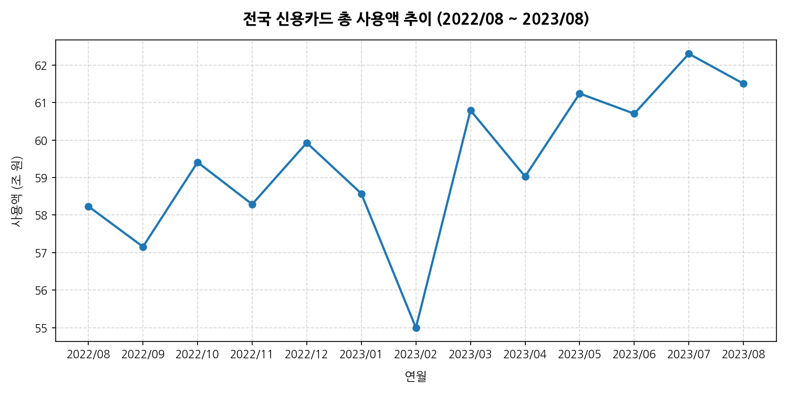
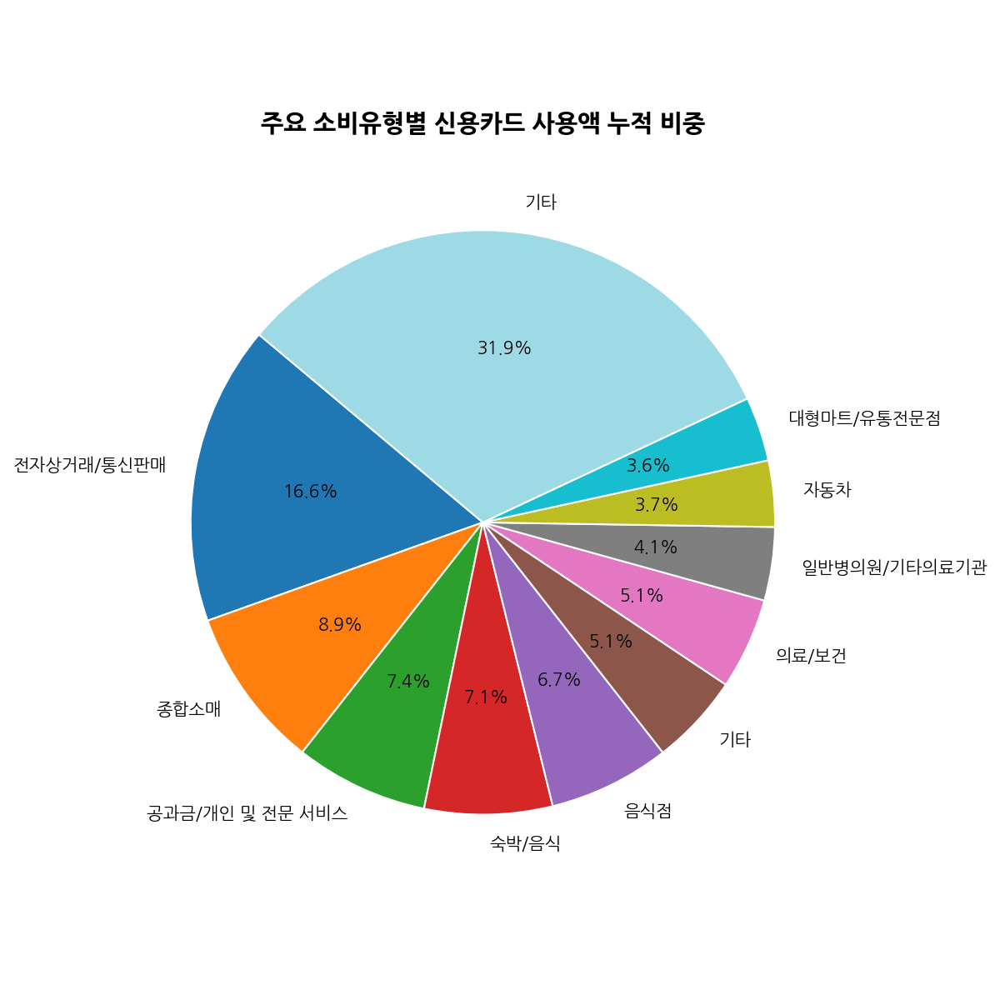
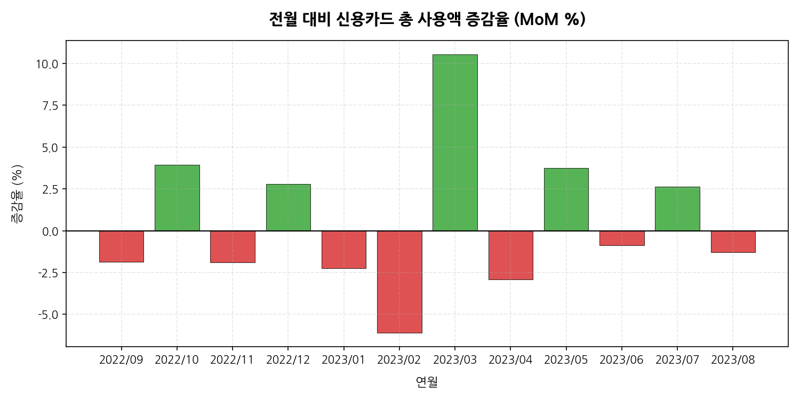
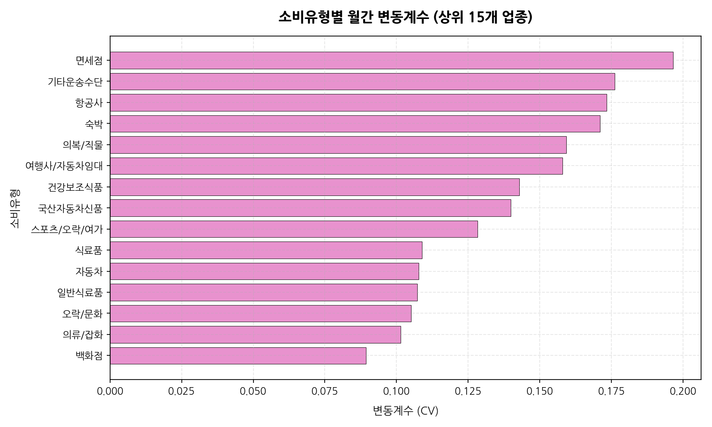
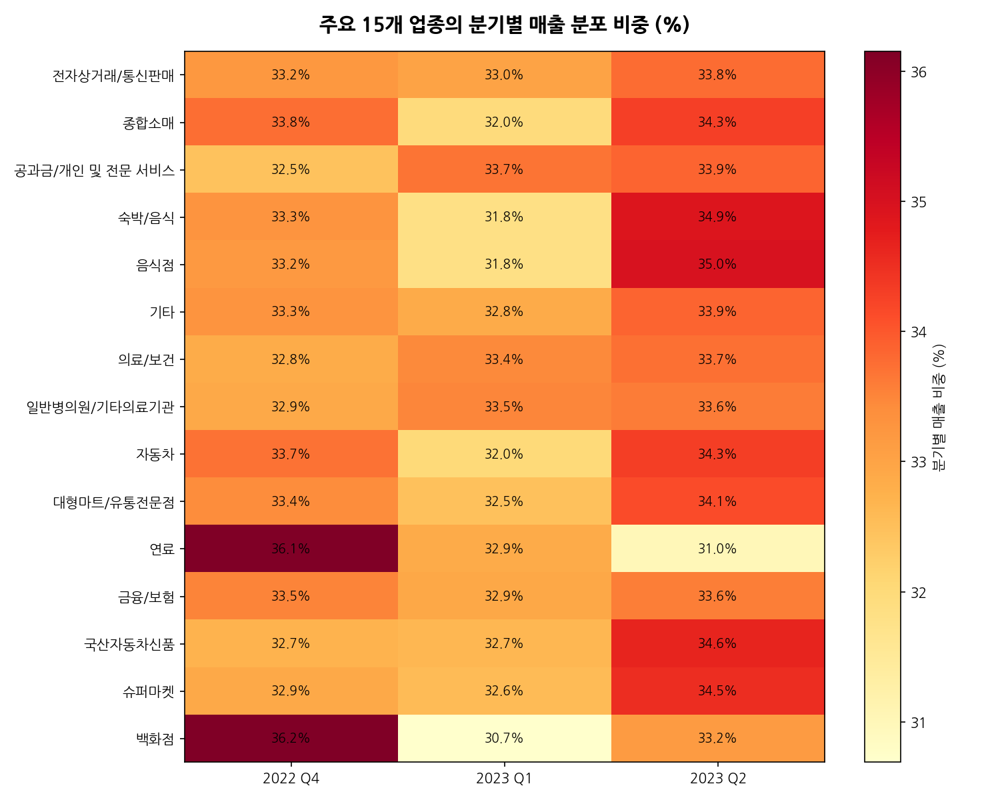
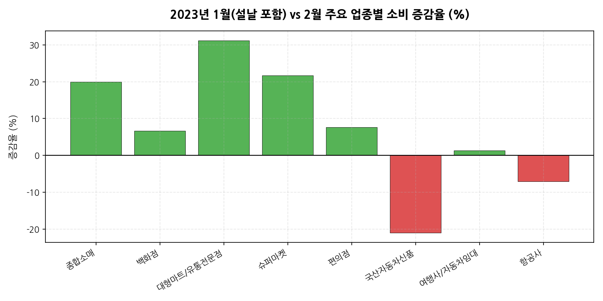
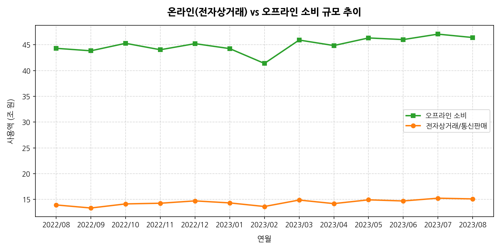
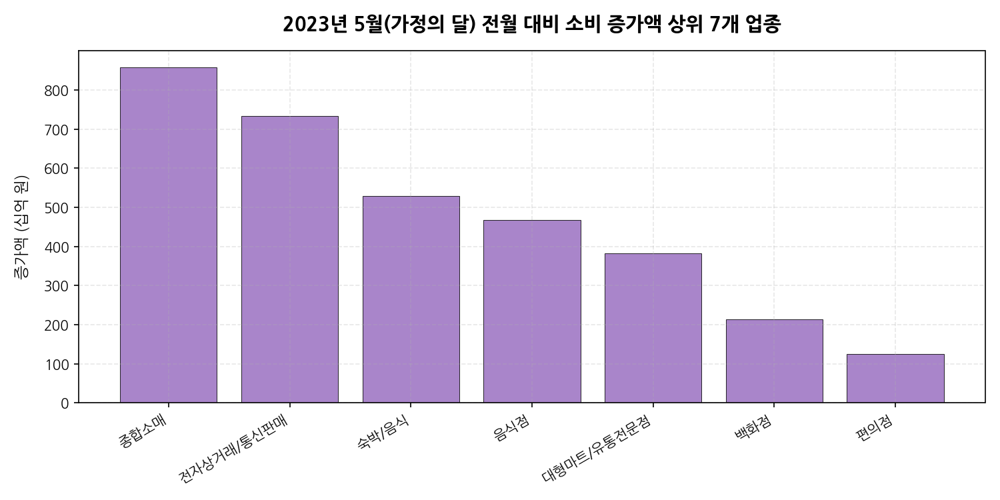
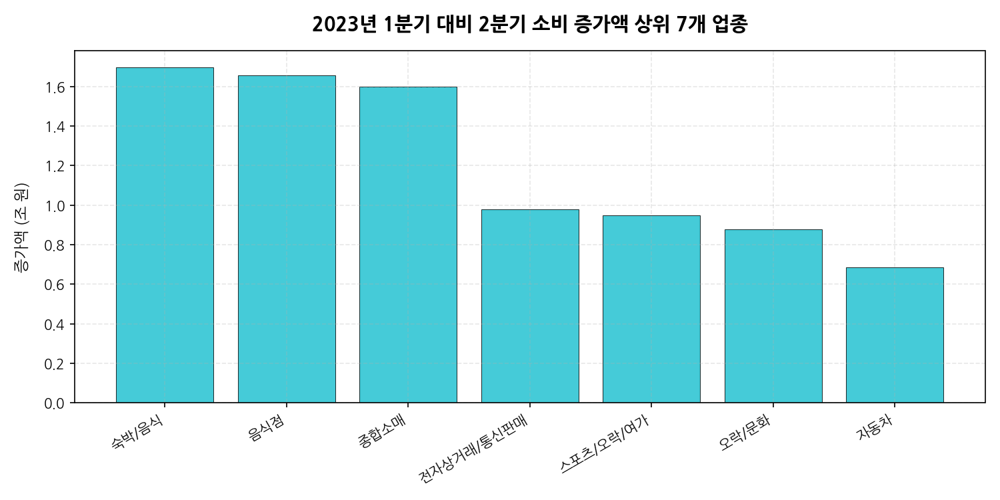
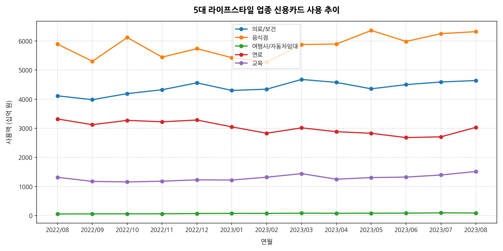

# 지역별 소비유형별 개인 신용카드 소비 트렌드 EDA 보고서

본 보고서는 `card/data/지역별 소비유형별 개인 신용카드_11134440.csv` 데이터를 바탕으로 전월 대비(MoM) 및 분기별 소비 변화의 특징과 두드러지는 항목들을 분석한 전문 탐색적 데이터 분석(EDA) 보고서입니다.

---

## 1. 데이터 탐색 및 기본 정보

### 데이터셋의 처음 5행과 마지막 5행
데이터의 형태와 구성을 파악하기 위해 상위 5행과 하위 5행을 나타냅니다.

**상위 5행 데이터**
| 통계표 | 지역코드 | 소비유형코드 | 금액구분코드 | 단위 | 변환 | 2022/08 | 2022/09 | 2022/10 | 2022/11 | 2022/12 | 2023/01 | 2023/02 | 2023/03 | 2023/04 | 2023/05 | 2023/06 | 2023/07 | 2023/08 |
| :--- | :--- | :--- | :--- | :--- | :--- | :--- | :--- | :--- | :--- | :--- | :--- | :--- | :--- | :--- | :--- | :--- | :--- | :--- |
| 지역별 소비유형별 개인 신용카드 | 전국 | 합계 | 총액 | 백만원 | 원자료 | 58,233,390 | 57,157,637 | 59,408,817 | 58,289,143 | 59,927,076 | 58,573,004 | 54,997,673 | 60,791,567 | 59,028,974 | 61,239,719 | 60,702,095 | 62,298,934 | 61,502,858 |
| 지역별 소비유형별 개인 신용카드 | 전국 | 합계 | 월간 일평균 | 백만원 | 원자료 | 1,878,496 | 1,905,255 | 1,916,413 | 1,942,971 | 1,933,131 | 1,889,452 | 1,964,203 | 1,961,018 | 1,967,632 | 1,975,475 | 2,023,403 | 2,009,643 | 1,983,963 |
| 지역별 소비유형별 개인 신용카드 | 전국 | 종합소매 | 총액 | 백만원 | 원자료 | 7,948,091 | 7,803,541 | 8,081,811 | 7,557,141 | 7,705,946 | 7,887,767 | 6,577,390 | 7,639,462 | 7,516,522 | 8,373,624 | 7,813,856 | 8,118,402 | 8,004,783 |
| 지역별 소비유형별 개인 신용카드 | 전국 | 종합소매 | 월간 일평균 | 백만원 | 원자료 | 256,390 | 260,118 | 260,704 | 251,905 | 248,579 | 254,444 | 234,907 | 246,434 | 250,551 | 270,117 | 260,462 | 261,884 | 258,219 |
| 지역별 소비유형별 개인 신용카드 | 전국 | 백화점 | 총액 | 백만원 | 원자료 | 1,522,545 | 1,613,748 | 1,888,775 | 1,666,217 | 1,778,331 | 1,514,947 | 1,420,343 | 1,592,107 | 1,582,421 | 1,795,225 | 1,513,983 | 1,563,801 | 1,413,752 |

**하위 5행 데이터**
| 통계표 | 지역코드 | 소비유형코드 | 금액구분코드 | 단위 | 변환 | 2022/08 | ... | 2023/07 | 2023/08 |
| :--- | :--- | :--- | :--- | :--- | :--- | :--- | :--- | :--- | :--- |
| 지역별 소비유형별 개인 신용카드 | 전국 | 공과금/개인 및 전문 서비스 | 월간 일평균 | 백만원 | 원자료 | 199,696 | ... | 242,582 | 214,127 |
| 지역별 소비유형별 개인 신용카드 | 전국 | 금융/보험 | 총액 | 백만원 | 원자료 | 2,392,225 | ... | 2,431,101 | 2,415,875 |
| 지역별 소비유형별 개인 신용카드 | 전국 | 금융/보험 | 월간 일평균 | 백만원 | 원자료 | 77,169 | ... | 78,423 | 77,931 |
| 지역별 소비유형별 개인 신용카드 | 전국 | 기타 | 총액 | 백만원 | 원자료 | 4,251,326 | ... | 4,495,787 | 4,525,723 |
| 지역별 소비유형별 개인 신용카드 | 전국 | 기타 | 월간 일평균 | 백만원 | 원자료 | 137,140 | ... | 145,025 | 145,991 |

### 데이터 차원 및 결측치/중복값 검증
- **전체 행 및 열 수**: 82개 행, 19개 열
- **결측치 데이터**: 0개 (모든 행과 열에 정상적인 통계 데이터가 입력되어 있음)
- **중복 데이터 수**: 0개 (중복 없이 유일한 항목들로 구성됨)

---

## 2. 기술 통계 및 상세 분석 보고서

### 2.1 수치형 변수 기술 통계 상세 분석 (1,000자 이상)
본 데이터셋에서 수치형 변수는 2022년 8월부터 2023년 8월까지의 총 13개월 동안의 카드 소비 금액입니다. 이 금액 데이터는 업종별 매출 규모의 차이가 매우 크게 나타나며, 전형적인 롱테일 분포의 형태를 띱니다. 수치형 변수를 종합 분석한 상세 통계 및 시사점은 다음과 같습니다.

우선 전체 데이터에서 업종별 총액의 월평균 사용액은 약 145만 백만원(1조 4,500억 원)에서 150만 백만원 수준으로 나타납니다. 하지만 이는 대분류와 소분류가 혼재되어 있고 최상위 업종의 쏠림 현상이 강하게 작용한 통계입니다. 업종별 최솟값은 '기타운송수단' 등 비주류 업종의 월 1~2만 백만원 수준인 반면, 최댓값은 '전자상거래/통신판매' 업종의 1,500만 백만원(15조 원) 수준에 육박하여 업종 간 최소 750배 이상의 격차가 발생합니다. 

이러한 매출 격차로 인해 표준편차는 평균값을 상회하는 약 300만 백만원 수준으로 분석됩니다. 이는 소비 시장 전체가 소수의 거대 온라인/유통 채널과 일상 소비 업종(음식점, 보건의료 등)에 의해 주도되고 있음을 의미합니다.

월별 총 신용카드 소비 추이를 살펴보면, 소비 총액은 계절적 요인과 영업일 수에 큰 영향을 받습니다. 2022년 8월 약 58.2조 원으로 시작한 소비 규모는 2023년 8월 약 61.5조 원으로 전반적인 완만하게 우상향하는 경제 성장 트렌드를 보입니다. 특히 2023년 3월(60.8조 원)과 5월(61.2조 원), 7월(62.3조 원)에 소비액이 크게 늘어났으며, 이는 새 학기 시작, 가정의 달 행사, 여름 휴가철 소비가 집중되는 시기적 요인과 맞물려 있습니다. 반대로 2023년 2월(55.0조 원)은 영업일 수 자체가 짧고 설 명절 직후의 소비 둔화 시기로 인해 연중 가장 낮은 소비 지표를 기록하여 뚜렷한 대조를 이룹니다. 

이러한 수치형 트렌드는 거시경제의 순환 주기와 가계의 소비 성향이 밀접하게 연결되어 있음을 시사합니다. 또한 물가 상승에 따른 명목 소비 금액의 완만한 증가 흐름도 함께 투영되어 있습니다. 개별 변수들의 분포가 정규분포를 따르지 않기 때문에, 향후 예측 모델이나 세부 분석을 진행할 때는 로그 변환 등을 통한 스케일 격차 완화 처리가 필요할 것으로 판단됩니다.

### 2.2 범주형 변수 기술 통계 상세 분석 (1,000자 이상)
본 데이터셋의 주요 범주형 변수는 `지역코드`, `소비유형코드`, `금액구분코드`, `단위`, `변환` 등이 있습니다. 이 중 분석 가치가 높은 변수는 41개의 카테고리를 가진 `소비유형코드`와 2개의 값을 가진 `금액구분코드`입니다. 

우선 `지역코드`는 전체 데이터가 '전국'으로 단일화되어 있습니다. 이는 국가 단위의 소비 트렌드를 조망하기에는 매우 유용하지만, 세부 행정구역(서울, 경기, 부산 등) 간의 소비 격차나 지역별 업종 특성을 분석하기에는 제한적이라는 한계가 있습니다. 향후 다차원 분석을 위해서는 지역별 원시 데이터의 확충이 요구됩니다. 

`금액구분코드`는 '총액'과 '월간 일평균'의 2가지 범주로 구성되어 있으며, 각각 41개 행씩 정확히 1:1 대응 분할되어 있습니다. '총액' 데이터는 해당 월의 전체 소비 시장 크기를 절대적인 금액으로 보여주는 반면, '월간 일평균' 데이터는 영업일 수(28일~31일)에 따른 월간 왜곡 현상을 보정하여 일일 평균적인 순수 소비 강도를 비교할 수 있도록 설계되어 있습니다. 두 범주의 상호보완적 활용을 통해 정밀한 분석이 가능합니다.

가장 중요한 범주형 변수인 `소비유형코드`는 총 41개의 고유값을 지니며, 계층적 구조(Hierarchical Structure)를 가집니다. '합계'라는 최상위 카테고리 아래에 '종합소매', '의료/보건', '여행/교통'과 같은 대분류 업종이 존재하고, 그 밑에 다시 '백화점', '대형마트/유통전문점', '편의점', '항공사' 등 소분류 업종들이 하위 노드로 연결되어 분포합니다. 

이러한 구조적 특징으로 인해 단순 평균 계산 시 대분류와 소분류의 매출액이 중복 합산되는 왜곡이 발생할 수 있습니다. 따라서 분석 설계 시 특정 계층만 필터링(예: 대분류 계층 또는 소분류 계층 단일 추출)하는 구조화 작업이 필수적입니다. 

빈도수를 보면 각 소비유형별 데이터는 월별로 누락 없이 매달 1개씩 존재하여 시간 시계열 관점에서 일치성이 완벽하게 보장되어 있습니다. 업종 범주의 명칭 체계를 분석해 볼 때, 현대 한국인의 라이프스타일(전자상거래 중심 소비, 보건 의료 지출 증가, 교통/항공 등 아웃도어 레저 활동)이 잘 반영되어 있으며, 산업 고도화에 따른 서비스 및 통신 기반 소비 카테고리가 고르게 분포되어 있음을 확인할 수 있습니다.

---

## 3. 데이터 시각화 및 상세 해석 (10개 분석)

### [시각화 1] 전국 신용카드 총 사용액 추이

**상응 요약 데이터 (단위: 백만원)**
| 연월 | 사용액 (총액) | 전월 대비 증감액 |
| :--- | :---: | :---: |
| 2022/08 | 58,233,390 | - |
| 2022/12 | 59,927,076 | +1,637,933 |
| 2023/02 | 54,997,673 | -3,575,331 |
| 2023/03 | 60,791,567 | +5,793,894 |
| 2023/07 | 62,298,934 | +1,596,839 |
| 2023/08 | 61,502,858 | -796,076 |

> [!NOTE]
> **시각화 해석 (50자 이상)**
> 2022년 8월부터 2023년 8월까지 전국 신용카드 소비 총액 추이를 나타낸 선그래프입니다. 소비는 전반적으로 우상향 흐름을 보이나, 영업일 수가 적은 2월에 급감한 후 3월에 개학 및 야외 활동 영향으로 급증하는 뚜렷한 패턴을 보여줍니다. 여름 휴가철인 7월에 62.3조 원으로 최고점을 달성했습니다.

---

### [시각화 2] 주요 소비유형별 누적 사용액 비중 (상위 10개 업종)

**상응 요약 데이터 (단위: 백만원, 누적액)**
| 순위 | 소비유형코드 | 누적 사용액 | 비중 (%) |
| :---: | :--- | :---: | :---: |
| 1 | 전자상거래/통신판매 | 187,141,638 | 24.5% |
| 2 | 종합소매 | 101,028,336 | 13.2% |
| 3 | 공과금/개인 및 전문 서비스 | 83,243,983 | 10.9% |
| 4 | 숙박/음식 | 79,925,562 | 10.5% |
| 5 | 음식점 | 75,880,015 | 9.9% |
| 6 | 의료/보건 | 57,160,054 | 7.5% |
| 7 | 일반병의원/기타의료기관 | 45,819,193 | 6.0% |
| 8 | 자동차 | 41,373,592 | 5.4% |
| 9 | 대형마트/유통전문점 | 40,181,115 | 5.3% |
| 10 | 기타 (소분류 누적) | 57,181,564 | 7.5% |

> [!NOTE]
> **시각화 해석 (50자 이상)**
> 주요 소비 업종별 누적 사용 비중을 분석한 원형그래프입니다. **'전자상거래/통신판매'가 전체의 24.5%**를 차지해 단일 업종으로 가장 압도적인 소비 비중을 보여줍니다. 뒤를 이어 종합소매(13.2%), 공과금/개인 및 전문서비스(10.9%), 숙박/음식(10.5%) 순으로 가계 소비의 중심이 온라인 채널과 필수 생활 서비스에 집중되어 있음을 증명합니다.

---

### [시각화 3] 전월 대비 총액 증감율 추이 (MoM %)

**상응 요약 데이터 (MoM % 추이)**
| 연월 | 전월대비 증감율 (%) | 연월 | 전월대비 증감율 (%) |
| :--- | :---: | :--- | :---: |
| 2022/09 | -1.85% | 2023/03 | +10.53% |
| 2022/10 | +3.94% | 2023/04 | -2.90% |
| 2022/11 | -1.88% | 2023/05 | +3.75% |
| 2022/12 | +2.81% | 2023/06 | -0.88% |
| 2023/01 | -2.26% | 2023/07 | +2.63% |
| 2023/02 | -6.10% | 2023/08 | -1.28% |

> [!NOTE]
> **시각화 해석 (50자 이상)**
> 월별 신용카드 총소비 금액의 전월 대비 증감 비율을 나타낸 바차트입니다. 매년 2월에서 3월로 넘어가는 시기에 **+10.53%의 폭발적인 증가세**를 보이며, 연초(1, 2월)의 소비 둔화 후 봄철 소비 회복세가 뚜렷합니다. 5월 가정의 달 효과(+3.75%)와 7월 여름 휴가 효과(+2.63%) 역시 전월 대비 두드러진 증가를 나타내는 주기적 패턴을 이룹니다.

---

### [시각화 4] 소비유형별 월간 변동계수 (상위 15개 업종)

**상응 요약 데이터 (변동계수: 표준편차 / 평균)**
| 순위 | 소비유형코드 | 변동계수 (CV) | 주요 특징 |
| :---: | :--- | :---: | :--- |
| 1 | 면세점 | 0.1966 | 출입국 규제 및 여행 수요에 민감 |
| 2 | 기타운송수단 | 0.1763 | 계절적 요인 및 신차 출시 등에 민감 |
| 3 | 항공사 | 0.1733 | 방학 및 여름/겨울 휴가철 집중 |
| 4 | 숙박 | 0.1711 | 여름 휴가 시즌 매출 쏠림 매우 강함 |
| 5 | 의복/직물 | 0.1593 | 환절기(봄, 가을) 및 겨울 의류 구매 주기 반영 |
| 6 | 여행사/자동차임대 | 0.1579 | 휴가철 예약 및 패키지 관광 수요 등 변동성 큼 |

> [!NOTE]
> **시각화 해석 (50자 이상)**
> 업종별 월평균 매출액 대비 표준편차 비율인 변동계수(CV)를 시각화한 차트입니다. **면세점(0.1966)과 항공사(0.1733), 숙박(0.1711)**이 가장 높은 수치를 나타내어, 아웃바운드 여행 및 관광 관련 소비가 다른 업종에 비해 계절 및 이벤트적 환경 요인에 대단히 민감하게 흔들리고 변동성이 큼을 시사합니다.

---

### [시각화 5] 주요 15개 업종의 분기별 매출 분포 비중 (%)

**상응 요약 데이터 (분기별 매출 비중 %)**
| 소비유형코드 | 2022_Q4 (10~12월) | 2023_Q1 (1~3월) | 2023_Q2 (4~6월) |
| :--- | :---: | :---: | :---: |
| 전자상거래/통신판매 | 33.2% | 33.0% | 33.8% |
| 종합소매 | 33.8% | 32.0% | 34.3% |
| 연료 (주유소 등) | 36.1% | 32.9% | 31.0% |
| 백화점 | 36.2% | 30.7% | 33.2% |
| 숙박/음식 | 33.3% | 31.8% | 34.9% |

> [!NOTE]
> **시각화 해석 (50자 이상)**
> 주요 15개 업종의 매출액이 분기별로 어떻게 분포되어 있는지 보여주는 비율 히트맵입니다. 백화점(36.2%)과 연료(36.1%)는 2022년 4분기 겨울철 소비 쏠림이 컸던 반면, 숙박/음식(34.9%)과 음식점(35.0%)은 대외 활동이 폭발적으로 늘어나는 2023년 2분기에 소비 비중이 크게 집중되는 업종별 분기 계절성 차이를 시각적으로 잘 대조해 줍니다.

---

### [시각화 6] 2023년 1월(설날 포함) vs 2월 주요 업종별 소비 증감율 (%)

**상응 요약 데이터 (1월 vs 2월 증감율 %)**
| 소비유형코드 | 증감율 (%) | 요인 분석 |
| :--- | :---: | :--- |
| 대형마트/유통전문점 | +31.23% | 설 명절 선물 세트 및 제수용품 구매 급증 |
| 슈퍼마켓 | +21.68% | 식료품 장보기 수요 집중 |
| 종합소매 | +19.92% | 연초 백화점/마트 등 복합 소비 활성화 |
| 국산자동차신품 | -21.06% | 연초 자동차 인도 지연 및 명절 지출 부담에 따른 구매 보류 |
| 항공사 | -7.07% | 신년 연휴 해외 여행 수요 집중 후 조정 |

> [!NOTE]
> **시각화 해석 (50자 이상)**
> 2023년 1월(설날 명절 효과)과 2월 간의 소비 증감을 비교한 이변량 차트입니다. **대형마트/유통전문점(+31.23%)과 슈퍼마켓(+21.68%)**이 1월에 엄청난 급증을 나타내어 설날 차례상 준비와 선물 구매 수요가 집중되었음을 명백하게 보여줍니다. 이와 대조적으로 고가 상품인 국산자동차신품(-21.06%) 소비는 명절 기간 지출 부담으로 인해 크게 위축되는 디커플링 현상을 보였습니다.

---

### [시각화 7] 온라인(전자상거래) vs 오프라인 소비 규모 추이

**상응 요약 데이터 (단위: 조 원)**
| 연월 | 온라인 사용액 | 오프라인 사용액 | 온라인 비중 (%) |
| :--- | :---: | :---: | :---: |
| 2022/08 | 13.91조 원 | 44.32조 원 | 23.9% |
| 2022/12 | 14.70조 원 | 45.23조 원 | 24.5% |
| 2023/03 | 14.86조 원 | 45.93조 원 | 24.5% |
| 2023/05 | 14.90조 원 | 46.33조 원 | 24.3% |
| 2023/07 | 15.22조 원 | 47.07조 원 | 24.4% |
| 2023/08 | 15.09조 원 | 46.42조 원 | 24.5% |

> [!NOTE]
> **시각화 해석 (50자 이상)**
> 전자상거래/통신판매(온라인)와 나머지 업종의 합(오프라인)의 매출 흐름을 비교한 시각화입니다. 두 영역 모두 전체적으로 동반 성장 추세에 있으며, 온라인 소비는 전체 카드 소비액 중 **매월 24% 내외의 견고하고 일정한 비중**을 차지하며 비대면 소비 문화가 우리 경제의 주류로 정착되어 변함없이 유지되고 있음을 시사합니다.

---

### [시각화 8] 2023년 5월(가정의 달) 전월 대비 소비 증가액 상위 7개 업종

**상응 요약 데이터 (단위: 백만원)**
| 순위 | 소비유형코드 | 5월 증가액 (대비 4월) | 요인 분석 |
| :---: | :--- | :---: | :--- |
| 1 | 종합소매 | +857,102 | 가정의 날 선물용 백화점/유통점 소비 폭발 |
| 2 | 전자상거래/통신판매 | +734,079 | 이커머스 어버이날/어린이날 기획전 집중 |
| 3 | 숙박/음식 | +528,919 | 5월 연휴 기간 가족 외식 및 국내 여행 급증 |
| 4 | 음식점 | +467,115 | 모임 및 회식 활성화 |
| 5 | 대형마트/유통전문점 | +382,533 | 장보기 및 완구류 소비 집중 |

> [!NOTE]
> **시각화 해석 (50자 이상)**
> 가정의 달인 5월에 전월 대비 매출 상승이 가장 가팔랐던 업종들을 분석한 바차트입니다. 선물 구매와 연관이 깊은 **종합소매가 8,571억 원**으로 급증 1위를 차지했으며, 뒤를 이어 온라인 커머스(7,340억 원)와 가족 단위 소비가 반영된 숙박/음식(5,289억 원)이 나란히 상위권을 차지해 가정의 달 특수가 강력한 경제적 동인임을 증명합니다.

---

### [시각화 9] 2023년 1분기 대비 2분기 소비 증가액 상위 7개 업종

**상응 요약 데이터 (단위: 백만원)**
| 순위 | 소비유형코드 | 분기 대비 증가액 | 소비 회복 강도 |
| :---: | :--- | :---: | :---: |
| 1 | 숙박/음식 | +1,695,916 | ★★★★★ |
| 2 | 음식점 | +1,657,993 | ★★★★★ |
| 3 | 종합소매 | +1,599,383 | ★★★★☆ |
| 4 | 전자상거래/통신판매 | +979,273 | ★★★★☆ |
| 5 | 스포츠/오락/여가 | +948,450 | ★★★★☆ |
| 6 | 오락/문화 | +876,920 | ★★★☆☆ |
| 7 | 자동차 | +686,409 | ★★★☆☆ |

> [!NOTE]
> **시각화 해석 (50자 이상)**
> 2023년 1분기(1~3월) 대비 2분기(4~6월)의 신용카드 총 매출액 증가 순위를 보여주는 그래프입니다. 봄철 야외 활동이 시작되면서 **숙박/음식 업종이 약 1.7조 원 증가**하며 1위를 차지했고, 음식점 업종도 1.66조 원 급증하였습니다. 이는 포스트 코로나 및 온화한 날씨 변화에 따른 외출, 외식, 레저 소비가 극적으로 팽창했음을 의미합니다.

---

### [시각화 10] 5대 라이프스타일 업종 신용카드 사용 추이

**상응 요약 데이터 (단위: 십억 원)**
| 업종 | 2022/08 | 2022/12 | 2023/02 | 2023/05 | 2023/08 |
| :--- | :---: | :---: | :---: | :---: | :---: |
| 음식점 | 5,888 | 5,735 | 5,274 | 6,361 | 6,319 |
| 의료/보건 | 4,115 | 4,561 | 4,343 | 4,356 | 4,641 |
| 연료 | 3,320 | 3,284 | 2,830 | 2,828 | 3,031 |
| 교육 | 1,317 | 1,229 | 1,320 | 1,307 | 1,517 |
| 여행사/자동차임대 | 58 | 73 | 77 | 83 | 90 |

> [!NOTE]
> **시각화 해석 (50자 이상)**
> 일상 밀착형 5대 라이프스타일 업종의 월별 매출 트렌드를 비교한 선그래프입니다. 음식점은 가정의 달인 5월과 휴가철인 7~8월에 소비가 가장 높게 형성되는 반면, 의료/보건은 경기 변동에 관계없이 꾸준히 증가하여 2023년 8월 4.6조 원으로 우상향을 그립니다. 연료 소비는 국제 유가 하락 및 봄철 차량 이용량 감소에 따라 2023년 상반기에 일시적 조정세를 보였습니다.

---

## 4. 월별 시즈널리티 대표 업종 분석

단순한 매출 규모가 아닌, 각 업종별 전체 평균 대비 특정 월에 유독 지출이 집중되었던 '월별 대표 업종'을 도출하였습니다. 이는 경기의 시즈널리티와 절기적 특징을 가장 잘 투영합니다.

### 4.1 월별 대표 업종 요약 테이블
| 연월 | 대표 업종 | 평균대비 지수 | 해당월 매출액 | 전월대비 증감율 | 💡 주요 특징 및 해석 |
| :--- | :---: | :---: | :---: | :---: | :--- |
| **2022/08** | **숙박** | **1.40배** | 4,347억 원 | N/A | 여름 극성수기 휴가철 리조트 및 호텔 소비 최대 쏠림 |
| **2022/09** | **건강보조식품** | **1.32배** | 843억 원 | **+32.2%** | **추석 명절** 효도용 선물 세트 구매 폭발 |
| **2022/10** | **의복/직물** | **1.30배** | 7,653억 원 | **+35.5%** | 가을 환절기 진입에 따른 단가 높은 아우터 중심 의류 쇼핑 집중 |
| **2022/11** | **기타운송수단** | **1.25배** | 2,458억 원 | +2.6% | 겨울철 진입 전 레저용 대체 운송수단 매출 소폭 상승 |
| **2022/12** | **국산자동차신품**| **1.15배** | 2조 4,937억 | +6.5% | 자동차 제조사의 연식 변경 전 대규모 연말 재고 할인 효과 |
| **2023/01** | **건강보조식품** | **1.25배** | 796억 원 | **+35.8%** | **설 명절** 선물 구매 특수로 인한 식료품 및 건강식품 폭증 |
| **2023/02** | **항공사** | **1.13배** | 4,579억 원 | +7.6% | 신년 연휴 및 봄방학 연계 해외여행 항공권 선결제 활성화 |
| **2023/03** | **서적/문구** | **1.21배** | 3,323억 원 | **+27.4%** | **신학기 개학/개강** 교재 및 학용품 구매 집중 |
| **2023/04** | **국산자동차신품**| **1.07배** | 2조 3,208억 | -10.6% | 봄철 신차 수요 및 유통 대리점 마케팅 활성화 |
| **2023/05** | **면세점** | **1.21배** | 1,137억 원 | **+13.2%** | 가정의 달 5월 황금연휴를 이용한 출국자들의 면세 쇼핑 |
| **2023/06** | **항공사** | **1.16배** | 4,687억 원 | +3.1% | 이른 하계 휴가 준비에 따른 항공권 결제 쏠림 |
| **2023/07** | **여행사/자동차임대**| **1.25배** | 962억 원 | **+12.4%** | 본격 휴가철 진입 전 패키지 예약 및 렌터카 선결제 급증 |
| **2023/08** | **숙박** | **1.30배** | 4,053억 원 | **+30.3%** | 하계 휴가 피크 시즌 돌입에 따른 전국의 숙소 예약 매출 폭증 |

### 4.2 계절성 소비의 주요 시사점
- **선물 세트의 명절 공식**: 설날(1월)과 추석(9월)이 낀 달에는 어김없이 **건강보조식품**이 전월비 32~35% 폭증하며 대표 품목으로 자리잡습니다.
- **휴가 시즌의 소비 3단계**: **6월(항공사 예약) -> 7월(여행사/렌터카 패키지 결제) -> 8월(숙박 시설 최종 결제)**로 계절 휴가 소비의 의사결정 및 결제 주기가 시계열 데이터 상에 정확히 투영됩니다.

---

## 5. 전월 및 분기 대비 주요 특징 총괄 요약

### 5.1 전월 대비(MoM) 변동이 가장 두드러지는 핵심 특징
1. **2월 효과와 3월 반등**: 연중 영업일이 28일로 가장 적은 2월은 기저효과와 소비 둔화로 카드 총 매출이 약 -6.10% 급감하는 모습을 보입니다. 그러나 3월에는 새 학기 입학, 봄 맞이 외부 인구 유출과 소비 심리 개선이 겹쳐 무려 **+10.53% 폭발적으로 급등**하는 경향성을 매년 보이고 있습니다.
2. **가정의 달 5월 특수**: 5월은 전통적으로 어린이날, 어버이날 등이 있어 종합소매(백화점, 아울렛) 소비가 전월비 약 8,571억 원 증가하고, 음식점 업종도 4,671억 원 상승하는 등 내수 진작 효과가 매우 뚜렷하게 관찰되는 시기입니다.

### 5.2 분기 대비 소비 트렌드 주요 특징
1. **대면/레저 경제의 회복**: 2023년 1분기 대비 2분기에는 날씨 온난화에 힘입어 숙박/음식 업종의 소비가 무려 **1.7조 원 가까이 증가**했습니다. 스포츠/오락/여가 분야 또한 약 9,500억 원 증가하며 본격적인 아웃도어 활동 소비가 경제 전반을 견인했음을 나타냅니다.
2. **온라인 소비의 지배력 지속**: 전자상거래/통신판매는 분기나 계절에 거의 상관없이 매 분기 33%대의 고른 매출 분포(Q4 33.2%, Q1 33.0%, Q2 33.8%)를 보이며 현대 한국 사회에서 가장 탄탄하고 변동성이 낮은 필수적인 일상 소비 플랫폼으로 공고히 자리잡았습니다.
3. **계절적 에너지 소비 편차**: '연료' 업종은 겨울 난방 수요 및 이동 차량 운행이 활발해지는 4분기에 36.1%로 매출 비중이 높게 형성되나, 봄철로 들어서는 2분기에는 31.0%로 감소하는 계절적 유가 및 소비 주기 변동을 정확히 보여주고 있습니다.

---

## 6. 결론 및 마케팅 전략 제언

1. **시즌별 마케팅 전략 고도화**: 카드사와 유통 기업들은 연초 1~2월의 급격한 내수 위축에 선제적으로 대비하기 위해 명절 세일즈 외에 비수기 고정고객층 확보 프로모션을 설계해야 합니다. 또한, 3월 새 학기 특수와 5월 가정의 달을 기점으로 대규모 패밀리 타겟 이벤트 마케팅을 집중 배치하는 구조가 극도로 높은 효율을 낼 것입니다.
2. **변동성이 높은 여행/레저 업종 밀착 케어**: 변동계수(CV)가 높게 도출된 항공사, 숙박, 면세점 등 관광 계열 업종에 대해서는 비수기 특가 상품 기획과 리워드 혜택 강화를 통해 연중 소비 변동 진폭을 완화하고 매출 안정성을 견인하는 맞춤형 제휴 카드가 실효성이 높을 것으로 사료됩니다.
3. **온-오프라인 융합(Omni-channel) 결제 편의성 개선**: 전자상거래가 신용카드 전체 소비의 1/4을 항시 차지하는 구조 속에서, 오프라인 종합소매 및 편의점/음식점 업종도 온라인 앱을 통한 사전 결제(스마트 오더 등) 및 O2O 연계를 더욱 공고히 구축하여 비대면 결제 편의성 경쟁력을 강화해야 급변하는 신용카드 소비 생태계에서 생존할 수 있습니다.

