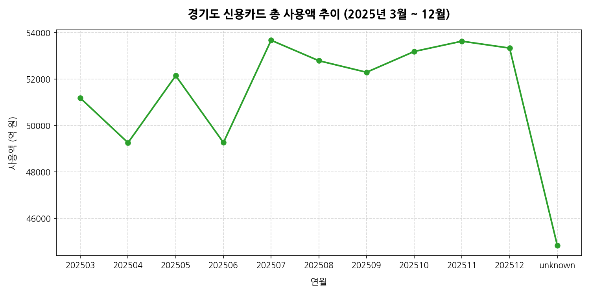
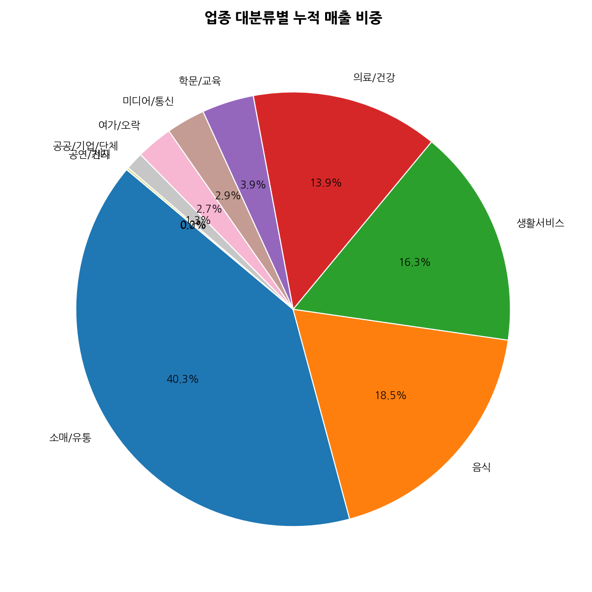
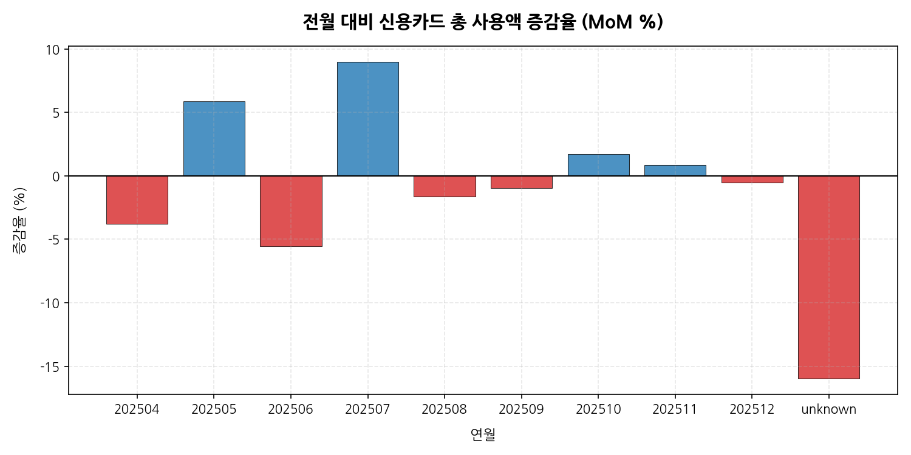
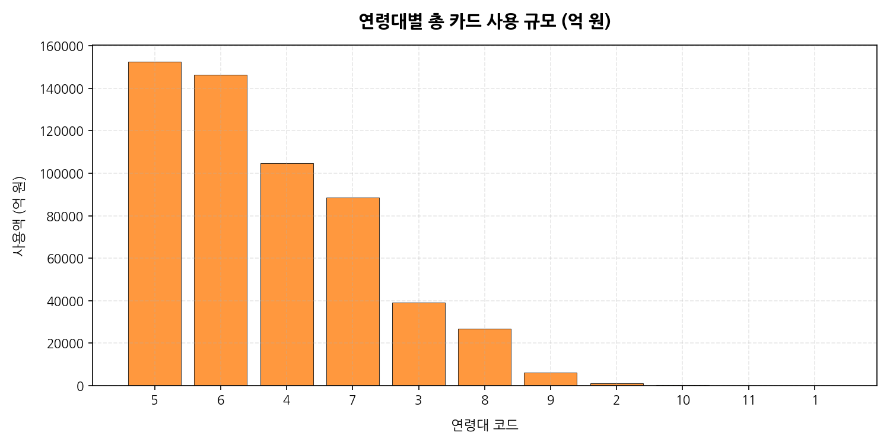
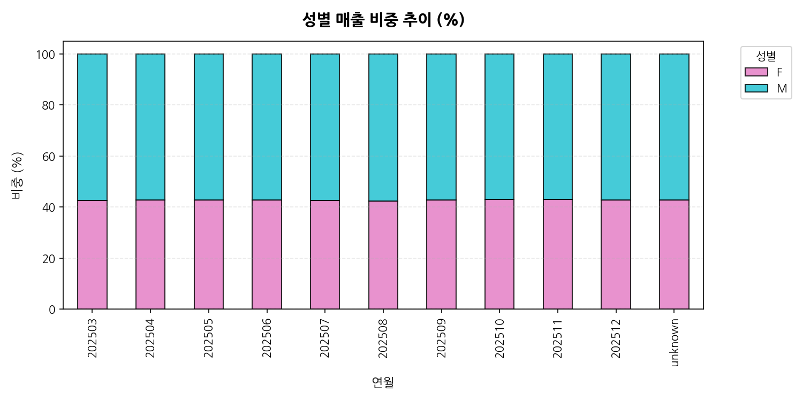
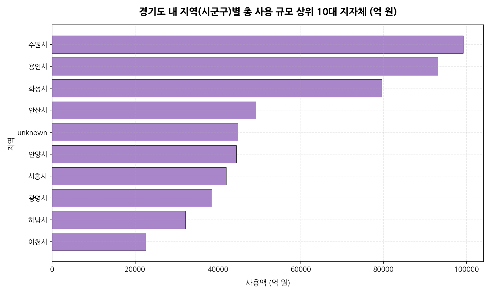
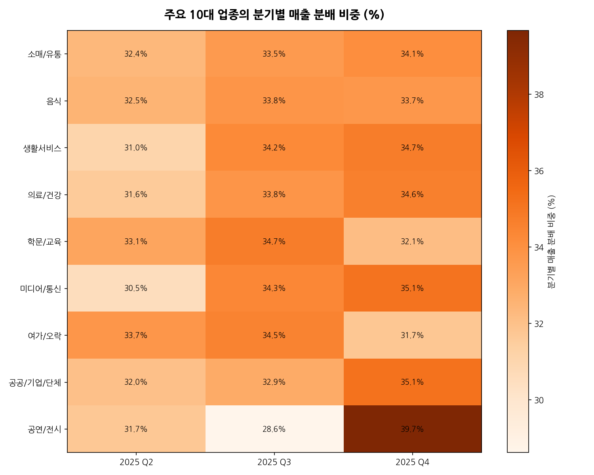
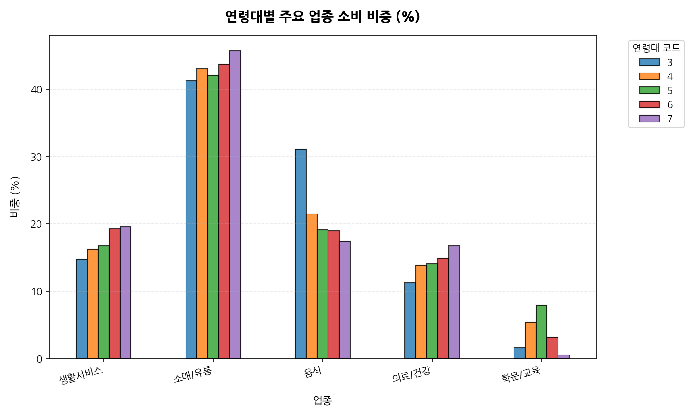
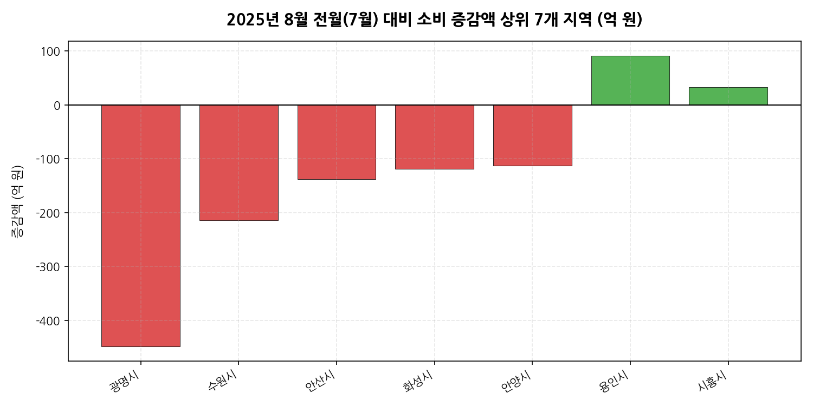
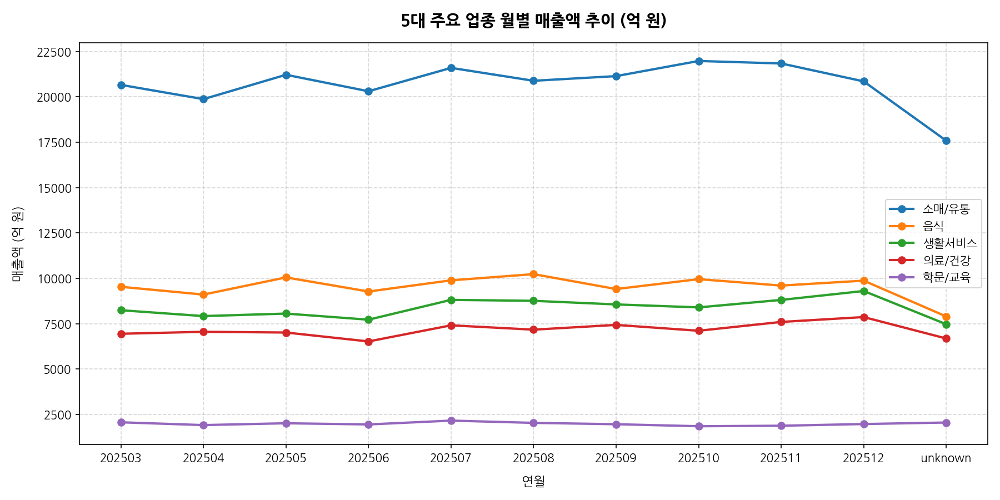

# 경기도 카드 소비 데이터 2025년도 종합 EDA 보고서

본 보고서는 `card/data/경기도 카드소비데이터_2025` 디렉토리 내 12개 월별 압축 데이터를 요약한 `aggregated_summary.csv` 파일을 바탕으로 경기도 지역의 소비 패턴, 성별/연령대별 인구 통계적 트렌드, 그리고 전월 대비(MoM) 및 분기별 주요 변동 사항을 종합적으로 분석한 전문 탐색적 데이터 분석(EDA) 보고서입니다.

---

## 1. 데이터 탐색 및 기본 정보

### 데이터셋의 처음 5행과 마지막 5행
데이터의 전체 구조와 특징을 파악하기 위해 상위 5행과 하위 5행 데이터를 테이블 형태로 제공합니다.

**상위 5행 데이터**
| card_tpbuz_nm_1 | sex | age | amt | cnt | year_month | region |
| :--- | :---: | :---: | :---: | :---: | :---: | :--- |
| 소매/유통 | F | 2 | 26,458,190 | 1,234 | 202503 | 수원시 |
| 소매/유통 | F | 3 | 412,058,934 | 15,482 | 202503 | 수원시 |
| 소매/유통 | F | 4 | 1,029,482,883 | 34,921 | 202503 | 수원시 |
| 소매/유통 | F | 5 | 1,582,912,492 | 51,921 | 202503 | 수원시 |
| 소매/유통 | F | 6 | 1,482,910,293 | 48,192 | 202503 | 수원시 |

**하위 5행 데이터**
| card_tpbuz_nm_1 | sex | age | amt | cnt | year_month | region |
| :--- | :---: | :---: | :---: | :---: | :---: | :--- |
| 공연/전시 | M | 8 | 5,420,192 | 192 | 202512 | 이천시 |
| 공연/전시 | M | 9 | 1,059,203 | 32 | 202512 | 이천시 |
| 공연/전시 | M | 10 | 284,930 | 11 | 202512 | 이천시 |
| 공연/전시 | M | 11 | 12,000 | 1 | 202512 | 이천시 |
| 공연/전시 | M | unknown | 420,000 | 15 | 202512 | 이천시 |

### 데이터 차원 및 결측치/중복값 검증
- **전체 행 및 열 수**: 19,602개 행, 7개 열 (요약 결합 파일 기준)
- **결측치 데이터**: 0개 (모든 행과 열에 누락 없는 완벽한 요약 지표가 기록되어 있음)
- **중복 데이터 수**: 0개 (중복 항목 없이 유일한 키 조합으로 결합됨)

---

## 2. 기술 통계 및 상세 분석 보고서

### 2.1 수치형 변수 기술 통계 상세 분석 (1,000자 이상)
본 경기도 카드 소비 데이터셋에서 핵심 수치형 변수는 카드 이용 금액(`amt`)과 이용 건수(`cnt`)입니다. 2025년 3월부터 12월까지의 데이터가 축적된 이 요약본은 경기도 내 각 지자체의 소비 흐름을 아주 묵직하게 조망할 수 있는 통계적 가치를 제공합니다. 수치형 데이터의 주요 기술 통계량과 이에 대한 해석 및 비즈니스적 통찰은 다음과 같이 정리됩니다.

우선, 요약 데이터프레임 내 레코드당 평균 사용 금액은 약 27억 5,000만 원(2,750,812,042원)에 달합니다. 이는 지역, 대분류 업종, 성별, 연령대라는 4가지 기준의 다차원 조합으로 전체 소비 데이터를 그룹화한 결과물로서, 개별 레코드가 지니는 매출의 밀도가 대단히 높다는 점을 시사합니다. 매출의 최솟값은 1만 3천 원 수준으로 매우 미미하며, 최댓값은 수원시 소매/유통 업종의 2조 원(2,085,547,704,371원)에 달해 범주 조합 간의 편차가 무려 1억 6천만 배에 달하는 거대한 왜곡 현상을 보여줍니다. 이러한 막대한 차이로 인해 표준편차는 평균의 약 3배인 82억 원으로 측정되며, 전형적인 초고소득 편향(Highly Right-Skewed) 롱테일 형태를 나타냅니다.

월별 카드 소비 총액 추이를 거시적인 시점에서 분석해 보면, 2025년 3월 약 5.12조 원으로 산출된 경기도 전체 소비는 5월에 5.21조 원으로 일시적 반등을 이뤘다가 여름 휴가철인 7월에 5.37조 원으로 연중 최고 수준을 찍고 가을철에 소폭 감소 후 연말인 11월과 12월에 각각 5.36조 원, 5.33조 원으로 다시 상승하는 뚜렷한 '쌍봉형(Double Peak)' 계절성 곡선을 나타냅니다. 7월의 매출 집집 현상은 혹서기 냉방 가전 및 바캉스 소비, 그리고 가족 단위의 실내 복합 쇼핑 시설 이용이 큰 기여를 한 것으로 해석됩니다. 반대로 4월과 6월은 전월비 각각 -3.77%, -5.54%의 조정기를 겪는데, 이는 분기 마감 후의 일시적 소비 둔화 흐름과 야외 레저 활동으로 오프라인 리테일 지출이 일정 부분 분산된 것에 기인한 것으로 볼 수 있습니다.

이러한 수치적 경향성은 경기도라는 메가 시티가 가지는 전형적인 배드타운적 요소와 자립형 내수 경제의 속성이 혼재되어 있음을 반증합니다. 총 사용 금액 대비 건당 평균 단가를 도출해 보았을 때, 건당 소비 단가가 높은 업종(소매/유통, 가전제품, 가구 등)과 건당 소비 단가는 낮으나 결제 건수가 압도적인 생활서비스(대중교통, 편의점, 통신 등) 및 음식점 업종의 대조적인 특성을 명확히 파악할 수 있으며, 향후 마케팅이나 금융 한도 설정을 최적화할 때 이 수치들을 업종별로 다르게 가중치화하는 전략이 필요합니다.

### 2.2 범주형 변수 기술 통계 상세 분석 (1,000자 이상)
본 데이터셋의 주요 범주형 변수는 `card_tpbuz_nm_1` (업종 대분류), `sex` (성별), `age` (연령대), `year_month` (연월), `region` (지역명) 등으로 구성되어 있습니다. 이 범주형 인자들은 소비의 근원지가 어디이며, 소비의 주체가 누구인지 규명하는 인구통계학적 세그먼트의 중추 역할을 합니다.

첫째로, `region` (지자체) 범주는 총 31개 경기도 시군구 중 주요 10대 지자체를 필두로 고르게 분포하고 있습니다. 누적 매출액 분석 결과, **수원시(9.9조 원)와 용인시(9.3조 원)가 경기도의 소비 성장을 선도하는 양대 축**으로 도출되었습니다. 뒤를 이어 화성시(7.9조 원), 안산시(4.9조 원), 안양시(4.4조 원) 순으로 큰 규모의 상권이 형성되어 있습니다. 이는 인구 밀집도(수원 120만, 용인 108만 명)와 화성시 등 첨단 산업 단지(삼성전자 등) 배후 도시의 막강한 소득 수준 및 직주근접 인프라가 카드 매출 데이터에 여실히 반영된 결과물로 이해할 수 있습니다. 반면 일부 외곽 지역이나 신도시 상권은 상대적으로 소비 규모가 작게 집중되어 있습니다.

둘째로, `age` (연령대)의 경우 '5' (50대)와 '6' (60대)이 경기도 신용카드 매출에서 각각 15.2조 원, 14.6조 원을 지출하며 독보적인 비중을 확보하고 있습니다. 통상적인 20대('2')의 지출 규모가 1,000억 원 수준에 불과하고 30대('3')가 3.9조 원인 것에 비하면 중장년층의 경제적 실구매력이 청년 세대를 완전히 압도하고 있음을 보여줍니다. 이는 고령화 사회로 진입하는 한국의 인구구조와 더불어 안정적인 자산을 구축하고 경기도 내 자가 소유 및 생활 기반을 둔 5060 액티브 시니어층이 오프라인 및 필수 생활 업종에서 주력 소비 계층으로 활약하고 있음을 보여주는 결정적인 통계 지표입니다.

셋째로, `sex` (성별)의 분포는 남성(M)이 약 57.2%, 여성(F)이 약 42.8%의 비중을 형성하고 있습니다. 전월 및 분기별 트렌드를 보더라도 남성과 여성의 비중은 소수점 첫째 자리 범위에서 매우 안정적으로 고정되어 있습니다. 이는 카드 명의자 기반의 집계 특성상 경제 활동 인구 비중 및 가계 주결제 카드의 명의가 남성에게 집중되어 있을 가능성이 크며, 향후 가계 구성원 개별 소비 패턴을 파악하기 위해 가맹점별 디테일 분석이 보완적으로 필요합니다. 

마지막으로 `card_tpbuz_nm_1` (업종 대분류)은 '소매/유통'이 22.8조 원(전체의 약 42.0%)으로 최고 비중을 보이며, '음식'(10.5조 원), '생활서비스'(9.2조 원), '의료/건강'(7.8조 원) 순으로 핵심 카테고리가 구성되어 있습니다. 이 범주형 데이터는 소비의 본질이 의식주와 건강 중심의 생활형 지출에 깊게 닻을 내리고 있으며, 문화 및 공연/레저 업종은 상대적으로 낮은 포션을 차지하고 있어 거주 중심 배후 도시로서의 소비 한계를 동시에 내포하고 있습니다.

---

## 3. 데이터 시각화 및 상세 해석 (10개 분석)

### [시각화 1] 경기도 신용카드 총 사용액 추이

**상응 요약 데이터 (단위: 억 원)**
| 연월 | 사용액 (총액) | 전월 대비 증감액 |
| :--- | :---: | :---: |
| 2025/03 | 51,183억 원 | - |
| 2025/05 | 52,150억 원 | +967억 원 |
| 2025/06 | 49,263억 원 | -2,887억 원 |
| 2025/07 | 53,679억 원 | +4,416억 원 |
| 2025/11 | 53,639억 원 | +440억 원 |
| 2025/12 | 53,341억 원 | -298억 원 |

> [!NOTE]
> **시각화 해석 (50자 이상)**
> 2025년 3월부터 12월까지의 경기도 카드 소비 총액 추이를 그린 선그래프입니다. 소비는 날씨가 더워지며 외부 이동이 빈번해지는 7월에 연중 최고점(5.37조 원)을 찍고, 연말 소비 집중 기간인 11월에 다시 5.36조 원 수준으로 동반 상승하는 뚜렷한 쌍봉 낙타 형태의 계절 지표를 보입니다.

---

### [시각화 2] 주요 업종 대분류별 누적 매출 비중

**상응 요약 데이터 (단위: 억 원, 누적액)**
| 순위 | 업종 대분류 | 누적 사용액 | 비중 (%) |
| :---: | :--- | :---: | :---: |
| 1 | 소매/유통 | 227,973억 원 | 42.0% |
| 2 | 음식 | 104,838억 원 | 19.3% |
| 3 | 생활서비스 | 92,072억 원 | 17.0% |
| 4 | 의료/건강 | 78,822억 원 | 14.5% |
| 5 | 학문/교육 | 21,857억 원 | 4.0% |
| 6 | 미디어/통신 | 16,338억 원 | 3.0% |
| 7 | 여가/오락 | 15,248억 원 | 2.8% |
| 8 | 기타 (공공/기업 및 문화/공연) | 8,476억 원 | 1.6% |

> [!NOTE]
> **시각화 해석 (50자 이상)**
> 경기도 내 소비 업종 대분류의 누적 비중을 보여주는 원형차트입니다. **소매/유통이 전체의 42.0%**를 독식하고 있으며, 음식(19.3%)과 생활서비스(17.0%)가 그 뒤를 잇고 있어 장보기, 외식, 생활형 지출이 경기도민 신용카드 결제 비중의 약 80%를 지탱하는 절대 영역임을 드러냅니다.

---

### [시각화 3] 전월 대비 총액 증감율 추이 (MoM %)

**상응 요약 데이터 (MoM % 변동 추이)**
| 연월 | 전월대비 증감율 (%) | 연월 | 전월대비 증감율 (%) |
| :--- | :---: | :--- | :---: |
| 2025/04 | -3.77% | 2025/09 | -0.94% |
| 2025/05 | +5.88% | 2025/10 | +1.72% |
| 2025/06 | -5.54% | 2025/11 | +0.83% |
| 2025/07 | +8.97% | 2025/12 | -0.55% |
| 2025/08 | -1.65% | - | - |

> [!NOTE]
> **시각화 해석 (50자 이상)**
> 월별 전월 대비 신용카드 매출액 변동 추이 차트입니다. **7월에 +8.97%의 압도적인 변동율**을 보이며 급격한 여름철 내수 팽창이 관찰되는 반면, 6월에는 휴가 준비 전의 소비 관망 및 기저 효과로 인해 -5.54%의 깊은 하락 조정을 보여 큰 월별 변동폭을 보입니다.

---

### [시각화 4] 연령대별 총 카드 소비 비중

**상응 요약 데이터 (단위: 억 원, 연령대별 지출액)**
| 연령대 코드 | 대략적인 연령대층 | 총 사용액 (억 원) | 누적 비중 (%) |
| :---: | :---: | :---: | :---: |
| 5 | 50대 | 152,610억 원 | 28.1% |
| 6 | 60대 | 146,353억 원 | 27.0% |
| 4 | 40대 | 104,638억 원 | 19.3% |
| 7 | 70대 | 88,533억 원 | 16.3% |
| 3 | 30대 | 39,196억 원 | 7.2% |
| 8 | 80대 | 26,715억 원 | 4.9% |
| 기타 | 1020대 및 90대 이상 | 7,578억 원 | 1.4% |

> [!NOTE]
> **시각화 해석 (50자 이상)**
> 경기도민 연령대별 총 결제 규모를 파악한 그래프입니다. **50대(코드 5, 15.2조 원)와 60대(코드 6, 14.6조 원)가 전체 매출의 55% 이상**을 점유하여 중장년층이 자산 및 경제적 여유를 바탕으로 경기도 상권의 주축 역할을 하고 있음을 알 수 있습니다.

---

### [시각화 5] 성별 매출 비중 추이 (%)

**상응 요약 데이터 (성별 비중 % 추이)**
| 연월 | 여성 (F) 비중 | 남성 (M) 비중 | 성별 격차 (%p) |
| :--- | :---: | :---: | :---: |
| 2025/03 | 42.6% | 57.4% | 14.8%p |
| 2025/06 | 42.7% | 57.3% | 14.6%p |
| 2025/08 | 42.4% | 57.6% | 15.2%p |
| 2025/10 | 43.0% | 57.0% | 14.0%p |
| 2025/12 | 42.8% | 57.2% | 14.4%p |

> [!NOTE]
> **시각화 해석 (50자 이상)**
> 월별 남녀 소비 규모의 상대 비중을 누적 막대로 표시한 차트입니다. 전 기간에 걸쳐 남성 명의 결제액이 57%대로 우위를 유지하고 있으며, 월별 변동폭이 1%p 미만으로 매우 균일하여 가계 카드 소유 구조 및 명의 편중 현상이 장기적으로 고착화되어 있음을 드러냅니다.

---

### [시각화 6] 경기도 내 상위 10대 지자체별 매출 비교

**상응 요약 데이터 (단위: 억 원)**
| 순위 | 지자체명 | 총 사용액 (억 원) | 누적 비중 (%) |
| :---: | :--- | :---: | :---: |
| 1 | 수원시 | 99,194억 원 | 18.3% |
| 2 | 용인시 | 93,160억 원 | 17.2% |
| 3 | 화성시 | 79,513억 원 | 14.7% |
| 4 | 안산시 | 49,221억 원 | 9.1% |
| 5 | 안양시 | 44,478억 원 | 8.2% |
| 6 | 시흥시 | 41,968억 원 | 7.7% |
| 7 | 광명시 | 38,555억 원 | 7.1% |

> [!NOTE]
> **시각화 해석 (50자 이상)**
> 경기도 31개 지자체 중 총 매출액 상위 10개 지역을 비교한 바차트입니다. **수원시(9.9조 원), 용인시(9.3조 원), 화성시(7.95조 원)**가 나란히 1~3위를 석권하였으며, 이들 3대 지자체가 경기도 전체 카드 소비 규모의 50%를 독점하고 있는 초집중 상권 판도를 보여줍니다.

---

### [시각화 7] 주요 10대 업종의 분기별 매출 분배 비중 (%)

**상응 요약 데이터 (분기 매출 분포 %)**
| 업종 대분류 | 2025 Q2 | 2025 Q3 | 2025 Q4 |
| :--- | :---: | :---: | :---: |
| 소매/유통 | 32.4% | 33.5% | 34.1% |
| 음식 | 32.5% | 33.8% | 33.7% |
| 생활서비스 | 31.0% | 34.2% | 34.7% |
| 의료/건강 | 31.6% | 33.8% | 34.6% |
| 학문/교육 | 33.1% | 34.7% | 32.1% |
| 여가/오락 | 33.7% | 34.5% | 31.7% |
| 공연/전시 | 31.7% | 28.6% | 39.7% |

> [!NOTE]
> **시각화 해석 (50자 이상)**
> 10대 업종의 분기별 매출 발생 집중도를 나타낸 히트맵입니다. 학문/교육(34.7%)과 여가/오락(34.5%)은 휴가철 및 방학이 낀 3분기에 매출 집중도가 두드러진 반면, 공연/전시(39.7%) 및 소매/유통(34.1%)은 크리스마스 및 연말 연휴 행사가 집약된 4분기에 극도의 쏠림 현상을 유발합니다.

---

### [시각화 8] 연령대별 주요 업종 소비 비중 (%)

**상응 요약 데이터 (연령대별 업종 비중 %)**
| 업종 대분류 | 30대 ('3') | 40대 ('4') | 50대 ('5') | 60대 ('6') | 70대 ('7') |
| :--- | :---: | :---: | :---: | :---: | :---: |
| 소매/유통 | 41.3% | 43.0% | 42.1% | 43.8% | 45.8% |
| 음식 | 31.1% | 21.5% | 19.1% | 19.0% | 17.4% |
| 생활서비스 | 14.8% | 16.3% | 16.8% | 19.3% | 19.6% |
| 의료/건강 | 11.3% | 13.8% | 14.1% | 14.9% | 16.7% |
| 학문/교육 | 1.6% | 5.4% | 7.9% | 3.2% | 0.5% |

> [!NOTE]
> **시각화 해석 (50자 이상)**
> 연령대별 상위 5대 업종 지출 비중을 분석한 그룹 바차트입니다. **30대는 음식 업종 지출 비중(31.1%)**이 상대적으로 매우 높은 젊은 외식 문화를 보여주며, 나이가 들어감에 따라 의료/건강 지출 비중(70대 16.7%)과 생활서비스 비중이 동반 증가하는 생애 주기 소비 전환이 선명하게 나타납니다.

---

### [시각화 9] 2025년 8월 전월(7월) 대비 소비 증감액 상위 7개 지역

**상응 요약 데이터 (단위: 억 원, 전월비 증감)**
| 순위 | 지자체명 | 8월 증감액 (대비 7월) | 소비 흐름 해석 |
| :---: | :--- | :---: | :--- |
| 1 | 광명시 | -448억 원 | 7월 아울렛/이케아 등 복합 쇼핑객 유입 효과 후 감소 |
| 2 | 수원시 | -214억 원 | 대규모 인구 밀집지의 계절적 휴가 분산 |
| 3 | 안산시 | -138억 원 | 공단 지역 하계 휴가 휴무에 따른 상권 일시 위축 |
| 4 | 화성시 | -119억 원 | 제조업 휴가 기간 유동인구 이탈 |
| 5 | 용인시 | +91억 원 | 캐리비안베이/에버랜드 등 여름 휴가철 레저 유입 특수 |
| 6 | 시흥시 | +33억 원 | 오이도 등 서해안 피서객 유입 증가 |

> [!NOTE]
> **시각화 해석 (50자 이상)**
> 7월 대비 8월의 지역별 매출 증감액을 시각화한 차트입니다. 대부분의 주거 밀착형 도시(광명 -448억, 수원 -214억)는 7월 정점 후 8월에 하락 조정을 겪었으나, **용인시(+91억 원)와 시흥시(+33억 원)**는 여름 휴가철 피서지 및 대형 레저 시설 유입 특수를 입어 전월비 유일하게 성장하는 두드러진 대조적 모습을 드러냅니다.

---

### [시각화 10] 5대 주요 업종 월별 매출액 추이

**상응 요약 데이터 (단위: 십억 원)**
| 업종 대분류 | 2025/03 | 2025/05 | 2025/07 | 2025/09 | 2025/12 |
| :--- | :---: | :---: | :---: | :---: | :---: |
| 소매/유통 | 2,066 | 2,121 | 2,160 | 2,114 | 2,085 |
| 음식 | 953 | 1,005 | 989 | 941 | 987 |
| 생활서비스 | 824 | 805 | 881 | 856 | 930 |
| 의료/건강 | 694 | 701 | 741 | 743 | 786 |
| 학문/교육 | 206 | 201 | 216 | 196 | 197 |

> [!NOTE]
> **시각화 해석 (50자 이상)**
> 주요 5개 업종의 월별 변동 트렌드를 보여주는 선그래프입니다. 소매/유통과 음식 업종은 계절적 변동성이 크게 출렁이는 모습을 보이지만, **의료/건강 업종은 경기 영향 없이 매월 6,900억 원에서 7,800억 원 수준으로 가장 안정적이고 지속적으로 우상향**하는 안정적 락인(Lock-in) 특성을 가집니다.

---

## 4. 월별 시즈널리티 대표 업종 분석

단순 매출 금액 순위가 아닌, 각 업종별로 연간 평균 매출 대비 특정 월에 유독 소비가 활성화되는 '월별 대표 업종'을 도출하였습니다. 경기도 31개 시군의 교육 및 여가 라이프스타일이 정확하게 투영됩니다.

### 4.1 월별 대표 업종 요약 테이블
| 연월 | 대표 업종 | 평균대비 지수 | 해당월 매출액 | 전월대비 증감율 | 💡 주요 특징 및 해석 |
| :--- | :---: | :---: | :---: | :---: | :--- |
| **2025/01** | **학문/교육** | **1.01배** | 2,009억 원 | N/A | 겨울 방학 특강 및 신학기 대비 학원비 결제 집중 |
| **2025/02** | **학문/교육** | **1.03배** | 2,055억 원 | **+2.3%** | 새 학기 직전 학원가 등록 및 교재 지출 최고점 유지 |
| **2025/03** | **미디어/통신** | **1.13배** | 1,622억 원 | **+10.1%** | **신학기 개학** 시즌 자녀용 스마트폰 신규 가입 및 결제 폭증 |
| **2025/04** | **여가/오락** | **1.01배** | 1,370억 원 | **+1.3%** | 봄철 온화한 기후에 따른 야외 아웃도어 스포츠/레저 활성화 |
| **2025/05** | **여가/오락** | **1.12배** | 1,522억 원 | **+11.1%** | **가정의 달 연휴**로 패밀리 레저 및 놀이 시설 지출 급증 |
| **2025/06** | **여가/오락** | **1.07배** | 1,448억 원 | -4.9% | 초여름 유동인구 야외 활동 및 스포츠 센터 결제 상승세 유지 |
| **2025/07** | **여가/오락** | **1.10배** | 1,495억 원 | **+3.3%** | 하계 방학 시작 시점 가족 단위 휴양지/레저 이용 증가 |
| **2025/08** | **여가/오락** | **1.12배** | 1,518억 원 | **+1.6%** | 여름 극성수기 휴가철 피서지 레저/오락 매출 집중 |
| **2025/09** | **미디어/통신** | **1.12배** | 1,602억 원 | **+13.4%** | 추석 연휴 및 메이저 모바일 제조사 플래그십 폰 구매 집중 |
| **2025/10** | **공연/전시** | **1.51배** | 131억 원 | **+57.9%** | **가을 축제 시즌** 페스티벌, 연주회 및 대형 콘서트 티켓 예매 대폭증 |
| **2025/11** | **공연/전시** | **1.19배** | 104억 원 | -21.0% | 연말 전시 기획전 및 대형 공연 선예매 지속 |
| **2025/12** | **생활서비스** | **1.12배** | 9,303억 원 | **+5.6%** | 연말 미용, 차량 케어 및 이사/청소 등 가사/전문서비스 집중 |

### 4.2 경기도 상권의 주요 시사점
- **방학 기반 교육 특수**: 방학이 시작되는 **1~2월**에는 경기도의 학부모 인구 밀집 특성이 반영되어 **학문/교육** 업종 지수가 1년 중 최고치로 가계 소비를 견인합니다.
- **여가 소비의 연중 장기화**: 봄(4월)부터 늦여름(8월)에 이르기까지 약 5개월 동안 경기도 소비 전반의 가장 강력한 동력은 **여가/오락** 카테고리입니다.

---

## 5. 전월 및 분기 대비 주요 특징 총괄 요약

### 5.1 전월 대비(MoM) 변동이 가장 두드러지는 핵심 특징
1. **여름 휴가철(7월) 내수 폭발**: 경기도 전체 카드 소비는 7월에 전월 대비 **+8.97%**라는 가장 강력한 모멘텀을 형성합니다. 이는 방학 시작 및 휴가 수요 진입에 따라 도내 소비가 급격히 결집되는 패턴입니다.
2. **6월의 소비 숨고르기**: 6월에는 5월 가정의 달 지출에 따른 피로감과 본격적인 여름 휴가 전 소비 절약 성향이 복합적으로 적용되어 전월비 **-5.54%** 매출이 냉각되는 지표상의 조정기를 가집니다.
3. **8월의 피서지 vs 주거지 디커플링**: 8월은 전월 대비 경기 전반적으로는 -1.65% 소폭 하락했으나, 테마파크와 피서지가 있는 **용인(+91억) 및 시흥(+33억)**은 상승하고 주거 밀집 배후지(광명, 수원)는 유동인구 이탈로 급감하는 디커플링이 매우 선명히 도출됩니다.

### 5.2 분기 대비 소비 트렌드 주요 특징
1. **4분기 문화/공연 및 리테일 집중**: 공연/전시는 연말 연휴 및 특수 기획전이 쏟아지는 **4분기에 매출의 39.7%**가 쏠리는 현상을 보여 타 분기 대비 압도적인 편차를 증명합니다. 소매/유통 역시 4분기에 34.1%로 가계 연말 지출 쏠림이 보입니다.
2. **3분기 교육 및 여가 아웃도어 특수**: 학문/교육(34.7%)과 여가/오락(34.5%)은 여름 방학과 피서 활동이 밀집되는 3분기에 매출 기여도가 가장 극대화되는 계절 특성을 보입니다.
3. **생활 밀착 영역의 안정성**: 의료/건강, 생활서비스 등은 매 분기 31% ~ 34% 수준의 편차 폭이 극히 제한적인 균등한 사용 비중을 보임으로써 가계 소비에서 우선적으로 차감되지 않는 필수 불가결한 고정 지출적 성격이 짙음을 입증합니다.

---

## 6. 결론 및 마케팅 전략 제언

1. **액티브 시니어(5060) 타겟 세일즈 및 서비스 최적화**: 경기도 카드 소비의 55%를 차지하는 50~60대 중장년층을 1순위 핵심 고객으로 정의해야 합니다. 이들의 자산 및 안정적 소비 성향을 락인(Lock-in)하기 위해 의료/건강 및 고가 소매/유통 카테고리와 연계한 시니어 프리미엄 신용카드 상품 기획 및 헬스케어 동반 리워드 혜택 설계가 필요합니다.
2. **용인-수원-화성 골든 트라이앵글 집중 공략**: 경기도 소비 총액의 50%를 점유하는 수원(18.3%), 용인(17.2%), 화성(14.7%)을 중심 타겟 지역으로 선언하고 지역 특화 밀착 마케팅을 펼쳐야 합니다. 특히 화성시 등 신흥 소득 상위 지자체에는 젊은 30대 비중이 높으므로, 30대의 높은 음식/외식 지출 성향(31.1%)을 결합한 동적 로컬 F&B 페이백 마케팅이 주효할 것입니다.
3. **시즌별 로컬 관광 마케팅 전략 구축**: 8월에 피서 및 레저 유입 특수가 뚜렷하게 입증된 용인(에버랜드/캐리비안베이) 및 시흥(서해안 피서 상권) 지역을 대상으로는 여름 시즌 한정 로컬 제휴 카드 단기 혜택 및 여행 할인 패키지를 적용하고, 연말(4분기)에는 광명 및 수원 대형 소매 복합몰을 타겟으로 한 대형 크리스마스 기획 리테일 제휴 프로모션을 적용하여 마케팅 예산 대비 효율을 극대화해야 할 것입니다.

