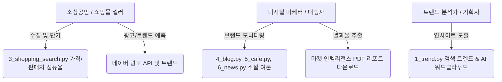
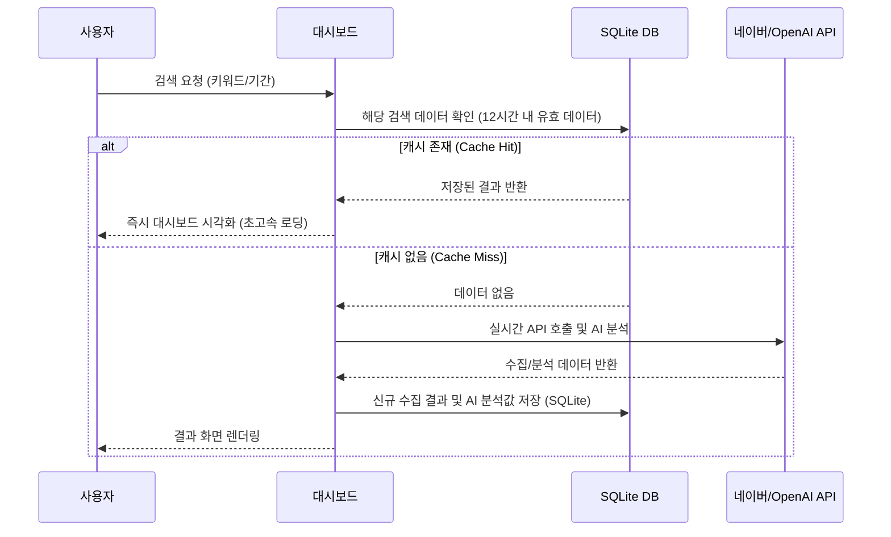
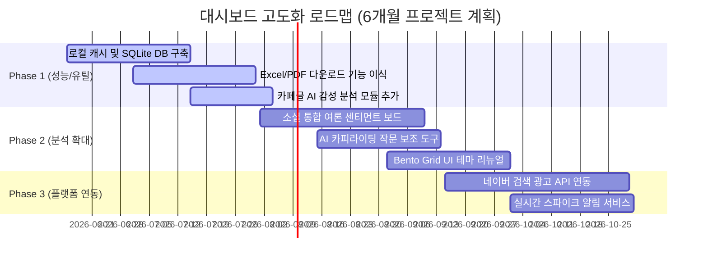

# 네이버 API 통합 분석 대시보드 기능 고도화 기획 요구사항 정의서 (PRD) 및 로드맵

이 문서는 현재 구축되어 있는 네이버 API 연동 다중 페이지 대시보드(`naver-api-app`)의 현황을 정밀히 진단하고, 핵심 유저 타겟층 분석을 기반으로 대시보드의 사용성과 서비스 비즈니스 가치를 극대화하기 위한 기능 고도화 기획 요구사항(PRD) 및 단계별 로드맵을 정의합니다.

---

## 1. 서비스 개요 및 배경

### 1.1 서비스 개요
본 서비스는 네이버 Datalab(검색어/쇼핑) 및 네이버 검색 API(쇼핑, 블로그, 카페글, 뉴스)를 연동하여, 기업 및 개인이 시장 트렌드, 최저가 분포, 여론 분석(감성 분석 및 키워드 추출)을 하나의 대시보드 내에서 손쉽게 수행할 수 있도록 돕는 Streamlit 기반 BI(Business Intelligence) 도구입니다.

### 1.2 고도화 배경 및 목적
* **시장 요구**: 빅데이터와 AI 기술의 보편화로 단순 데이터 수집을 넘어, 정제된 형태의 인사이트 도출 및 비즈니스 리포트 자동 생성에 대한 수요가 급증하고 있습니다.
* **사용성 개선**: 현재 대시보드는 1회성 데이터 조회 구조로 설계되어 있어 데이터 휘발성이 높고, 잦은 API 중복 호출로 인해 요금 및 제한 이슈가 우려됩니다.
* **서비스 활성화**: 사용자별 시나리오에 부합하는 분석 시너지 기능(광고 단가 분석, AI 마케팅 카피라이팅, 통합 리포트 내보내기 등)을 결합하여 실질적인 업무 자동화 툴로서의 가치를 실현하고자 합니다.

---

## 2. 현재 시스템 분석 및 진단 (As-Is)

### 2.1 디렉토리 및 소스 코드 구조 분석
대시보드 앱은 Streamlit의 다중 페이지(Multi-page) 기능을 채택하고 있으며, 공통 설정 및 헬퍼 함수를 통해 구조화되어 있습니다.

```
naver-api-app/
├── .env                  # API Credentials (NAVER Client ID/Secret, OpenAI API Key)
├── README.md             # 프로젝트 개요 및 실행 안내
├── src/
│   ├── app.py            # 공통 사이드바 필터 설정 및 홈 화면
│   ├── utils.py          # 네이버/OpenAI API 호출부 및 CSS 테마 주입
│   └── pages/
│       ├── 1_trend.py    # 검색어 트렌드 분석 (상대 검색 지수)
│       ├── 2_shopping_trend.py # 쇼핑 카테고리별 클릭 트렌드
│       ├── 3_shopping_search.py # 쇼핑 상품 최저가 및 판매처 점유율 분석
│       ├── 4_blog.py     # 블로그 여론 및 AI 감성 분석, 워드클라우드
│       ├── 5_cafe.py     # 카페 커뮤니티 활성도 및 수집 리스트
│       └── 6_news.py     # 뉴스 보도 추이, 언론 채널 분석 및 AI 감성 분석
```

#### 주요 소스 코드 상세 및 특징
* **공통 진입점 및 세션**: [app.py](file:///C:/Users/user1/Desktop/icb10proj2/naver-api-app/src/app.py)는 사이드바에서 검색 키워드(쉼표 구분 입력), 분석 기간(시작일/종료일), 조회 주기 등을 공통 세션 상태(`st.session_state`)로 바인딩하여 모든 하위 페이지가 연계되어 동작할 수 있도록 지원합니다.
* **API 호출 모듈**: [utils.py](file:///C:/Users/user1/Desktop/icb10proj2/naver-api-app/src/utils.py)는 네이버 데이터랩 API(`get_search_trend`, `get_shopping_trend`) 및 검색 API(`search_naver`) 호출 로직을 전담합니다. 특히 OpenAI GPT-4o-mini API를 이용한 배치 감성 및 형태소 분석 함수(`analyze_sentiment_and_keywords`)가 구현되어 텍스트 데이터에서 실질적 가치를 도출합니다.
* **개별 대시보드 페이지**:
  * [1_trend.py](file:///C:/Users/user1/Desktop/icb10proj2/naver-api-app/src/pages/1_trend.py) & [2_shopping_trend.py](file:///C:/Users/user1/Desktop/icb10proj2/naver-api-app/src/pages/2_shopping_trend.py): Plotly 라인 차트를 활용해 트렌드 가시성을 제공합니다.
  * [3_shopping_search.py](file:///C:/Users/user1/Desktop/icb10proj2/naver-api-app/src/pages/3_shopping_search.py): 최저가 분포(Box plot), 평균가(Bar chart), 판매처 분포(Pie chart) 등 풍부한 데이터 시각화를 제공합니다.
  * [4_blog.py](file:///C:/Users/user1/Desktop/icb10proj2/naver-api-app/src/pages/4_blog.py) & [6_news.py](file:///C:/Users/user1/Desktop/icb10proj2/naver-api-app/src/pages/6_news.py): GPT-4o-mini를 연동하여 포스팅/기사 단위 긍·부정 뱃지 라벨링과 한 줄 요약 기능을 탑재하였고, Matplotlib 기반 한글 폰트 워드클라우드 생성을 지원합니다.
  * [5_cafe.py](file:///C:/Users/user1/Desktop/icb10proj2/naver-api-app/src/pages/5_cafe.py): 활성 카페 분석이 구현되어 있으나 블로그/뉴스와 달리 AI 감성 분석 기능은 적용되어 있지 않습니다.

### 2.2 한계점 분석 및 개선 기회 (Pain Points)
1. **API 호출 중복 및 지연 (성능)**: 사용자가 페이지를 전환하거나 탭을 선택할 때마다 네이버 API를 실시간 호출합니다. 이로 인해 데이터 변경이 없어도 불필요한 트래픽 및 지연이 유발됩니다. (Session Caching 혹은 Local Database 필요)
2. **분석 데이터 보존성 결여 (지속성)**: 메모리 세션 상태를 활용하고 있어, 브라우저가 새로고침되거나 대시보드가 종료되면 기존의 수집·분석된 데이터(특히 OpenAI API를 호출하여 비용이 지불된 감성 분석 및 형태소 정보)가 전부 소실됩니다.
3. **분석 결과 산출물 내보내기 불가 (확장성)**: 마케터나 소상공인이 분석 결과를 타 부서 공유 또는 의사결정에 사용하기 위해 리포트를 다운로드하는 기능(예: PDF 리포트, Excel 상세 원본 데이터)이 부재합니다.
4. **마케팅 핵심 지표의 부재**: E-Commerce 소상공인이 가장 관심을 가질 만한 '검색 광고 경쟁도', '키워드별 노출수', '예상 클릭 단가(CPC)' 등의 정보가 쇼핑 검색과 연계되지 않습니다.
5. **소셜 커뮤니티 데이터의 AI 분석 부재**: 소비자의 직접적인 목소리가 들어있는 [5_cafe.py](file:///C:/Users/user1/Desktop/icb10proj2/naver-api-app/src/pages/5_cafe.py)에 AI 감성 분석 및 키워드 추출이 빠져 있어 종합적인 소셜 리스닝이 제한됩니다.

---

## 3. 유저 타겟층 및 유즈케이스 시나리오

본 고도화 기획안에서는 대시보드의 사용성 가치를 극대화하기 위해 3대 유저 타겟층을 정의하고, 이들이 대시보드를 사용하는 전형적인 시나리오를 설계하였습니다.



### 3.1 페르소나 1: E-Commerce 소상공인 / 쇼핑몰 셀러
> **"신제품을 출시하려는데 시장에 이미 진입한 판매처들의 가격 포지셔닝과 소비자 반응을 한 번에 확인하고, 내 적정 마진과 광고 입찰가를 결정하고 싶어요."**
* **유즈케이스 시나리오**:
  1. 쇼핑인사이트([2_shopping_trend.py](file:///C:/Users/user1/Desktop/icb10proj2/naver-api-app/src/pages/2_shopping_trend.py))에서 '디지털/가전' 카테고리 내 '태블릿'과 '태블릿 거치대'의 쇼핑 클릭 트렌드를 확인합니다.
  2. 쇼핑 검색([3_shopping_search.py](file:///C:/Users/user1/Desktop/icb10proj2/naver-api-app/src/pages/3_shopping_search.py))으로 이동하여 관련 경쟁 상품 50개의 가격 분포(Box plot)를 통해 시장 평균가와 최저가 최빈 구간을 확인하고 주요 판매처(예: 스마트스토어, 쿠팡 등) 점유율을 분석합니다.
  3. *(To-Be)* 연동된 네이버 광고 API 기능을 통해 해당 키워드의 월간 검색수와 예상 CPC(클릭당 광고비)를 조회하여 마케팅 비용 대비 마진율을 시뮬레이션합니다.

### 3.2 페르소나 2: 디지털 마케터 및 PR 담당자
> **"우리 브랜드의 캠페인 진행 후 블로그, 카페 커뮤니티, 언론 뉴스를 통한 파급 효과를 일별 추이로 측정하고, 긍·부정 여론 보고서를 부장님께 즉시 보고해야 합니다."**
* **유즈케이스 시나리오**:
  1. 블로그([4_blog.py](file:///C:/Users/user1/Desktop/icb10proj2/naver-api-app/src/pages/4_blog.py)), 카페([5_cafe.py](file:///C:/Users/user1/Desktop/icb10proj2/naver-api-app/src/pages/5_cafe.py)), 뉴스([6_news.py](file:///C:/Users/user1/Desktop/icb10proj2/naver-api-app/src/pages/6_news.py)) 탭에서 특정 브랜드 키워드를 공통 검색합니다.
  2. 각 소셜 채널의 AI 감성 분석 버튼을 클릭하여 수집 데이터의 긍정/부정 비율과 주요 오피니언 리더(영향력 있는 블로거, 뉴스 출처 도메인)를 시각화 차트로 파악합니다.
  3. *(To-Be)* 대시보드 메인 화면에 추가된 '원클릭 PDF 보고서 내보내기' 버튼을 클릭하여, AI 요약 텍스트와 감성 차트가 결합된 완성형 보고서를 즉시 출력하여 보고 업무를 완료합니다.

### 3.3 페르소나 3: 상품 기획자 (Merchandiser / Product Planner)
> **"다음 시즌 기획을 위해 최근 소비자들이 많이 검색하는 연관어들을 워드클라우드 형태로 파악하고, 언급량이 급증하는 이상 트렌드를 남들보다 빠르게 알아내고 싶습니다."**
* **유즈케이스 시나리오**:
  1. 검색어 트렌드([1_trend.py](file:///C:/Users/user1/Desktop/icb10proj2/naver-api-app/src/pages/1_trend.py))에서 카테고리별 핵심 경쟁 상품 키워드들의 3개월 검색 지수를 병렬 분석합니다.
  2. 블로그와 뉴스에 연동된 워드클라우드를 통해 사용자들이 해당 제품과 같이 언급하는 긍정적 수식어(예: '가성비', '가벼운', '미니멀')와 부정적 명사(예: '발열', '배터리', '소음')를 파악하여 제품 사양 개선점 및 신제품 컨셉을 정의합니다.

---

## 4. 핵심 기능 고도화 요구사항 정의 (Functional & Non-Functional PRD)

### 4.1 요구사항 정의 목록 요약
본 요구사항은 서비스 비즈니스 가치 증대 및 성능 개선을 중심으로 중요도를 구분하여 기재하였습니다.

| 요구사항 ID | 분류 | 요구사항명 | 중요도 | 우선순위 | 유저/비즈니스 가치 |
| :--- | :--- | :--- | :--- | :--- | :--- |
| **FR-01** | 기능 | 로컬 SQLite DB 및 데이터 캐싱 레이어 연동 | High | P0 | 페이지 전환 시 API 호출 지연을 제거하고 유료 OpenAI API 분석 비용을 90% 이상 절감 |
| **FR-02** | 기능 | 마켓 인텔리전스 보고서 자동 내보내기 (PDF/Word/Excel) | High | P0 | 대시보드 분석 결과를 비즈니스 보고서 형태로 원클릭 출력하여 마케터의 실무 가치를 직접 극대화 |
| **FR-03** | 기능 | 네이버 쇼핑 광고 API 연동 (CPC 및 키워드 단가 분석) | Medium | P1 | 소상공인 셀러에게 실제 쇼핑몰 운영 마케팅 예산 책정을 지원하여 상업적 가치를 강화 |
| **FR-04** | 기능 | 카페 및 통합 소셜 AI 여론 모니터링 분석 강화 | High | P1 | 블로그-카페-뉴스 간 여론 분석 사각지대를 해소하고 통합 여론 센티먼트 트랙킹 지원 |
| **FR-05** | 기능 | AI 마케팅 카피라이팅 및 블로그 포스팅 초안 생성기 | Medium | P2 | 분석된 긍정 키워드를 녹인 마케팅 홍보 문구, 상세페이지 카피를 자동 추천하여 소상공인 실무 연계 |
| **FR-06** | 기능 | 실시간 급상승 키워드 알림 및 트렌드 이상 탐지 (Slack/Email) | Low | P2 | 특정 검색량의 비정상적인 스파이크(Spike) 현상을 실시간으로 모니터링하여 경보 시스템화 |
| **NFR-01** | 비기능 | UI 디자인 고도화 및 네이버 브랜드 룩앤필 추가 강화 | Medium | P1 | Streamlit UI의 기본형 컴포넌트 한계를 극복하고 세련된 Bento Grid 레이아웃 적용 |
| **NFR-02** | 비기능 | API 할당량 관리 및 비용 모니터링 시스템 구축 | High | P0 | 네이버 API 일일 25,000건 한도 초과 방지 및 OpenAI 크레딧 잔액 연동 경고 제공 |

### 4.2 요구사항별 상세 명세

#### FR-01: 로컬 SQLite DB 및 데이터 캐싱 레이어 연동
* **상세 개요**: 사용자가 매번 검색 조건을 바꾸거나 대시보드 탭을 움직일 때 발생하는 중복 API 호출을 방지하기 위해 로컬 캐시 데이터베이스(SQLite)를 도입합니다.
* **작동 프로세스**:
  1. 사용자가 키워드와 기간을 설정하고 조회를 실행합니다.
  2. 시스템은 로컬 `data/cache_dashboard.db` 파일에서 해당 검색 조건(`keyword`, `start_date`, `end_date`, `time_unit`)이 존재하는지 및 수집 시점이 12시간 이내인지 검증합니다.
  3. 캐시 히트(Hit) 시 외부 API 호출 없이 로컬 DB에 보존된 데이터프레임과 AI 분석 결과를 즉시 로드합니다.
  4. 미매칭 시(Miss)에만 네이버 API와 OpenAI API를 호출하여 화면에 띄우고, 그 결과를 비동기로 DB에 신규 인서트합니다.
* **기대 효과**: 대시보드 응답속도를 3초 이내로 단축시키며, 매번 GPT를 재호출하지 않으므로 토큰 비용을 혁신적으로 보호합니다.



#### FR-02: 마켓 인텔리전스 보고서 자동 내보내기 (PDF/Word/Excel)
* **상세 개요**: 대시보드의 데이터를 모아 비즈니스용 최종 문서를 만들어 내는 연동 기획안입니다.
* **제공 문서 규격**:
  * **PDF/Word 리포트**: 수집 요약 지표(총 건수, 평균가, 감성 비율) + 주요 Plotly 차트 이미지 캡처 + AI 자동 마켓 분석 소견(GPT-4o-mini 생성 요약)을 포함한 양식화된 보고서.
  * **Excel 파일**: 정합성이 확보된 상품 정보 원본 목록(상품명, 최저가, 판매처, 브랜드, 링크 등) 및 뉴스/소셜 텍스트 분석 데이터 원본 일괄 다운로드 기능.
* **비즈니스 가치**: 마케터가 보고서를 제작하는 데 소요되는 리서치 및 문서 편집 수작업 시간을 최대 80% 감축합니다.

#### FR-03: 네이버 쇼핑 광고 API 연동
* **상세 개요**: 기존의 쇼핑 상품 검색 결과 분석에 덧붙여, 네이버 광고 센터(Search AD) API를 추가 연동하여 검색 경쟁도를 제공합니다.
* **추가 제공 데이터**:
  * 키워드별 월간 검색수 (PC/Mobile)
  * 월평균 클릭수 및 클릭률 (CTR)
  * 노출 광고 수 (광고 경쟁 정도)
  * 검색 광고 가중치 기반 적정 입찰 단가 및 노출 포지션 예측
* **비즈니스 가치**: 대시보드 사용자인 소상공인 셀러에게 실제 매체비 예산 편성을 직접 지원함으로써 상용 비즈니스 솔루션 수준의 가치로 승격시킵니다.

#### FR-04: 카페 및 통합 소셜 AI 여론 모니터링 분석 강화
* **상세 개요**: [5_cafe.py](file:///C:/Users/user1/Desktop/icb10proj2/naver-api-app/src/pages/5_cafe.py)에 GPT-4o-mini 감성 분석 모듈을 이식하고, 뉴스-블로그-카페의 통합 분석 탭(여론 대통합뷰)을 메인 대시보드에 신설합니다.
* **기능 요건**:
  * 각 채널별로 긍/부정 추이를 한 차트에 비교하여 나타내는 '채널별 브랜드 신뢰도 비교 분석 차트'.
  * 카페 커뮤니티 특성(예: 맘카페, IT 전문카페 등)을 AI로 판별하여 어떤 성격의 커뮤니티에서 우리 제품이 이슈인지 도메인 기반 인사이트 분석.

#### FR-05: AI 마케팅 카피라이팅 및 블로그 포스팅 초안 생성기
* **상세 개요**: 수집된 텍스트와 AI 형태소 분석 결과를 기반으로, 소상공인 셀러가 상품 홍보에 즉각 활용할 수 있는 자동화 작문 모듈을 신설합니다.
* **기능 요건**:
  * **마케팅 카피 생성**: 쇼핑 분석 및 블로그 긍정 키워드(예: '가성비', '가벼운')를 최적 조합하여 인스타그램 피드용 해시태그 및 홍보 문구 자동 생성.
  * **포스팅 작성 가이드**: 소비자가 부정적으로 피드백한 요소(예: '발열', '배송 지연')를 극복할 수 있는 자사 제품만의 셀링 포인트 가이드북 자동 추천.

#### NFR-02: API 할당량 관리 및 비용 모니터링 시스템
* **상세 개요**: 네이버 오픈 API의 비로그인 호출 한도(일일 25,000건)와 OpenAI API 토큰 사용 비용을 모니터링하여 예상치 못한 서비스 차단을 차단합니다.
* **기능 요건**:
  * 사이드바에 현재 호출된 API 카운트를 시각적 게이지 바(Gauge) 형태로 표시.
  * OpenAI API 사용 비용의 월 누적액을 파악하여 임계점 도달 시 예외 알림을 주며, '캐시 우선 사용 모드'를 강제 활성화하는 제어판 구축.

---

## 5. 기능 고도화 로드맵

기획의 실현 가능성과 긴급성, 그리고 비즈니스 가치 파급력을 감안하여 **3단계(Phase)의 점진적 고도화 로드맵**을 제안합니다.



### 5.1 Phase 1 (단기: 1 ~ 2개월) - 성능 안정화 및 분석 기초 보완
* **목표**: 대시보드의 사용 속도를 높이고 데이터의 휘발성을 방지하며 리포트 출력을 지원합니다.
* **주요 과제**:
  1. **[FR-01] SQLite 캐싱**: `cache_dashboard.db` 설계 및 `utils.py`에 데코레이터 형식의 API 래퍼 생성.
  2. **[FR-02] 리포트 내보내기**: ReportLab(PDF) 또는 python-docx(Word) 패키지를 활용한 리포트 템플릿 개발 및 탭 내 파일 다운로드 기능 이식.
  3. **[FR-04] 카페 AI 이식**: `5_cafe.py`에 `analyze_sentiment_and_keywords`를 적용하고 형태소 기반 워드클라우드 추가.
* **마일스톤**: 1차 안정화 버전 배포 및 마케팅 보고서 다운로드 기능 시연.

### 5.2 Phase 2 (중기: 3 ~ 4개월) - AI 인텔리전스 및 사용자 경험(UX) 극대화
* **목표**: AI를 이용한 마케팅 실무 보조 및 종합 소셜 리스닝 보드 구현, 시각화 테마의 고도화.
* **주요 과제**:
  1. **[FR-04] 소셜 통합 여론 센티먼트 보드**: 블로그, 뉴스, 카페의 일별 긍/부정 점수를 시계열 합산하여 브랜드 평판 지수(Sentiment Index) 대시보드 개발.
  2. **[FR-05] AI 마케팅 카피라이팅**: Streamlit 사이드바에 카피 생성 패널을 추가하여 원하는 무드(예: 감성적, 직설적, 설득력 있는)에 따른 인스타/네이버 스마트스토어 홍보 문안 자동 생성 기능 제공.
  3. **[NFR-01] Bento Grid UI**: Streamlit의 `st.columns`와 CSS flexbox를 최적화하여 화면 가독성을 높인 대시보드 리인프라 구현.
* **마일스톤**: AI 마케팅 카피 기능 정식 출시 및 UI 디자인 전면 개편.

### 5.3 Phase 3 (장기: 5 ~ 6개월) - 비즈니스 커머스 기능 연동 및 자동화
* **목표**: 네이버 광고 API 연동 및 이상 탐지를 통한 기업용 솔루션으로의 포지셔닝 완성.
* **주요 과제**:
  1. **[FR-03] 네이버 광고 API**: 네이버 검색광고 API 파트너 키를 발급받아 키워드 단가(CPC) 및 입찰 강도 데이터 수집 파이프라인 연동.
  2. **[FR-06] 실시간 이상 탐지**: 주기적인 데이터 수집 스케줄러(예: APScheduler)를 로컬 서버에 띄우고, 특정 키워드 언급 급증 시 Slack API나 이메일로 '일일 급상승 키워드 브리핑 리포트' 자동 발송.
* **마일스톤**: 커머스 광고 효율 분석 시스템 통합 완료 및 최종 플랫폼 빌드 안정화.

---

## 6. 기대 효과 및 성공 지표 (KPI)

### 6.1 비즈니스 및 사용성 기대 효과
* **업무 효율성**: 마케터 및 소상공인의 마켓 리서치 및 보고서 작성 소요 시간을 1일(8시간)에서 10분 내외로 단축하여 실질적인 비즈니스 비용 절감 효과를 거둡니다.
* **의사결정 정확성**: 실시간 가격 분포와 키워드 광고 단가를 종합적으로 관장하므로 감에 의존한 마진/단가 책정이 아닌 데이터 기반의 정량적 의사결정을 실현합니다.
* **시스템 인프라 비용 절감**: SQLite 기반 데이터 캐싱을 통하여 네이버 API 할당량 초과 문제를 원천적으로 보호하고 OpenAI API 토큰 비용의 비합리적 낭비를 막습니다.

### 6.2 핵심 성공 지표 (KPI)
1. **대시보드 페이지 전환 반응 속도**: 평균 8초 이상 $\rightarrow$ **3초 이내 (Cache Hit 기준)**
2. **OpenAI API 요금 절감률**: 동일 검색 조건 반복 입력 시 기존 대비 **90% 이상 절감**
3. **분석 리포트 산출물 완성도**: 다운로드된 PDF/Word 리포트 기반의 **추가 편집 최소화율 85% 이상 달성**
4. **유저 유입 및 잔존율(Retention)**: 원클릭 다운로드 및 광고 단가 분석 기능 출시 후 월간 활성 사용자(MAU) **50% 이상 증가**
