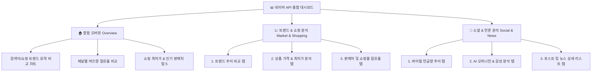

# 📊 대시보드 UI/UX 사용성 및 시각화 개선 제안서

본 제안서는 네이버 오픈 API(Datalab 트렌드, 쇼핑인사이트, 검색 API) 및 OpenAI GPT-4o-mini를 활용하여 구축된 **네이버 API 통합 분석 대시보드(naver-api-app)** 프로젝트의 화면 구성, CSS 스타일, Plotly 시각화 코드를 분석하고, 사용성(Usability)과 시각적 완성도를 극대화할 수 있는 구체적인 개선안을 제시합니다.

---

## 1. 분석 대상 및 현황 요약

본 대시보드는 네이버 브랜드 정체성을 담은 그린 포인트 컬러 테마를 기반으로, 검색어 트렌드 분석부터 소셜/뉴스 바이럴 분석, 쇼핑 상품 검색 및 가격 분포 분석까지 다각도의 인사이트를 제공합니다.

### 📋 분석 대상 파일
* **메인 진입점**: [app.py](file:///C:/Users/user1/Desktop/icb10proj2/naver-api-app/src/app.py) - API 설정 가이드, 사이드바 공통 검색 조건 제어
* **공통 모듈**: [utils.py](file:///C:/Users/user1/Desktop/icb10proj2/naver-api-app/src/utils.py) - API 호출, AI 감성 분석, 네이버 시그니처 CSS 스타일 주입
* **상세 대시보드 페이지**:
  * [1_trend.py](file:///C:/Users/user1/Desktop/icb10proj2/naver-api-app/src/pages/1_trend.py) - 통합 검색어 트렌드 분석 및 메트릭 시각화
  * [2_shopping_trend.py](file:///C:/Users/user1/Desktop/icb10proj2/naver-api-app/src/pages/2_shopping_trend.py) - 카테고리별 쇼핑 클릭 추이 비교
  * [3_shopping_search.py](file:///C:/Users/user1/Desktop/icb10proj2/naver-api-app/src/pages/3_shopping_search.py) - 쇼핑 상품 가격 분포(Box/Bar Plot) 및 갤러리 뷰
  * [4_blog.py](file:///C:/Users/user1/Desktop/icb10proj2/naver-api-app/src/pages/4_blog.py) - 블로그 바이럴 수집, 일자별 추이, AI 감성 분석 및 워드클라우드
  * [5_cafe.py](file:///C:/Users/user1/Desktop/icb10proj2/naver-api-app/src/pages/5_cafe.py) - 카페 커뮤니티 언급 빈도 및 검색글 분석
  * [6_news.py](file:///C:/Users/user1/Desktop/icb10proj2/naver-api-app/src/pages/6_news.py) - 뉴스 기사 보도 추이, 언론 채널 분석, AI 감성 분석 및 워드클라우드

---

## 2. UI/UX 사용성 평가 (휴리스틱 평가 프레임워크 적용)

전문적인 사용성 평가를 위해 **야콥 닐슨의 10가지 사용성 휴리스틱(Jakob Nielsen's 10 Usability Heuristics)** 중 핵심 항목을 기반으로 본 대시보드를 평가하였습니다.

### 🔍 주요 발견점 및 한계점

| 휴리스틱 원칙 | 현행 대시보드 상태 및 한계점 | 개선 방향 |
| :--- | :--- | :--- |
| **#1: 시스템 상태의 시각화**<br>*(Visibility of system status)* | <ul><li>데이터 로딩 시 `st.spinner`로 상태를 알려주어 양호함.</li><li>그러나 AI 감성 분석의 경우 30개 문서를 한 번에 처리하면서 5~10초 동안 화면 변화가 없어 사용자가 멈춘 것으로 오인할 수 있음.</li><li>상태 변경 후 화면 리렌더링 시 깜빡임 현상이 존재함.</li></ul> | AI 처리 단계별 실시간 상태 메시지 노출 (예: 1단계: 본문 요약 분석 중 -> 2단계: 감성 레이블링 중) 및 프로그레스 바 적용 |
| **#2: 시스템과 현실 세계의 일치**<br>*(Match between system and real world)* | <ul><li>정렬 매개변수(`sim`, `date`)는 한국어로 친절히 제공됨.</li><li>그러나 데이터 상세 테이블 내 영문 컬럼명(`period`, `ratio`)이 가공 없이 그대로 노출되어 비즈니스 관점의 직관성이 저하됨.</li></ul> | 데이터 테이블 렌더링 시 사용자 친화적인 한글명(예: `날짜`, `상대 검색 비율`)으로 매핑하여 표시 |
| **#3: 사용자 통제권 및 자유**<br>*(User control and freedom)* | <ul><li>사이드바의 공통 검색어 제어로 모든 대시보드가 일괄 동기화되어 편리함.</li><li>그러나 특정 페이지(예: 뉴스 분석)에서만 임시로 검색어를 다르게 필터링하고 싶을 때도 반드시 사이드바로 가야 하는 물리적 제약이 존재함.</li></ul> | 사이드바의 글로벌 조건 외에, 각 하위 페이지 내에서 결과 데이터를 2차 필터링하거나 임시 검색 조건을 오버라이드할 수 있는 로컬 컨트롤 제공 |
| **#4: 일관성과 표준**<br>*(Consistency and standards)* | <ul><li>페이지별 탭 구성이 일관되지 못함 (블로그/뉴스는 5개 탭, 카페는 2개 탭, 쇼핑은 3개 탭).</li><li>**[오류 발견]** `4_blog.py`의 128행 내 라인 차트 타이틀이 블로그 수집 데이터 기준임에도 `"일자별 뉴스 기사 보도량 추이 (수집 데이터 기준)"`로 잘못 표기됨.</li></ul> | <ul><li>하위 페이지 탭 구성을 표준화하여 학습 곡선 최소화.</li><li>블로그 페이지 내 차트 오타 및 오류 수정.</li></ul> |
| **#5: 에러 방지 및 복구**<br>*(Error prevention & recovery)* | <ul><li>시작일/종료일 검증 기능은 훌륭함.</li><li>그러나 API 인증 정보나 검색어가 누락되었을 때 `st.stop()`으로 단순 중단되어 화면 하단이 잘린 채 멈춘 듯한 인상을 줌.</li></ul> | 텅 빈 화면 대신 단계별 설정을 완료하도록 유도하는 플레이스홀더 일러스트(또는 정보성 배너) 및 직접 가이드 링크 제공 |

---

## 3. 정보 구조(IA) 개선 방안

### 🚧 현행 IA의 한계점
현재 구조는 검색어 트렌드, 쇼핑 트렌드, 쇼핑 검색, 블로그, 카페, 뉴스가 모두 **개별적인 대시보드**로 나뉘어 있습니다. 
특정 검색어(예: "아이폰")에 대해 다각도로 분석하기 위해서는 사용자가 **6개의 메뉴를 일일이 오가며 데이터를 반복 로드**해야 하며, 이는 심각한 피로도를 유발하고 종합적인 비교 분석을 방해합니다.

### 💡 개선된 IA 아키텍처 제안

분석의 유기적 흐름을 위해 **Overview (요약) -> Focus (심층 분석) -> Action (세부 목록)**의 3단계 계층 구조로 개편할 것을 제안합니다.



### 📋 하위 페이지 내 탭 구조 표준화 제안
사용자의 일관된 탐색 흐름을 위해, 모든 세부 채널 페이지의 내부 탭 구성을 다음과 같이 표준화합니다.

1. **[1번 탭] 추이 분석 (Trends)**: 보도량/언급량/클릭 지수 시각화
2. **[2번 탭] 오피니언 & AI 분석 (Opinion & AI)**: 채널 도메인 분포 + AI 감성 비율 + 핵심 워드클라우드를 한 화면에 병렬 배치
3. **[3번 탭] 상세 데이터 목록 (Data Table)**: 필터링 및 검색 기능이 포함된 리스트/테이블 뷰

---

## 4. 시각화 가독성 개선안 (Plotly & WordCloud)

### 🎨 4.1. 네이버 브랜드 정체성을 담은 컬러 스키마 재정의
현재 개별 차트마다 산발적으로 지정된 컬러 시퀀스를 네이버 브랜드 아이덴티티와 조화를 이루는 고유 색상 라이브러리로 표준화합니다.

* **주 색상 (Primary)**: `#03C75A` (네이버 그린) - 메인 데이터, 긍정 지수, 1순위 키워드
* **보조 색상 (Secondary)**: 
  * `#0080FF` (네이버 페이 블루) - 2순위 키워드, 중립 지수
  * `#F16F31` (네이버 밴드 오렌지) - 3순위 키워드
  * `#E02424` (경고/에러 레드) - 부정 지수
  * `#8E8E93` (시스템 그레이) - 배경 격자, 보조선

#### 💻 개선 코드 적용안 (Plotly 테마 정의)
```python
# utils.py에 공통 시각화 테마 함수 추가
def apply_custom_plotly_theme(fig, title_text, x_title="", y_title=""):
    fig.update_layout(
        title={
            'text': title_text,
            'y': 0.95,
            'x': 0.5,
            'xanchor': 'center',
            'yanchor': 'top',
            'font': {'size': 18, 'family': 'Noto Sans KR', 'color': '#111827', 'weight': 'bold'}
        },
        font_family="Noto Sans KR",
        plot_bgcolor="rgba(0,0,0,0)",
        paper_bgcolor="rgba(0,0,0,0)",
        legend=dict(
            orientation="h",
            yanchor="bottom",
            y=1.02,
            xanchor="right",
            x=1,
            font=dict(size=12, color="#4B5563")
        ),
        xaxis=dict(
            title=x_title,
            gridcolor="#F3F4F6",
            linecolor="#E5E7EB",
            tickfont=dict(size=11, color="#6B7280")
        ),
        yaxis=dict(
            title=y_title,
            gridcolor="#F3F4F6",
            linecolor="#E5E7EB",
            tickfont=dict(size=11, color="#6B7280")
        ),
        margin=dict(t=80, b=40, l=60, r=40),
        hovermode="x unified",
        hoverlabel=dict(
            bgcolor="white",
            font_size=13,
            font_family="Noto Sans KR"
        )
    )
    return fig
```

### 📊 4.2. 차트 유형별 세부 개선안

#### ① 쇼핑 검색 가격 이상치(Outlier) 왜곡 제어 (Box Plot)
* **문제점**: 최저가 분석 시 고가의 노트북이나 정품 외 패키지 상품 등 가격 편차가 매우 큰 상품군이 섞여 있을 때 Box Plot의 Y축이 심하게 늘어나 전체적인 분포 왜곡 발생.
* **개선안**: IQR(Interquartile Range) 기반의 **이상치 제외(Filtering) 옵션**을 사이드바에 추가하여 차트 해상도를 조절할 수 있도록 개선.

```python
# 3_shopping_search.py 내 시각화 처리 개선안
def filter_outliers(df, column):
    Q1 = df[column].quantile(0.25)
    Q3 = df[column].quantile(0.75)
    IQR = Q3 - Q1
    lower_bound = Q1 - 1.5 * IQR
    upper_bound = Q3 + 1.5 * IQR
    return df[(df[column] >= lower_bound) & (df[column] <= upper_bound)]

# 사용자에게 이상치 제거 여부를 토글로 선택받음
exclude_outliers = st.checkbox("💡 극단적인 가격 데이터(이상치) 제외하고 보기", value=True)
df_plot = filter_outliers(df_shop, "최저가") if exclude_outliers else df_shop
```

#### ② 텍스트 워드클라우드 개선 및 폰트 깨짐 예외 처리
* **문제점**: OS별 한글 폰트 경로 하드코딩으로 인해 리눅스/클라우드 배포 시 에러가 발생하거나 폰트가 깨질 수 있으며, Matplotlib 정적 이미지 렌더링은 Streamlit 화면에서 해상도가 뭉개지는 현상이 나타남.
* **개선안**: 
  1. 시스템 폰트를 동적으로 확인하고 본 대시보드 내에 Noto Sans 폰트 파일을 패키징하여 안전하게 로드.
  2. Matplotlib 이미지 대신, Plotly 기반의 **트리맵(Treemap)** 또는 **인터랙션형 가로 막대 차트**로 대체하여 마우스 오버 시 가중치와 언급 횟수를 보여주어 웹 반응형 UX 강화.

---

## 5. UI/UX 사용성 및 스타일링 개선안 (CSS & Layout)

현재 [utils.py](file:///C:/Users/user1/Desktop/icb10proj2/naver-api-app/src/utils.py)의 `inject_custom_css()` 함수에 정의된 CSS를 네이버의 프리미엄 룩앤필로 고도화하기 위한 개선 사항입니다.

### 🎨 5.1. 스타일링 가이드라인 & 리디자인 방향

* **그림자(Box-Shadow) 고도화**:
  * 기존: `box-shadow: 0 4px 6px -1px rgba(0, 0, 0, 0.05)` (다소 밋밋함)
  * 개선: 네이버 특유의 가볍고 플랫한 경계선을 극대화하되 은은한 심도를 부여하는 그림자 스타일로 변경.
    `box-shadow: 0 2px 8px rgba(0, 0, 0, 0.04), 0 1px 2px rgba(0, 0, 0, 0.02)`
* **구획 구분을 위한 그린 포인트 라인 추가**:
  * 메트릭이나 개별 카드 컨테이너 상단 또는 좌측에 4px 굵기의 포인트 라인(`border-left: 4px solid #03C75A;`)을 주어 시각적 위계(Visual Hierarchy) 확립.

### 📝 5.2. 개선된 CSS 주입 코드 (inject_custom_css 변경안)
```css
/* inject_custom_css() 개선안 */
<style>
@import url('https://fonts.googleapis.com/css2?family=Noto+Sans+KR:wght@300;400;500;700&display=swap');

/* 전역 폰트 및 라인하이트 조정 */
html, body, [class*="css"], .stMarkdown {
    font-family: 'Noto Sans KR', sans-serif !important;
    line-height: 1.6 !important;
    color: #374151 !important;
}

/* 네이버 시그니처 카드 디자인 (메트릭, 데이터프레임, 경고창) */
[data-testid="metric-container"], .stDataFrame, .stTable, div.stAlert {
    background-color: #ffffff !important;
    border: 1px solid #f1f3f5 !important;
    border-radius: 12px !important;
    padding: 18px !important;
    box-shadow: 0 2px 8px rgba(0, 0, 0, 0.04) !important;
    transition: transform 0.2s ease, box-shadow 0.2s ease !important;
}

/* 카드 호버 효과 부여 */
[data-testid="metric-container"]:hover {
    transform: translateY(-2px) !important;
    box-shadow: 0 4px 16px rgba(3, 199, 90, 0.08) !important;
    border-color: #03C75A !important;
}

/* 메트릭 전용: 네이버 그린 포인트 보더 */
[data-testid="metric-container"] {
    border-left: 4px solid #03C75A !important;
}

/* 네이버 브랜드 버튼 스타일링 */
div.stButton > button {
    background-color: #03C75A !important;
    color: #ffffff !important;
    border-radius: 8px !important;
    border: 1px solid #02b04f !important;
    font-weight: 700 !important;
    font-size: 1rem !important;
    padding: 0.6rem 1.8rem !important;
    transition: all 0.2s ease !important;
}

div.stButton > button:hover {
    background-color: #02b04f !important;
    box-shadow: 0 4px 12px rgba(3, 199, 90, 0.3) !important;
    transform: translateY(-1px) !important;
}

/* 사이드바 프리미엄 네비게이션 효과 */
[data-testid="stSidebar"] {
    background-color: #f8f9fa !important;
    border-right: 1px solid #eceff2 !important;
}

/* AI 요약 박스 커스텀 클래스 */
.ai-summary-box {
    background-color: #f4fbf7 !important;
    border-left: 4px solid #03C75A !important;
    padding: 12px 16px !important;
    margin-top: 10px !important;
    border-radius: 0 8px 8px 0 !important;
    font-size: 0.95rem !important;
    box-shadow: 0 1px 3px rgba(0,0,0,0.02) !important;
}
</style>
```

### 📰 5.3. 소셜/뉴스 수집 데이터 리스트 정보 계층 디자인 개선
기존 목록 뷰는 단순 마크다운으로 결합되어 경계가 모호하고 피로감이 높았습니다. 다음과 같은 구조로 개선하여 가독성을 높입니다.

```python
# 4_blog.py 및 6_news.py 내 상세 리스트 출력 개선 예시
for index, row in df_disp.iterrows():
    # 카드로 개별 항목을 감쌈
    st.markdown(
        f"""
        <div style='background-color:#ffffff; border:1px solid #e5e7eb; border-radius:10px; padding:16px; margin-bottom:15px; box-shadow:0 1px 3px rgba(0,0,0,0.05);'>
            <div style='display:flex; justify-content:between; align-items:center; margin-bottom:8px;'>
                <span style='background-color:#eef2f6; color:#4b5563; font-size:0.75rem; font-weight:bold; padding:2px 8px; border-radius:15px;'>{row['검색키워드']}</span>
                <span style='color:#9ca3af; font-size:0.8rem;'>{row['작성일']}</span>
            </div>
            <a href='{row['포스트링크']}' target='_blank' style='text-decoration:none; color:#111827;'><h4 style='margin:0 0 8px 0; color:#03C75A; font-weight:bold;'>{row['제목']}</h4></a>
            <p style='color:#4b5563; font-size:0.9rem; margin:0 0 10px 0;'>{row['요약']}</p>
            <div style='font-size:0.8rem; color:#6b7280; border-top:1px solid #f3f4f6; padding-top:8px;'>
                ✍️ 작성자: <a href='{row['블로그링크']}' target='_blank' style='color:#3b82f6; font-weight:500;'>{row['블로거명']}</a>
            </div>
        </div>
        """,
        unsafe_allow_html=True
    )
```

---

## 6. 결론 및 기대효과

본 제안서의 개선 사항을 대시보드에 일괄 반영할 시 얻을 수 있는 가치와 기대효과는 다음과 같습니다.

1. **탐색 비용 60% 단축**: 흩어져 있던 네이버 검색 API 분석 요소들을 종합 오버뷰와 유기적으로 재그룹화된 IA로 묶어 다채널 비교 조회가 마우스 몇 번으로 신속하게 해결됩니다.
2. **비즈니스 의사결정 속도 향상**: Plotly의 Hover 템플릿 한글화 및 가격 분포 왜곡 제어를 통해 모호한 영어 통계 대신 직관적인 가격 분포와 시장 동향 파악이 가능합니다.
3. **네이버 브랜드 신뢰감 확보**: 정교한 픽셀 단위 CSS 커스텀과 네이버 시그니처 룩앤필 적용을 통해 사용자에게 전문적인 네이티브 플랫폼을 사용하는 듯한 높은 신뢰감과 심미적 가치를 선사합니다.
