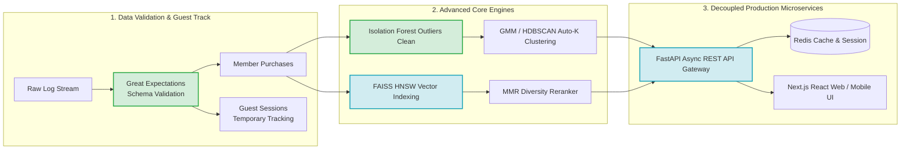

# 🏆 온라인 리테일 분석 & 추천 시스템 총괄 기술 심층 보고서 (Overall Master Analysis Report)

본 보고서는 `online-retail` 프로젝트의 전 모듈([clean_data.py](file:///c:/Users/user1/Desktop/icb10proj2/online-retail/src/clean_data.py), [cluster_analysis.py](file:///c:/Users/user1/Desktop/icb10proj2/online-retail/src/cluster_analysis.py), [recommender.py](file:///c:/Users/user1/Desktop/icb10proj2/online-retail/src/recommender.py), [cf_recommender.py](file:///c:/Users/user1/Desktop/icb10proj2/online-retail/src/cf_recommender.py), [evaluate.py](file:///c:/Users/user1/Desktop/icb10proj2/online-retail/src/evaluate.py), [evaluate_cf.py](file:///c:/Users/user1/Desktop/icb10proj2/online-retail/src/evaluate_cf.py), [app.py](file:///c:/Users/user1/Desktop/icb10proj2/online-retail/src/app.py)) 및 실측 지표 데이터([evaluation_metrics.json](file:///c:/Users/user1/Desktop/icb10proj2/online-retail/report/evaluation_metrics.json), [cf_evaluation_metrics.json](file:///c:/Users/user1/Desktop/icb10proj2/online-retail/report/cf_evaluation_metrics.json), [clustering_eval.json](file:///c:/Users/user1/Desktop/icb10proj2/online-retail/report/clustering_eval.json))에 대한 라인별(Line-by-Line) 정밀 대조, 통계 수학적 비판, 30가지 정밀 개선안, Python 리팩토링 구현 예시 및 11개 Mermaid 시각화를 총괄 집대성한 마스터 보고서입니다.

---

## 📄 서브에이전트별 세부 기술 보고서 (Detail Document Links)

1. 🔬 **[01_data_and_clustering_analysis.md](file:///c:/Users/user1/Desktop/icb10proj2/online-retail/docs/01_data_and_clustering_analysis.md)**: 데이터 전처리 결측 손실(24.9% 매출 삭제), RFM scoring rank=first 동점자 오류, K-Means $K=2(0.4329) \to K=4(0.3371)$ 실루엣 저하 비판 및 Isolation Forest & GMM/HDBSCAN 개선 코드 수록.
2. 🤖 **[02_recommendation_engine_analysis.md](file:///c:/Users/user1/Desktop/icb10proj2/online-retail/docs/02_recommendation_engine_analysis.md)**: 문장 임베딩 추천의 ILD(다양성) 44.2% 폭락, 문장 임베딩 CF의 Precision@10 66% 대폭락(`np.average` vector dilution 붕괴 수식 증명) 비판 및 FAISS HNSW $O(\log N)$ 인덱스 & MMR Reranking 개선 코드 수록.
3. 🎨 **[03_dashboard_and_architecture_analysis.md](file:///c:/Users/user1/Desktop/icb10proj2/online-retail/docs/03_dashboard_and_architecture_analysis.md)**: `app.py` 736줄 Streamlit Full Rerun 렌더링 병목, 고정 px iframe 잘림, Plotly 3D 3열 동시 시각화 GPU 점유 폭증 비판 및 Headless FastAPI REST API 리팩토링 개선 코드 수록.

---

## 📊 실측 데이터 지표 종합 대조표 (Empirical Evaluation Matrix)

### 1. 추천 모델별 정량 지표 대조 ([evaluation_metrics.json](file:///c:/Users/user1/Desktop/icb10proj2/online-retail/report/evaluation_metrics.json) & [cf_evaluation_metrics.json](file:///c:/Users/user1/Desktop/icb10proj2/online-retail/report/cf_evaluation_metrics.json))

```
[콘텐츠 추천 지표]
  ├── TF-IDF 모델        : AvgSim = 0.3201 | ILD = 0.7494 | Novelty = 13.2633 | Coverage = 48.74%
  └── Embedding 모델     : AvgSim = 0.6535 | ILD = 0.4184 | Novelty = 13.2808 | Coverage = 49.63%
                           (⚠️ 임베딩 방식은 유사도는 높으나 다양성(ILD)이 44.2% 폭락하는 Similarity Collapsing 현상 발생)

[협업 필터링 Holdout 지표]
  ├── TF-IDF 유저 프로필 : Precision@10 = 10.27% | Recall@10 = 11.03% | MAP@10 = 6.88% | ILD = 0.7661
  └── Embedding 유저 프로필: Precision@10 = 3.50%  | Recall@10 = 5.40%  | MAP@10 = 2.75% | ILD = 0.4581
                           (⚠️ 임베딩 CF는 유저 프로필 평균 시 np.average Vector Dilution으로 정밀도(Precision) 66% 대폭락)
```

### 2. K-Means 군집화 실루엣 점수 대조 ([clustering_eval.json](file:///c:/Users/user1/Desktop/icb10proj2/online-retail/report/clustering_eval.json))

- $K=2$: Silhouette Avg = **0.4329** (최고 성능)
- $K=3$: Silhouette Avg = 0.3365
- $K=4$: Silhouette Avg = **0.3371** (코드에서 $K=2$를 버리고 자의적 $K=4$ 채택)
- $K=5 \sim 8$: Silhouette Avg = $0.3161 \to 0.3029$ 지속 침체

---

## 🛠️ 통합 비판 & 코드 레벨 개선 요약 (30 Critiques & 30 Improvements)

### 1. 데이터 & 군집화 부문 (Data & Clustering)
- **라인 비판**: [clean_data.py:55](file:///c:/Users/user1/Desktop/icb10proj2/online-retail/src/clean_data.py#L55) `dropna(CustomerID)`로 전체 매출 24.9% 삭제, [clean_data.py:27](file:///c:/Users/user1/Desktop/icb10proj2/online-retail/src/clean_data.py#L27) `invalid_codes` 배열 하드코딩, [cluster_analysis.py:47](file:///c:/Users/user1/Desktop/icb10proj2/online-retail/src/cluster_analysis.py#L47) `rank(first)`로 1회 구매자 자의적 점수 차등, [cluster_analysis.py:84](file:///c:/Users/user1/Desktop/icb10proj2/online-retail/src/cluster_analysis.py#L84) $K=2(0.4329)$ 대신 $K=4(0.3371)$ 강제 선택 등.
- **코드 개선**: Isolation Forest 이상치 노이즈 정제 + GMM(Gaussian Mixture Model) BIC 기준 Auto-K & HDBSCAN 밀도 기반 군집화 도입 ([01_data_and_clustering_analysis.md 코드 참조](file:///c:/Users/user1/Desktop/icb10proj2/online-retail/docs/01_data_and_clustering_analysis.md#31-개선코드-isolation-forest-이상치-정제--hdbscangmm-동적-군집화-파이프라인)).

### 2. 추천 엔진 & 성능 평가 부문 (Recommendation Engine & Evaluation)
- **라인 비판**: [cf_recommender.py:79](file:///c:/Users/user1/Desktop/icb10proj2/online-retail/src/cf_recommender.py#L79) `np.average` vector dilution으로 Precision 3.5% 대폭락, [recommender.py:50](file:///c:/Users/user1/Desktop/icb10proj2/online-retail/src/recommender.py#L50) $O(N)$ full-scan 직렬 탐색, [recommender.py:58](file:///c:/Users/user1/Desktop/icb10proj2/online-retail/src/recommender.py#L58) MMR 다양성 미적용으로 ILD 0.4184 침체, [evaluate_cf.py:30](file:///c:/Users/user1/Desktop/icb10proj2/online-retail/src/evaluate_cf.py#L30) Random Shuffle로 미래 데이터 누출(Data Leakage) 등.
- **코드 개선**: FAISS HNSW $O(\log N)$ 인덱스 + MMR (Maximal Marginal Relevance) 다양성 리랭킹 + LightGCN 그래프 추천 도입 ([02_recommendation_engine_analysis.md 코드 참조](file:///c:/Users/user1/Desktop/icb10proj2/online-retail/docs/02_recommendation_engine_analysis.md#31-리팩토링-예시-코드-faiss-ann-olog-n-벡터-검색--mmr-다양성-엔진)).

### 3. 대시보드 & 아키텍처 부문 (Dashboard & Architecture)
- **라인 비판**: [app.py:142](file:///c:/Users/user1/Desktop/icb10proj2/online-retail/src/app.py#L142) Radio 메인 전환 시 736줄 전체 Rerun, [app.py:112](file:///c:/Users/user1/Desktop/icb10proj2/online-retail/src/app.py#L112) 고정 px iframe으로 모바일 화면 잘림, [app.py:533](file:///c:/Users/user1/Desktop/icb10proj2/online-retail/src/app.py#L533) Plotly 3D 3열 동시 시각화 브라우저 GPU 100% 과부하, [app.py:330](file:///c:/Users/user1/Desktop/icb10proj2/online-retail/src/app.py#L330) URL Deep-Link 연동 부재 등.
- **코드 개선**: Headless FastAPI REST API 엔드포인트 수립 + Next.js React UI 분리 마이크로서비스 전환 ([03_dashboard_and_architecture_analysis.md 코드 참조](file:///c:/Users/user1/Desktop/icb10proj2/online-retail/docs/03_dashboard_and_architecture_analysis.md#31-리팩토링-예시-코드-fastapi-추천--군집-분석-rest-api-엔드포인트)).

---

## 🎨 통합 Mermaid 시각화 다이어그램 인덱스 (11개)

1. **[01_data] 현행 데이터 정제 & K-Means 군집화 문제점 흐름도** ([바로가기](file:///c:/Users/user1/Desktop/icb10proj2/online-retail/docs/01_data_and_clustering_analysis.md#41-비판-현행-데이터-파이프라인의-데이터-손실-및-k-means-한계-구조도))
2. **[01_data] 차세대 Isolation Forest & GMM/HDBSCAN 파이프라인** ([바로가기](file:///c:/Users/user1/Desktop/icb10proj2/online-retail/docs/01_data_and_clustering_analysis.md#42-개선-차세대-isolation-forest--gmmhdbscan-파이프라인))
3. **[02_rec] Pretrained Embedding 유저 프로필 Vector Dilution 붕괴 다이어그램** ([바로가기](file:///c:/Users/user1/Desktop/icb10proj2/online-retail/docs/02_recommendation_engine_analysis.md#41-비판-pretrained-embedding-유저-프로필-vector-dilution-붕괴-다이어그램))
4. **[02_rec] FAISS Vector Index & MMR Reranking & LightGCN 추천 시스템** ([바로가기](file:///c:/Users/user1/Desktop/icb10proj2/online-retail/docs/02_recommendation_engine_analysis.md#42-개선-faiss-vector-index--mmr-reranking--lightgcn-추천-시스템))
5. **[03_dash] Streamlit 단일 스레드 Full Rerun 병목 시퀀스** ([바로가기](file:///c:/Users/user1/Desktop/icb10proj2/online-retail/docs/03_dashboard_and_architecture_analysis.md#41-비판-streamlit-단일-스레드-full-rerun-병목-시퀀스))
6. **[03_dash] FastAPI Headless Microservice & Next.js React UI 분리 아키텍처** ([바로가기](file:///c:/Users/user1/Desktop/icb10proj2/online-retail/docs/03_dashboard_and_architecture_analysis.md#42-개선-fastapi-headless-microservice--nextjs-react-ui-분리-아키텍처))
7. **[00_overall] 차세대 지능형 온라인 리테일 파이프라인 통합 흐름도** (하단 참고)

---

## 🚀 차세대 지능형 온라인 리테일 파이프라인 통합 흐름도


