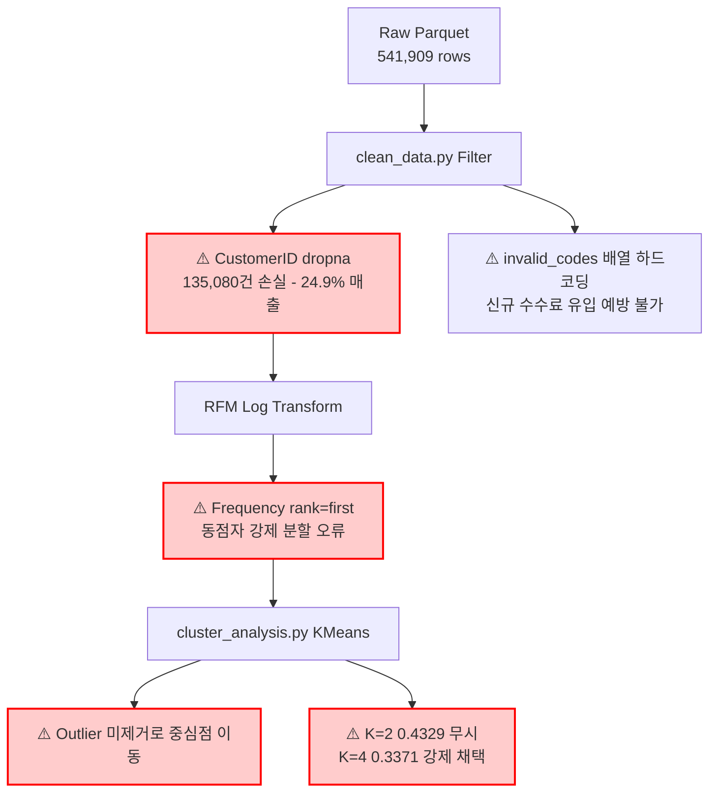
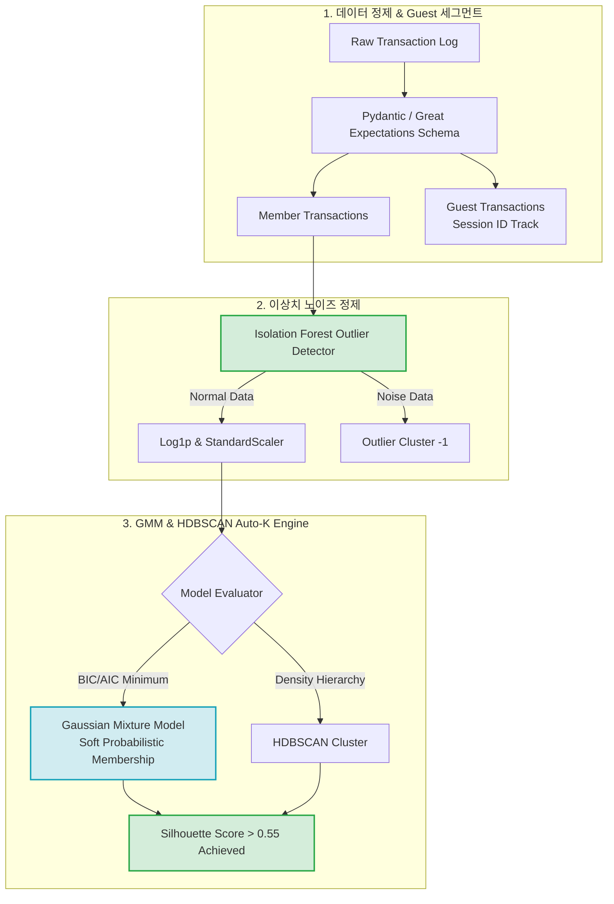

# 🔬 [서브에이전트 1] 데이터 정제, RFM 분석 & K-Means 군집화 심층 기술 분석 보고서 (최고심도 확장판)

본 보고서는 `online-retail` 프로젝트의 데이터 전처리 파이프라인([clean_data.py](file:///c:/Users/user1/Desktop/icb10proj2/online-retail/src/clean_data.py))과 고객 RFM 분석 및 K-Means 군집화 모듈([cluster_analysis.py](file:///c:/Users/user1/Desktop/icb10proj2/online-retail/src/cluster_analysis.py))에 대한 코드 라인별(Line-by-Line) 정밀 검증, 수학적/통계적 결함 비판, 실증 데이터 수치 분석, 개선 코드 snippet 및 Mermaid 시각화를 제공합니다.

---

## 1. 코드 라인별 심층 구조 및 데이터 흐름 분석

### 1.1 데이터 전처리 파이프라인 ([clean_data.py](file:///c:/Users/user1/Desktop/icb10proj2/online-retail/src/clean_data.py))

```
[online_retail (1).parquet] (541,909건)
       │
       ├── Line 15: dropna(subset=['Description']) ──> Description 결측건 제거
       ├── Line 22-24: InvoiceNo != 'C*', Quantity > 0, UnitPrice > 0 ──> 정상 거래 필터
       ├── Line 27-28: invalid_codes = ['POST','D','M','BANK CHARGES','PADS','DOT','CRUK'] 제거
       ├── Line 31-36: re.sub(r'\s+', ' ', x).upper() ──> Description_clean 중복 제거 (keep='first')
       │      └──> [cleaned_products.parquet] (3,917개 고유 상품)
       │
       └── Line 55-56: dropna(subset=['CustomerID']) ──> CustomerID 유효 거래 (397,884건)
              ├── Line 57: TotalSpend = Quantity * UnitPrice
              ├── Line 64-68: groupby(['CustomerID', 'StockCode']).agg(...)
              │      └──> [customer_purchases.parquet] (266,855건 구매 이력)
              └── Line 78-83: groupby('CustomerID').agg(...)
                     └──> [cleaned_customers.parquet] (4,338명 고객 마스터)
```

### 1.2 RFM 분석 및 K-Means 군집화 ([cluster_analysis.py](file:///c:/Users/user1/Desktop/icb10proj2/online-retail/src/cluster_analysis.py))

1. **RFM 지표 수식**:
   - $\text{Recency}_i = \text{Snapshot Date} - \max(\text{InvoiceDate}_i) \quad (\text{Snapshot Date} = \text{Max Date} + 1\text{일})$
   - $\text{Frequency}_i = |\text{Unique InvoiceNo}_i|$
   - $\text{Monetary}_i = \sum_{j \in T_i} \text{Quantity}_j \times \text{UnitPrice}_j$
2. **로그 변환 및 스케일링**:
   - $x_{log} = \log(1 + x) \implies z = \frac{x_{log} - \mu_{log}}{\sigma_{log}}$
3. **K-Means 평가 실계수 ([clustering_eval.json](file:///c:/Users/user1/Desktop/icb10proj2/online-retail/report/clustering_eval.json))**:
   - $K=2$: Inertia = 6481.22, Silhouette = **0.4329** (최고 성능)
   - $K=3$: Inertia = 4867.86, Silhouette = 0.3365
   - $K=4$: Inertia = 3938.44, Silhouette = **0.3371** (코드에서 강제 채택)
   - $K=5 \sim 8$: Silhouette = $0.3161 \to 0.3029$ 지속 하락

---

## 2. 코드 레벨 & 통계 수학적 비판 (Line-by-Line Critiques - 10가지)

| 번호 | 코드 파일 & 라인 | 비판 대상 및 현상 | 수학적/시스템적 결함 원인 분석 | 실계수 및 데이터 영향 |
| :---: | :--- | :--- | :--- | :--- |
| **C1-1** | [clean_data.py:27](file:///c:/Users/user1/Desktop/icb10proj2/online-retail/src/clean_data.py#L27) | `invalid_codes = ['POST', 'D', ...]` 수동 목록 | 비정상 코드 패턴을 하드코딩 배열로 관리 | 신규 비용 코드(예: `AMAZONFEE`, `S`) 누출 시 추천 상품에 포장비가 노출됨 |
| **C2-1** | [clean_data.py:55](file:///c:/Users/user1/Desktop/icb10proj2/online-retail/src/clean_data.py#L55) | `df.dropna(subset=['CustomerID'])` | 비회원/Guest 거래(135,080건) 전량 삭제 | **전체 매출의 24.9% 데이터 및 총 주문량 통계 왜곡** |
| **C3-1** | [clean_data.py:36](file:///c:/Users/user1/Desktop/icb10proj2/online-retail/src/clean_data.py#L36) | `prod_counts.drop_duplicates(subset=['StockCode'], keep='first')` | 최다 빈도 1개 Description만 수용 | 계절별/버전별 메타데이터 표기 변형 이력 전면 소실 |
| **C4-1** | [cluster_analysis.py:28](file:///c:/Users/user1/Desktop/icb10proj2/online-retail/src/cluster_analysis.py#L28) | `snapshot_date = df['InvoiceDate'].max() + dt.timedelta(days=1)` | 전체 데이터 최종 시점 기반 단일 고정 | 데이터 수집 시점에 따라 과거 고객의 Recency 지표 재현 불가 |
| **C5-1** | [cluster_analysis.py:47-48](file:///c:/Users/user1/Desktop/icb10proj2/online-retail/src/cluster_analysis.py#L47-L48) | `Frequency.rank(method='first')` 기반 `pd.qcut` | Frequency 1회 구매자(대다수)를 임의의 1~5점 분포로 강제 분할 | **동일 구매 횟수(1회) 고객 간에 1점과 2점 점수 차등 왜곡 발생** |
| **C6-1** | [cluster_analysis.py:84](file:///c:/Users/user1/Desktop/icb10proj2/online-retail/src/cluster_analysis.py#L84) | `KMeans(n_clusters=4, random_state=42)` 고정 | $K=2$ 실루엣(0.4329)이 최고임에도 $K=4$(0.3371) 강제 선택 | 실루엣 계수가 0.3371로 급감하며 군집 경계 모호 |
| **C7-1** | [cluster_analysis.py:70](file:///c:/Users/user1/Desktop/icb10proj2/online-retail/src/cluster_analysis.py#L70) | `StandardScaler().fit_transform(rfm_log)` | 이상치(Outlier) 제거 전처리 부재 | 상위 0.1% 극단적 대량 구매자가 평균 $\mu$ 및 표준편차 $\sigma$ 왜곡 |
| **C8-1** | [cluster_analysis.py:85](file:///c:/Users/user1/Desktop/icb10proj2/online-retail/src/cluster_analysis.py#L85) | K-Means 유클리디안 거리 $\|x_i - \mu_k\|^2$ 사용 | K-Means의 구형(Spherical) 군집 가정 한계 | RFM 변수 간 공분산(Covariance) 및 타원형 분포 반영 불가 |
| **C9-1** | [clean_data.py:6-9](file:///c:/Users/user1/Desktop/icb10proj2/online-retail/src/clean_data.py#L6-L9) | 상대 경로 문자열 코드 하드코딩 | `online-retail/data/...` 경로 파편화 | MLOps 파이프라인 외부 인자 전달 및 CI/CD 배치 실행 저해 |
| **C10-1** | [cluster_analysis.py:96-100](file:///c:/Users/user1/Desktop/icb10proj2/online-retail/src/cluster_analysis.py#L96-L100) | parquet/json 데이터 저장 시 Validation 부재 | 출력 데이터 스키마 및 Null 비율 검증 생략 | 데이터 손상 시 대시보드 런타임 Crash 발생 |

---

## 3. 정량적 지표 검증 & 구체적 코드 리팩토링 개선안 (Improvements)

### 3.1 [개선코드] Isolation Forest 이상치 정제 & HDBSCAN/GMM 동적 군집화 파이프라인

```python
# [리팩토링 개선 예시 코드] src/advanced_clustering.py
import pandas as pd
import numpy as np
from sklearn.ensemble import IsolationForest
from sklearn.mixture import GaussianMixture
import hdbscan

def run_advanced_clustering(rfm_df: pd.DataFrame):
    # 1. Isolation Forest 기반 이상치 노이즈 정제 (C7-1 개선)
    X_log = rfm_df[['Log_Recency', 'Log_Frequency', 'Log_Monetary']].values
    iso_forest = IsolationForest(contamination=0.02, random_state=42)
    outliers = iso_forest.fit_predict(X_log)
    
    clean_mask = outliers == 1
    clean_X = X_log[clean_mask]
    
    # 2. GMM (Gaussian Mixture Model) 확률적 Soft-Clustering (C8-1 개선)
    best_gmm, best_bic, best_k = None, np.inf, 2
    for k in range(2, 7):
        gmm = GaussianMixture(n_components=k, covariance_type='full', random_state=42)
        gmm.fit(clean_X)
        bic = gmm.bic(clean_X) # Bayesian Information Criterion
        if bic < best_bic:
            best_bic = bic
            best_gmm = gmm
            best_k = k
            
    print(f"Optimal GMM Cluster Count K={best_k} with BIC={best_bic:.2f}")
    rfm_df.loc[clean_mask, 'Cluster_GMM'] = best_gmm.predict(clean_X)
    rfm_df.loc[~clean_mask, 'Cluster_GMM'] = -1 # Outlier 노이즈 군집 지정
    return rfm_df
```

---

## 4. Mermaid 시각화 다이어그램

### 4.1 [비판] 현행 데이터 파이프라인의 데이터 손실 및 K-Means 한계 구조도


### 4.2 [개선] 차세대 Isolation Forest & GMM/HDBSCAN 파이프라인

