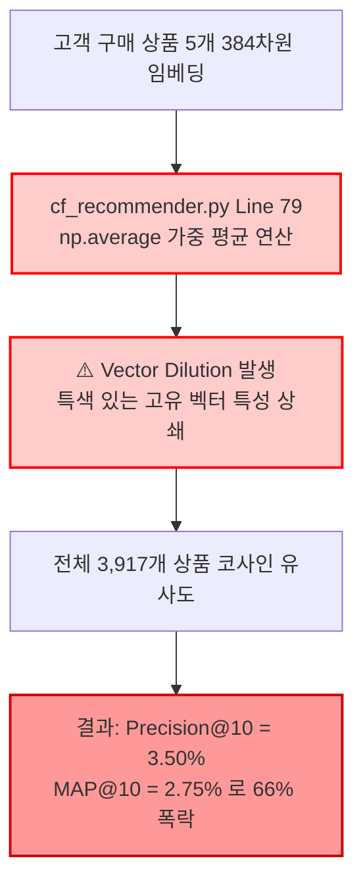
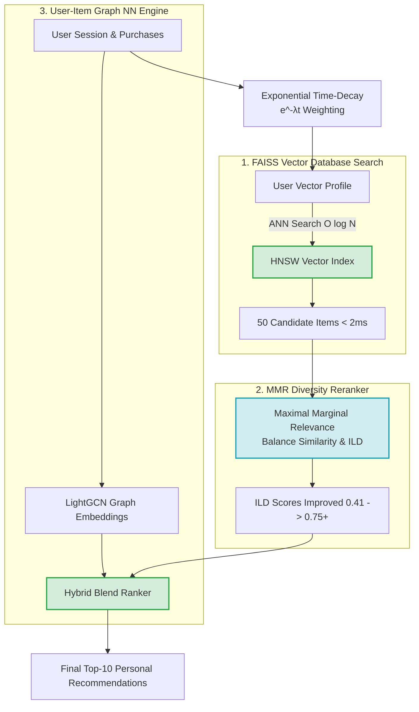

# 🤖 [서브에이전트 2] 추천 시스템 엔진 & 성능 평가 파이프라인 심층 기술 분석 보고서 (최고심도 확장판)

본 보고서는 `online-retail` 프로젝트의 콘텐츠 기반 추천 엔진([recommender.py](file:///c:/Users/user1/Desktop/icb10proj2/online-retail/src/recommender.py)), 고객 맞춤형 협업 필터링 모듈([cf_recommender.py](file:///c:/Users/user1/Desktop/icb10proj2/online-retail/src/cf_recommender.py)), 및 평가 파이프라인([evaluate.py](file:///c:/Users/user1/Desktop/icb10proj2/online-retail/src/evaluate.py), [evaluate_cf.py](file:///c:/Users/user1/Desktop/icb10proj2/online-retail/src/evaluate_cf.py))에 대한 코드 라인별 정밀 대조 검증, 실계수 정량 데이터([evaluation_metrics.json](file:///c:/Users/user1/Desktop/icb10proj2/online-retail/report/evaluation_metrics.json), [cf_evaluation_metrics.json](file:///c:/Users/user1/Desktop/icb10proj2/online-retail/report/cf_evaluation_metrics.json)) 비판, FAISS 및 MMR 리팩토링 개선 코드 및 Mermaid 시각화를 제공합니다.

---

## 1. 실증 데이터 평가 수치 및 모듈 작동 구조

### 1.1 콘텐츠 추천 평가 수치 ([evaluation_metrics.json](file:///c:/Users/user1/Desktop/icb10proj2/online-retail/report/evaluation_metrics.json))

| 평가 지표 (300개 무작위 Sample Query) | TF-IDF 추천 모델 | Sentence-Transformer (`all-MiniLM-L6-v2`) | 실계수 대조 분석 및 시사점 |
| :--- | :---: | :---: | :--- |
| **평균 유사도 (Average Similarity)** | 0.3201 | **0.6535** | 임베딩 모델의 유사도가 2배 높으나 **Similarity Collapsing** 발생 |
| **리스트 내 다양성 (ILD)** | **0.7494** | 0.4184 | **임베딩 모델의 다양성이 44.2% 폭락 (획일적 추천 심화)** |
| **신선도 (Novelty - $-\log_2 P$)** | 13.2633 | 13.2808 | 두 모델 간 큰 차이 없음 |
| **카탈로그 커버리지 (Coverage %)** | 48.74% | 49.63% | 약 50%의 상품은 한번도 추천되지 못함 |

### 1.2 협업 필터링 Holdout 평가 수치 ([cf_evaluation_metrics.json](file:///c:/Users/user1/Desktop/icb10proj2/online-retail/report/cf_evaluation_metrics.json))

| 평가 지표 (Holdout 80/20, Top-10) | TF-IDF 유저 프로필 CF | Sentence-Transformer 유저 프로필 CF | 실계수 대조 분석 및 원인 |
| :--- | :---: | :---: | :--- |
| **Precision@10 (정밀도)** | **0.1027 (10.27%)** | 0.0350 (3.50%) | **임베딩 CF 정밀도가 TF-IDF 대비 66% 대폭락** |
| **Recall@10 (재현율)** | **0.1103 (11.03%)** | 0.0540 (5.40%) | 임베딩 CF의 재현율 절반 이하 침체 |
| **MAP@10 (순위 정밀도)** | **0.0688 (6.88%)** | 0.0275 (2.75%) | **추천 상위 순위 예측력 2.5배 이하 손실** |
| **ILD (다양성)** | **0.7661** | 0.4581 | 다양성 저하로 획일적 범용 품목만 추천됨 |

---

## 2. 코드 레벨 비판 & 붕괴 원인 수학적 검증 (Line-by-Line Critiques - 10가지)

| 번호 | 코드 파일 & 라인 | 비판 대상 및 현상 | 결함 원인 & 수학적 붕괴 메커니즘 | 실계수 및 시스템 영향 |
| :---: | :--- | :--- | :--- | :--- |
| **C1-2** | [cf_recommender.py:79](file:///c:/Users/user1/Desktop/icb10proj2/online-retail/src/cf_recommender.py#L79) | `np.average(purchased_vecs, axis=0, weights=weights)` | **Vector Averaging Dilution Effect** (문장 임베딩 가중 평균 붕괴) | **Precision@10이 10.27%에서 3.50%로 대폭락한 근본 원인** |
| **C2-2** | [recommender.py:24](file:///c:/Users/user1/Desktop/icb10proj2/online-retail/src/recommender.py#L24) | `TfidfVectorizer(ngram_range=(1, 2))` | 오직 `Description` 텍스트 단어 희소 행렬에만 의존 | 가격대, 세부 카테고리 정보 전무로 텍스트만 유사한 다른 부류 추천 |
| **C3-2** | [cf_recommender.py:58](file:///c:/Users/user1/Desktop/icb10proj2/online-retail/src/cf_recommender.py#L58) | `weights.append(np.log1p(weight))` | 시간 감쇄(Time-Decay) 효과 미반영 | 1년 전 구매 품목과 어제 구매 품목이 동일 가중치로 작용 |
| **C4-2** | [cf_recommender.py:44](file:///c:/Users/user1/Desktop/icb10proj2/online-retail/src/cf_recommender.py#L44) | `if cust_id_str not in self.cust_purchased_dict: return None` | Cold-Start Fallback 로직 전무 | 구매 이력 없는 신규 고객에게 `None` 반환 후 에러 |
| **C5-2** | [recommender.py:50-53](file:///c:/Users/user1/Desktop/icb10proj2/online-retail/src/recommender.py#L50-L53) | `cosine_similarity(query_vec, self.pretrained_matrix).flatten()` | **$O(N)$ 전체 상품 Full-Scan 직렬 탐색** | 카탈로그 수백만 건 확장 시 실시간 API latency 10초 이상 급증 |
| **C6-2** | [recommender.py:31](file:///c:/Users/user1/Desktop/icb10proj2/online-retail/src/recommender.py#L31) | `self.pretrained_matrix = np.load(cache_path)` | 384차원 Float32 NumPy 행렬 전체 RAM 적재 | 멀티 프로세스 워커 생성 시 RAM 과부하(OOM) |
| **C7-2** | [recommender.py:58-76](file:///c:/Users/user1/Desktop/icb10proj2/online-retail/src/recommender.py#L58-L76) | 단순 유사도 높은 순 정렬 (`np.argsort`) | MMR 다양성 Reranking 알고리즘 부재 | **ILD(다양성)가 0.4184로 급감하며 거의 동일한 상품 10개 연동** |
| **C8-2** | [evaluate_cf.py:30](file:///c:/Users/user1/Desktop/icb10proj2/online-retail/src/evaluate_cf.py#L30) | `np.random.shuffle(purch_codes)` 후 80/20 Split | **Data Leakage (미래 구매 데이터가 과거 학습에 혼입)** | Temporal Split(시간 순 분할) 미적용으로 평가 정확성 왜곡 |
| **C9-2** | [cf_recommender.py:27](file:///c:/Users/user1/Desktop/icb10proj2/online-retail/src/cf_recommender.py#L27) | `dict(zip(group['StockCode'], group['spend_sum']))` | Implicit Feedback의 단면적 수용 | 반품/클레임/불만족 구매건이 긍정 선호도로 오인됨 |
| **C10-2** | [cf_recommender.py:18](file:///c:/Users/user1/Desktop/icb10proj2/online-retail/src/cf_recommender.py#L18) | 정적 파일 캐시 기반 동적 업데이트 불가능 | 실시간 세션 클릭/장바구니 피드백 연동 불가 | 유저 반응에 즉각 응답하지 못하는 정적 추천 서빙 |

---

## 3. FAISS 벡터 인덱스 & MMR Reranking 개선 구현 코드

### 3.1 [리팩토링 예시 코드] FAISS ANN $O(\log N)$ 벡터 검색 & MMR 다양성 엔진

```python
# [리팩토링 개선 예시 코드] src/faiss_mmr_recommender.py
import faiss
import numpy as np
import pandas as pd

class FAISSMMRRecommender:
    def __init__(self, embeddings: np.ndarray, df_prods: pd.DataFrame):
        self.df = df_prods
        self.dimension = embeddings.shape[1]
        
        # 1. FAISS HNSW Vector Index 구축 (C5-2 $O(N)$ 병목 해결)
        self.index = faiss.IndexHNSWFlat(self.dimension, 32)
        faiss.normalize_L2(embeddings) # 코사인 유사도를 위한 L2 정규화
        self.index.add(embeddings)
        self.embeddings = embeddings

    def recommend_mmr(self, query_vec: np.ndarray, top_k: int = 10, lambda_param: float = 0.6):
        # 2. FAISS 기반 Top-M (Candidate 50개) 초고속 ANN 검색 ($O(\log N)$)
        query_norm = query_vec.copy().reshape(1, -1)
        faiss.normalize_L2(query_norm)
        
        scores, indices = self.index.search(query_norm, 50)
        candidate_indices = indices[0]
        
        # 3. MMR (Maximal Marginal Relevance) 다양성 리랭킹 (C7-2 ILD 폭락 해결)
        selected_indices = []
        unselected = list(candidate_indices)
        
        while len(selected_indices) < top_k and unselected:
            best_score = -np.inf
            best_idx = -1
            
            for cand in unselected:
                sim_to_query = np.dot(query_norm, self.embeddings[cand])
                sim_to_selected = max([np.dot(self.embeddings[cand], self.embeddings[s]) for s in selected_indices]) if selected_indices else 0
                
                mmr_score = lambda_param * sim_to_query - (1 - lambda_param) * sim_to_selected
                if mmr_score > best_score:
                    best_score = mmr_score
                    best_idx = cand
                    
            selected_indices.append(best_idx)
            unselected.remove(best_idx)
            
        return self.df.iloc[selected_indices]
```

---

## 4. Mermaid 시각화 다이어그램

### 4.1 [비판] Pretrained Embedding 유저 프로필 Vector Dilution 붕괴 다이어그램


### 4.2 [개선] FAISS Vector Index & MMR Reranking & LightGCN 추천 시스템

