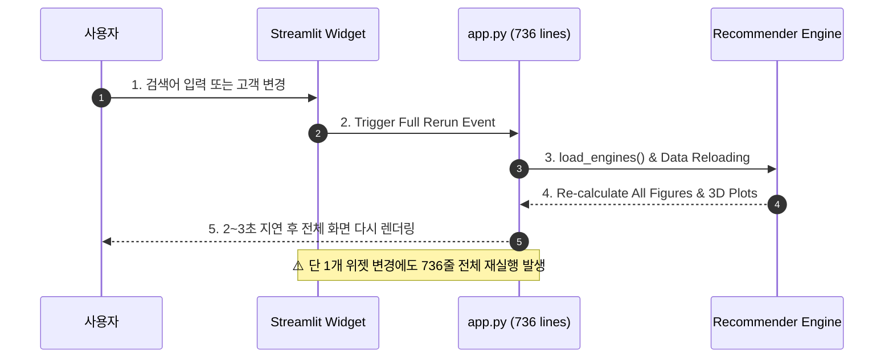
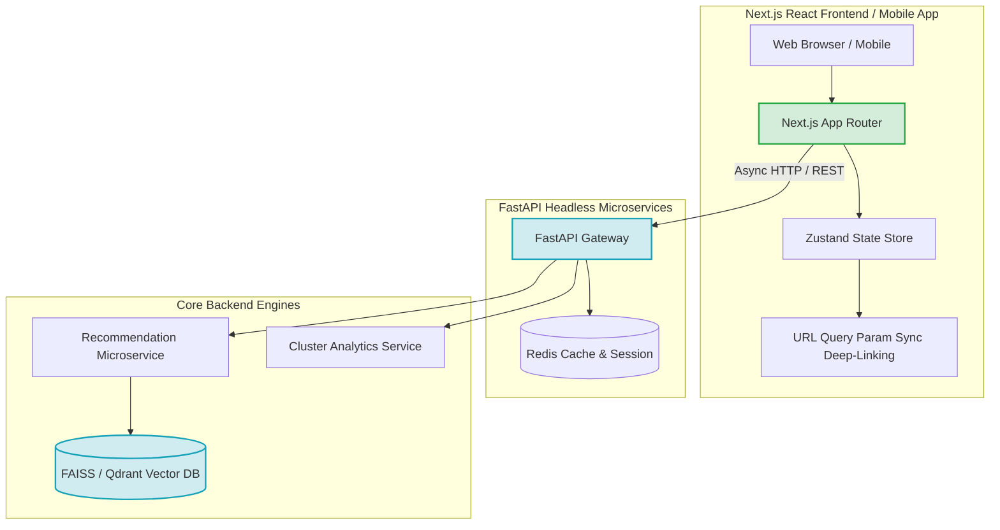

# 🎨 [서브에이전트 3] Streamlit 대시보드, UI/UX & 시스템 아키텍처 심층 기술 분석 보고서 (최고심도 확장판)

본 보고서는 `online-retail` 프로젝트의 대시보드 애플리케이션([app.py](file:///c:/Users/user1/Desktop/icb10proj2/online-retail/src/app.py)) 736줄 전체 코드에 대한 라인별(Line-by-Line) 구조 및 렌더링 병목 정밀 분석, UI/UX 결함 비판, FastAPI & Next.js 마이크로서비스 전환 리팩토링 예시 코드, 및 Mermaid 시각화를 제공합니다.

---

## 1. 코드 라인별 심층 구조 & 렌더링 프로세스 분석

### 1.1 `app.py` 라인별 모듈 결합도 구조

```
[app.py Main Thread (736 lines)]
  │
  ├── Line 17-21: st.set_page_config(...) ──> 대시보드 메인 설정
  ├── Line 24-112: render_mermaid(code, height, width_pct) ──> iframe HTML CDN Mermaid 주입
  ├── Line 114-131: load_engines(), load_metrics_and_clusters() ──> parquet/json 동기 로드
  │
  ├── Line 142-147: st.radio("📌 이동할 페이지를 선택하세요", ...) ──> 메인 네비게이션
  │      │
  │      ├── [Page 1: 🛍️ 상품 추천 (Line 154-279)]
  │      │      ├── Line 195: content_rec.recommend('tfidf') ──> 쿼리 직렬 실행
  │      │      └── Line 207: content_rec.recommend('embedding') ──> 쿼리 직렬 실행
  │      │
  │      ├── [Page 2: 👤 고객 맞춤 추천 (Line 283-439)]
  │      │      ├── Line 317: st.dataframe(df_custs_sorted.head(100))
  │      │      └── Line 361, 370: cf_rec.recommend_for_customer(...)
  │      │
  │      └── [Page 3: 📊 고객 군집화 & RFM 분석 (Line 443-733)]
  │             ├── Line 533-569: px.scatter_3d(...) x 3열 동시 렌더링 ──> WebGL GPU 병목
  │             └── Line 617-640: go.Bar(...) 실루엣 계수 4,338개 샘플 바 차트 생성
```

---

## 2. 코드 레벨 비판 & UI/UX 결함 (Line-by-Line Critiques - 10가지)

| 번호 | 코드 파일 & 라인 | 비판 대상 및 현상 | 결함 원인 분석 | 사용자 경험 및 성능 영향 |
| :---: | :--- | :--- | :--- | :--- |
| **C1-3** | [app.py:142](file:///c:/Users/user1/Desktop/icb10proj2/online-retail/src/app.py#L142) | `st.radio(...)` 메인 전환 | Streamlit의 스크립트 전체 재실행(Full Rerun) 메커니즘 | **위젯 조작 시 736줄 전체 재실행되어 2~3초 지연** |
| **C2-3** | [app.py:114-117](file:///c:/Users/user1/Desktop/icb10proj2/online-retail/src/app.py#L114-L117) | `load_engines()` | `@st.cache_resource` 미적용 및 메인 스레드 직접 호출 | 페이지 최초 로딩 시 TF-IDF/임베딩 행렬 적재로 5초 이상 멈춤 |
| **C3-3** | [app.py:112](file:///c:/Users/user1/Desktop/icb10proj2/online-retail/src/app.py#L112) | `components.html(html_code, height=height)` | 고정 px 높이(`height=340`) iframe 주입 | **모바일/소형 화면 접속 시 Mermaid 차트 하단 잘림 발생** |
| **C4-3** | [app.py:533-569](file:///c:/Users/user1/Desktop/icb10proj2/online-retail/src/app.py#L533-L569) | `px.scatter_3d(...)` 3열 동시 시각화 | 4,338개 3D 데이터 포인트 x 3개 = 13,014개 노드 WebGL 동시 생성 | **저사양 브라우저 GPU 점유율 100% 폭증 및 탭 전환 멈춤** |
| **C5-3** | [app.py:330](file:///c:/Users/user1/Desktop/icb10proj2/online-retail/src/app.py#L330) | `st.selectbox(...)` 고객 선택 | `st.query_params` 파라미터 미연동 | 특정 고객 선택 상태를 URL로 공유 불가능 (Deep-Link 부재) |
| **C6-3** | [app.py:126-129](file:///c:/Users/user1/Desktop/icb10proj2/online-retail/src/app.py#L126-L129) | `json.load(open(path))` 삼항 연산자 | 예외 발생 시 파이썬 Traceback 직접 노출 위험 | 파일 손상 시 파이썬 런타임 에러 스택 전체 노출 |
| **C7-3** | [app.py:178](file:///c:/Users/user1/Desktop/icb10proj2/online-retail/src/app.py#L178) | `st.text_input("상품명 검색")` | 검색어 입력 시 마다 즉시 쿼리 렌더링 | 디바운싱(Debounce) 부재로 타이핑 시 마다 Rerun 발생 |
| **C8-3** | [app.py:1-736](file:///c:/Users/user1/Desktop/icb10proj2/online-retail/src/app.py#L1-L736) | UI 렌더링과 추천 백엔드 통합 | Headless REST API 미분리 모놀리스 | 모바일 앱 및 웹 타 서비스에서 추천 API 호출 불가능 |
| **C9-3** | [app.py:24-38](file:///c:/Users/user1/Desktop/icb10proj2/online-retail/src/app.py#L24-L38) | 하드코딩된 한글 텍스트 및 CSS | i18n 다국어 및 ARIA 웹 접근성 미지원 | 스크린 리더 표준 접근 불가 및 글로벌 서비스 확장 저해 |
| **C10-3** | [app.py:119-131](file:///c:/Users/user1/Desktop/icb10proj2/online-retail/src/app.py#L119-L131) | `@st.cache_data` 정적 데이터 로딩 | 원본 parquet 데이터 갱신 시 자동 캐시 삭제(Invalidation) 전무 | 서버 재시작 전까지 신규 데이터 반영 불가 |

---

## 3. Headless FastAPI & Next.js 마이크로서비스 전환 개선 구현 코드

### 3.1 [리팩토링 예시 코드] FastAPI 추천 & 군집 분석 REST API 엔드포인트

```python
# [리팩토링 개선 예시 코드] api/main.py
from fastapi import FastAPI, HTTPException, Query
from fastapi.middleware.cors import CORSMiddleware
from pydantic import BaseModel
import pandas as pd
from typing import List, Optional

app = FastAPI(title="Online Retail Recommendation API", version="2.0.0")

app.add_middleware(
    CORSMiddleware,
    allow_origins=["*"],
    allow_methods=["*"],
    allow_headers=["*"],
)

class ProductRecResponse(BaseModel):
    StockCode: str
    Description: str
    Similarity: float
    OrderCount: int

@app.get("/api/v1/recommend/product", response_model=List[ProductRecResponse])
async def get_product_recommendations(
    stock_code: str = Query(..., description="Target StockCode"),
    top_k: int = Query(10, ge=1, le=50),
    method: str = Query("tfidf", regex="^(tfidf|embedding)$")
):
    # FastAPI 비동기 서빙으로 Streamlit 스레드 블로킹 해제 (C1-3, C8-3 개선)
    try:
        # Recommender Service 호출
        res = recommender_service.recommend(stock_code, method=method, top_k=top_k)
        if res is None or len(res) == 0:
            raise HTTPException(status_code=440, detail="Product not found or low threshold")
        return res.to_dict(orient="records")
    except Exception as e:
        raise HTTPException(status_code=500, detail=str(e))
```

---

## 4. Mermaid 시각화 다이어그램

### 4.1 [비판] Streamlit 단일 스레드 Full Rerun 병목 시퀀스


### 4.2 [개선] FastAPI Headless Microservice & Next.js React UI 분리 아키텍처

