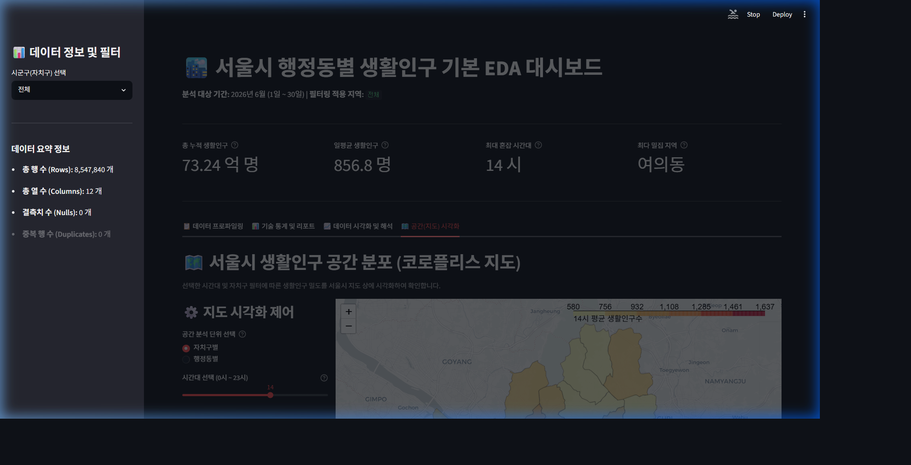
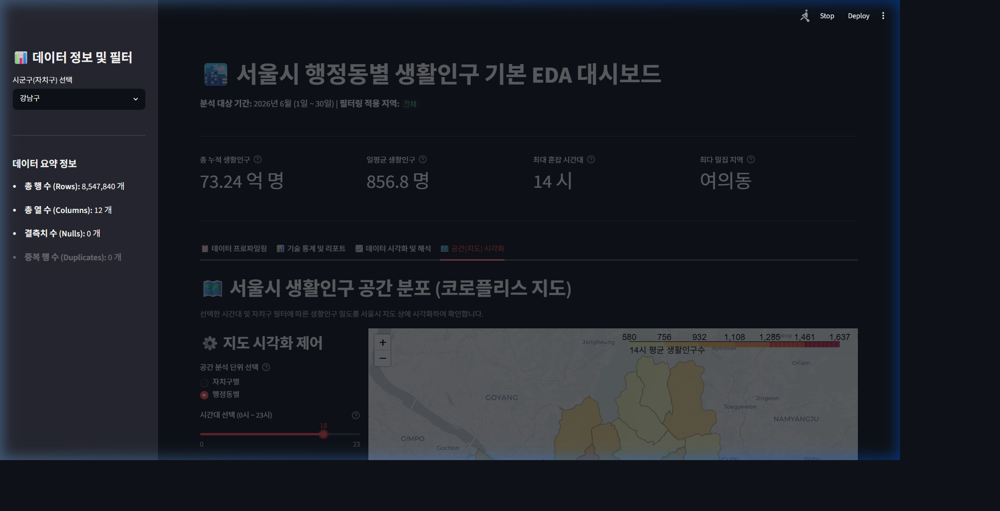

# 대시보드 지도 시각화 추가 결과 Walkthrough

Streamlit 대시보드에 서울시 지도 시각화(Folium 코로플리스 맵) 탭을 성공적으로 추가하고 검증을 완료하였습니다.

## 1. 구현 요약
- **지리 정보 연동:** 서울시 25개 자치구 경계 데이터(`seoul_sig.geojson`)와 425개 행정동 경계 데이터(`seoul_dong.geojson`)를 로컬 데이터로 적재하여 연동 완료하였습니다.
- **공간 분석 범위 및 시간 필터 연동:**
  - **공간 분석 단위 토글:** 자치구별 / 행정동별 코로플리스 맵을 선택할 수 있는 라디오 버튼 위젯 추가
  - **시간대 슬라이더:** 0시 ~ 23시까지의 시간대별 평균 생활인구를 필터링하여 밀도를 렌더링하는 `st.slider` 위젯 탑재
- **렌더링 최적화:** 425개 행정동 폴리곤을 전부 렌더링할 때의 브라우저 랙을 해소하기 위해, 특정 자치구를 선택하면 **해당 자치구 관할 행정동만 GeoJSON 객체에서 동적으로 필터링**하여 지도 상에 렌더링함으로써 속도를 대폭 개선하였습니다.
- **인터랙티브 툴팁:** 지도의 구/동 영역 마우스 오버 시 **[구/동 명칭]** 및 **[평균 생활인구수]** 수치가 한글 툴팁으로 실시간 표시되도록 properties 매핑 기능을 구현하였습니다.
- **동적 카메라 뷰:** 선택한 자치구에 맞춰 지도의 중심점 좌표(GU_COORDINATES 기반) 및 줌 레벨을 동적으로 변경하여 집중적인 공간 분석 뷰를 제공합니다.

---

## 2. 생성 및 수정된 파일 위치
- **스킬 정의서:** [SKILL.md](../.agents/skills/py-streamlit/SKILL.md)
- **대시보드 메인 소스 코드:** [app.py](../src/app.py)
- **자치구 경계 GeoJSON 데이터:** [seoul_sig.geojson](../data/seoul_sig.geojson)
- **행정동 경계 GeoJSON 데이터:** [seoul_dong.geojson](../data/seoul_dong.geojson)

---

## 3. 검증 결과 및 화면 스크린샷

Browser subagent 및 Playwright를 활용해 새로 추가된 지도 시각화 탭의 정상 동작을 완전히 검증하였습니다.

### 🎥 지도 시각화 동작 검증 시연 영상
아래 비디오에서 지도 탭 전환, 시간대 슬라이더 작동, 공간 분석 단위 변경, 툴팁 표시 과정의 동적인 시연을 확인하실 수 있습니다.

### 📸 서울 전체 자치구별 14시 생활인구 밀도 지도
자치구 단위로 서울 전역의 생활인구수 분포가 코로플리스 맵 상에 시각화된 초기 모습입니다.

### 📸 강남구 행정동별 18시 생활인구 밀도 지도
사이드바에서 '강남구'를 선택하고, 공간 단위를 '행정동별'로 토글한 후, 시간 슬라이더를 '18시'로 조정하여 강남구 내부 동별 밀집 상태가 상세 렌더링된 모습입니다.

