# 식품의약품안전처 건강기능식품 영양성분 정보 EDA 보고서

본 보고서는 건강기능식품 영양성분 정보 데이터셋을 바탕으로, 2030 세대의 운동 목적 및 영양제 소비 트렌드를 파악하기 위해 진행된 탐색적 데이터 분석(EDA) 결과를 담고 있습니다. 분석을 통해 영양제 시장의 고함량 및 제형 트렌드, 주요 성분 구성, 수입 시장의 지리적 구조를 실증적으로 규명합니다.

---

## 1. 데이터 탐색 및 기본 정보

### ① 데이터셋 구조 및 미리보기
데이터셋은 총 **4,380개의 행(Row)**과 **60개의 열(Column)**로 구성되어 있으며, 중복 데이터는 발견되지 않았습니다. (중복 데이터 건수: 0건)

#### 상위 5개 행 미리보기
| index | 식품코드 | 식품명 | 데이터구분명 | 식품대분류명 | 대표식품명 | 에너지(kcal) | 단백질(g) | 지방(g) | 탄수화물(g) | 수입여부 | 원산지국명 |
| :--- | :--- | :--- | :--- | :--- | :--- | :---: | :---: | :---: | :---: | :---: | :---: |
| 0 | F102-054540000-0037 | 힐리 엠에스엠 770 | 건강기능식품 | 기능성 원료 | 엠에스엠 | 3 | 0.0 | 0.0 | 0.5 | Y | 미국 |
| 1 | F101-020200000-0003 | 힐리 셀레늄 300 | 건강기능식품 | 영양성분 | 셀레늄 | 0 | 0.0 | 0.0 | 0.0 | Y | 미국 |
| 2 | F101-003030000-0144 | 힐리 비타민D 5000 | 건강기능식품 | 영양성분 | 비타민 D | 0 | 0.0 | 0.0 | 0.0 | Y | 미국 |
| 3 | F101-013130000-0044 | 힐리 비오틴 10000 | 건강기능식품 | 영양성분 | 비오틴 | 0 | 0.0 | 0.0 | 0.0 | Y | 미국 |
| 4 | F101-016160000-0030 | 힐리 마그네슘 500 | 건강기능식품 | 영양성분 | 마그네슘 | 4 | 0.0 | 0.0 | 1.0 | Y | 미국 |

#### 하위 5개 행 미리보기
| index | 식품코드 | 식품명 | 데이터구분명 | 식품대분류명 | 대표식품명 | 에너지(kcal) | 단백질(g) | 지방(g) | 탄수화물(g) | 수입여부 | 원산지국명 |
| :--- | :--- | :--- | :--- | :--- | :--- | :---: | :---: | :---: | :---: | :---: | :---: |
| 4375 | F102-050500000-0004 | 100억 프로바이오틱스 골드 | 건강기능식품 | 기능성 원료 | 프로바이오틱스 | 0 | 0.0 | 0.0 | 0.0 | Y | 캐나다 |
| 4376 | F102-050500000-0003 | 100억 유산균 알파 | 건강기능식품 | 기능성 원료 | 프로바이오틱스 | 0 | 0.0 | 0.0 | 0.0 | Y | 캐나다 |
| 4377 | F102-050500000-0002 | 100억 유산균 2.0 | 건강기능식품 | 기능성 원료 | 프로바이오틱스 | 0 | 0.0 | 0.0 | 0.0 | Y | 캐나다 |
| 4378 | F102-050500000-0001 | 100억 유산균 | 건강기능식품 | 기능성 원료 | 프로바이오틱스 | 0 | 0.0 | 0.0 | 0.0 | Y | 캐나다 |
| 4379 | F103-001010000-0001 | 100억 생유산균 프로바이오틱스 플러스 아연 셀레늄 | 건강기능식품 | 복합 | 복합제품(영양소, 기능성) | 0 | 0.0 | 0.0 | 0.0 | Y | 캐나다 |

### ② 데이터 타입 및 결측치 요약
- `유형명`, `수분(g)`, `회분(g)`, `레티놀(μg)`, `섭취대상` 컬럼은 전체 4,380행에 대해 비어 있는 결측치 데이터입니다.
- 주요 수치 데이터(`에너지`, `단백질`, `지방`, `탄수화물`)는 4,380행 모두 결측치 없이 수집되었습니다.
- 주요 미량 영양소인 `비타민 D`(1,427개 제품), `비타민 C`(748개 제품), `칼슘`(650개 제품), `나트륨`(4,309개 제품) 등이 유의미한 빈도로 분석 데이터셋에 포함되어 영양 성분별 분포를 명확히 제시합니다.

---

## 2. 수치형 변수 기술 통계 분석 보고서

건강기능식품 영양성분 정보 데이터셋의 수치형 변수들을 살펴보면, 비타민 및 미네랄, 3대 영양소(탄수화물, 단백질, 지방), 나트륨, 콜레스테롤 등 다양한 영양소의 함량 분포를 확인할 수 있습니다.

가장 먼저 에너지(kcal)의 경우, 평균 9.18 kcal로 매우 낮게 나타납니다. 25% 분위수, 50% 분위수가 모두 0 kcal이며 75% 분위수조차 8 kcal에 불과합니다. 이는 대다수의 수입 건강기능식품이 정제(알약)나 캡슐 형태를 띠고 있어, 섭취를 통해 획득하는 열량이 거의 0에 가깝기 때문입니다. 다만 최댓값이 1,260 kcal인 아웃라이어 제품이 존재하는데, 이는 운동하는 유저들이 체중 조절이나 근육 증량을 위해 대용량으로 섭취하는 단백질 보충제 및 다이어트 식사 대용 쉐이크 제품군이 포함되어 있기 때문으로 파악됩니다. 

3대 영양소의 함량 또한 극단적인 우편향 분포를 보입니다. 단백질(g)은 평균 0.69g(최댓값 50g), 탄수화물(g)은 평균 0.83g(최댓값 256g), 지방(g)은 평균 0.31g(최댓값 17g)으로 매우 미미한 양이 제공됩니다. 이는 수입 영양제 시장이 칼로리를 얻는 대량 영양소 위주가 아니라 미량의 생리활성 성분을 섭취하기 위한 목적에 집중되어 있음을 방증합니다.

비타민 D(μg)는 1,427개 제품에서 평균 25.85 μg(최댓값 600 μg)이 검출되었습니다. 75% 분위수가 25 μg 수준인 반면 최댓값이 600 μg에 달해, 시중의 표준 권장량 제품 외에 메가도스(Megadose) 요법을 지향하는 고함량 수입 영양제가 다수 유통되고 있음을 보여줍니다. 현대인의 햇빛 노출 부족으로 비타민 D 결핍이 보편화됨에 따라 수입 시장에서도 높은 비중으로 공급되고 있습니다. 비타민 C(mg)의 경우 748개 제품에서 평균 179.29 mg(최댓값 3,000 mg)의 분포를 나타냅니다. 중위수(50%)는 50 mg으로 하루 권장 섭취량의 표준 기준선을 형성하고 있으나, 최댓값 3,000 mg처럼 면역력 증진 및 항산화를 극대화하려는 목적의 고함량 제품군 수요가 탄탄하게 형성되어 있음을 의미합니다. 나트륨(mg)은 평균 6.51 mg으로 대단히 낮으며 최댓값 또한 540 mg에 불과하므로, 영양제 복용으로 인한 나트륨 과잉 섭취 우려는 지극히 미미합니다.

이와 같은 수치형 통계 결과가 제시하는 비즈니스 및 플랫폼 기획적 시사점은 다음과 같습니다. 첫째, 2030 세대(헬시플레저족)를 타깃으로 할 때 '저칼로리' 및 '무설탕'은 기본적인 전제 조건이 됩니다. 맛을 위해 액상이나 구미 제형으로 변화하는 트렌드 속에서도 설탕 과다 첨가 등으로 인한 열량 상승을 제어하는 성분 검증 로직이 대시보드 내에 포함되어야 합니다. 둘째, 비타민 D와 C 등 특정 영양성분의 높은 결측 비율 및 메가도스 제품군의 존재는 병용 섭취 시 과잉증 부작용의 위험성을 높입니다. 사용자가 다수의 종합영양제와 단일 성분제를 병용 섭취할 때, 지용성 영양소(예: 비타민 D)의 경우 상한 섭취 기준량을 직관적으로 확인시켜 주는 시각적 안전 경고 장치(Warning Dash)가 스마트 케어 화면 구성에 필수적으로 반영되어야 할 것입니다.

---

## 3. 범주형 변수 기술 통계 분석 보고서

범주형 변수의 분석 결과를 관찰하면 국내 유통 중인 수입 건강기능식품 시장의 명확한 구조적 공급 특성을 도출할 수 있습니다. 

가장 두드러지는 특성은 `수입여부` 변수로, 전체 4,380개 제품이 전부 'Y'로 나타나 전량 해외 수입 제품으로 구성되어 있음을 보여줍니다. 이는 고함량 포뮬러와 합리적인 가성비를 추구하며 아이허브, 쿠팡 직구 등을 통해 미국, 캐나다 등 북미산 영양제를 적극적으로 구매하는 2030 세대의 헬스케어 소비 패턴과 긴밀히 맞닿아 있습니다.

`원산지국명`에 대한 빈도 분포를 보면, 총 33개의 원산지국 중에서 미국이 2,659개(약 60.7%)로 절대적인 우위를 차지하고 있으며, 캐나다가 1,162개(약 26.5%)로 그 뒤를 잇고 있습니다. 북미 지역 2개국이 전체 데이터셋의 87.2%를 차지하고 있는 점은 국내 소비자들이 해외 영양제 브랜드를 인지하고 신뢰하는 기준이 북미산 제조 설비와 규격에 집중되어 있음을 증명합니다. 호주(138개), 뉴질랜드(81개), 독일(78개) 순으로 집계되었으며, 유럽 국가들에 비해 영미권 자연주의 및 메가 브랜드에 대한 선호도가 뚜렷합니다.

`식품대분류명` 기준으로는 '복합' 제품이 3,305개로 전체의 75.46%를 차지하고 있습니다. '기능성 원료' 단일 제제는 556개(12.69%), '영양성분' 중심은 519개(11.85%)로 나타났습니다. 이는 소비자들이 영양제를 따로 챙겨 먹는 번거로움을 줄이기 위해, 비타민 B군과 활성 물질이 결합한 형태처럼 다중 효과를 기대할 수 있는 복합 제제를 압도적으로 선호하고 있음을 명확히 보여줍니다. 

복용 순응도를 결정짓는 `1일섭취횟수` 데이터를 분석해보면 '1회' 복용 제품이 3,858개로 약 88.1%를 점유하고 있습니다. 2회(463개), 3회(57개), 4회(2개) 등으로 갈수록 제품 비중이 급격히 감소합니다. 2030 세대의 바쁜 라이프스타일 속에서는 '하루에 단 한 번만 복용하면 되는 간편함'이 제품 선택의 가장 중요한 허들이자 트렌드가 되었음을 반증합니다. 또한 `1회분량`은 '1캡슐'(2,398개)이 주류를 형성하고 있어, 아직까지는 수입 영양제 공급 시장에서 캡슐/정제 제형이 주를 이룹니다. `제조사명`에서는 `US PHARMATECH NV INC.`가 555개로 가장 높은 빈도를 기록했고 고유 제조사가 338개에 달해 다변화된 해외 OEM/ODM 인프라를 확인케 합니다.

이러한 범주형 데이터 통찰은 플랫폼 UI/UX 기획에 실무적인 방향성을 제시합니다. 첫째, 2030 영양제 큐레이션 제공 시 원산지 및 수입 정보의 투명성이 매우 중요하므로 국가별 브랜드 필터링 기능이 제공되어야 합니다. 둘째, 대다수가 '복합(75.5%)' 유형이므로, 스마트 케어 대화면에서 개별 성분의 함량을 식약처 가이드라인 기준으로 파싱하여 중복 과다 섭취를 자동으로 발라내 주는 필터링 시스템의 핵심 백엔드 데이터 구조를 이 '복합' 범주 매핑 정보에 기초하여 설계해야 합니다. 셋째, 1일 1회 복용 비중이 높은 점을 감안하여 캘린더 알림 발송 시 '모닝 타임(공복 복용)'과 '식후 타임'으로 복용 시간대를 단일 직관 뷰로 노출하는 것이 2030 세대 복용 순응도 개선에 효과적일 것입니다.

---

## 4. 데이터 시각화 및 세부 통찰 (10개 시각화 + 텍스트 분석)

### 📊 1) 에너지(kcal) 분포 분석 (단변량)
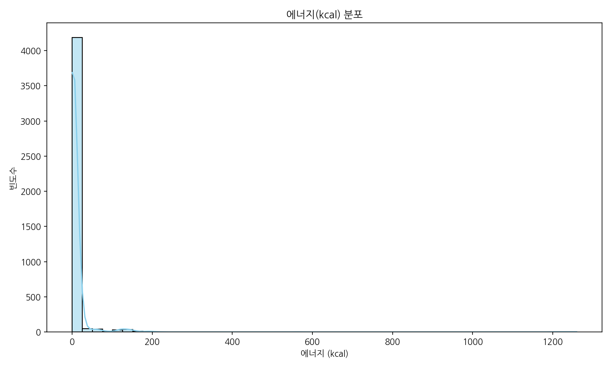

#### 📋 동반 데이터 테이블 (에너지 기술 통계)
| 통계 지표 | 값 (kcal) |
| :--- | :---: |
| 총 제품수 (count) | 4,380.0 |
| 평균값 (mean) | 9.18 |
| 표준편차 (std) | 54.13 |
| 최솟값 (min) | 0.0 |
| 25% 분위수 (25%) | 0.0 |
| 50% 분위수 (중앙값) | 0.0 |
| 75% 분위수 (75%) | 8.0 |
| 최댓값 (max) | 1,260.0 |

#### 💡 그래프 해석 및 통찰
대다수의 수입 영양제는 1회 섭취량 기준으로 칼로리가 거의 없는 저열량 구성을 띠고 있습니다. 중앙값과 25% 분위수가 0 kcal로 나타나며, 75% 분포선도 8 kcal 이하로 극히 제한적입니다. 단백질 쉐이크 등 극소수의 영양 보충제만이 최대 1,260 kcal의 이상치를 형성하여 우측으로 긴 꼬리를 갖는 우편향 분포를 이룹니다. 다이어트와 건강 관리를 중시하는 2030 세대 타깃 설계 시, 영양제 포뮬러 자체의 당류나 탄수화물 유래 칼로리를 0에 가깝게 표기하고 걸러주는 필터의 필요성을 시각적으로 방증합니다.

---

### 📊 2) 식품대분류명 빈도 분포 (단변량)
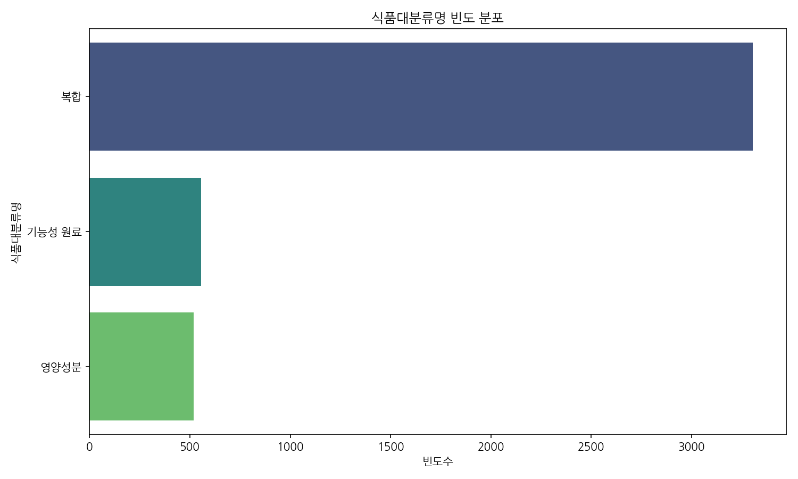

#### 📋 동반 데이터 테이블 (분류별 빈도 및 비율)
| 식품대분류명 | 빈도수 (개) | 비율 (%) |
| :--- | :---: | :---: |
| **복합** | 3,305 | 75.46% |
| **기능성 원료** | 556 | 12.69% |
| **영양성분** | 519 | 11.85% |
| **합계** | **4,380** | **100.00%** |

#### 💡 그래프 해석 및 통찰
식품대분류명 중 '복합' 제품군이 전체의 3/4 이상인 75.46%를 점유해 지배적인 강세를 나타냅니다. 단일 영양소인 '영양성분(11.85%)'이나 '기능성 원료(12.69%)' 단독 제형보다, 소비자들이 한 알로 비타민과 활성 유효 물질을 종합적으로 공급받길 원한다는 점을 시사합니다. 영양제 병용 시 각 복합 제품에 포함된 핵심 물질의 중복 연계 계산 로직을 정교하게 구축해야만 과다 복용 위험을 예방할 수 있음을 뜻합니다.

---

### 📊 3) 수입여부 비율 분석 (단변량)
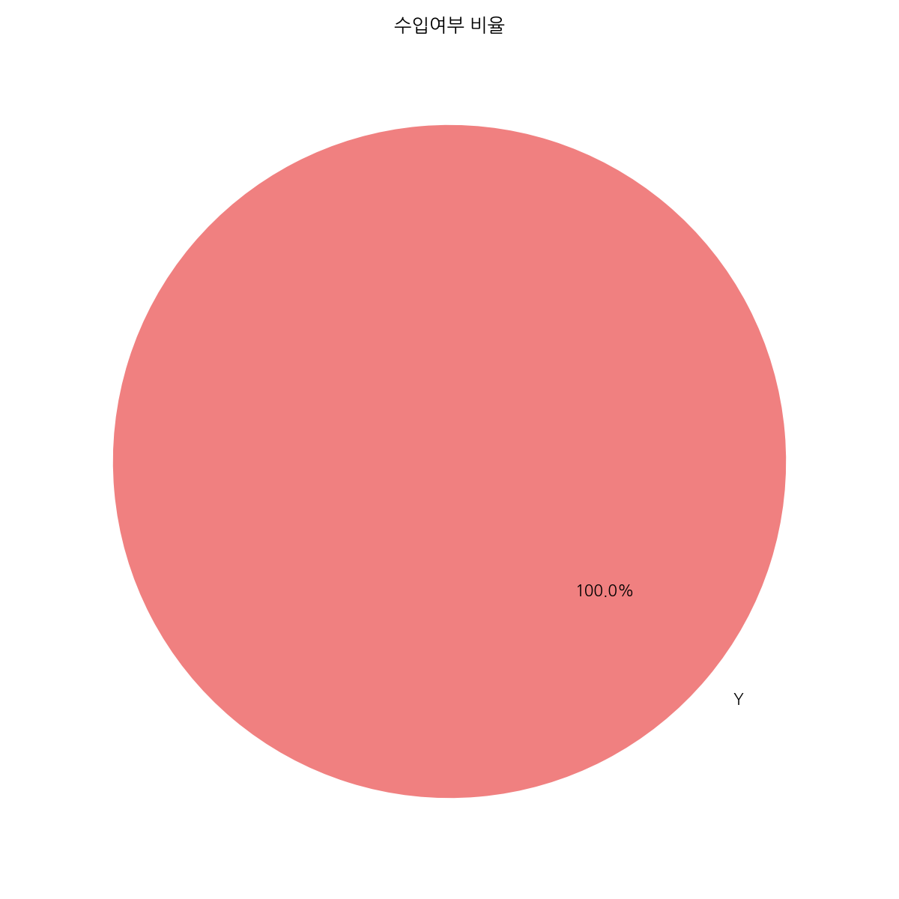

#### 📋 동반 데이터 테이블 (수입여부 카운트)
| 수입여부 | 빈도수 (개) | 비율 (%) |
| :--- | :---: | :---: |
| **Y (수입)** | 4,380 | 100.0% |
| **N (국내)** | 0 | 0.0% |

#### 💡 그래프 해석 및 통찰
데이터셋 내 모든 건기식 제품이 100% 수입된 제품(Y)으로 구성되어 있습니다. 해외 직구와 정식 수입 통관 영양제에 대한 2030 세대의 강한 선호도가 그대로 반영된 결과입니다. 해외 규격 및 제조사 데이터를 연계하여 각 수입 브랜드별 안전 등급과 글로벌 품질 인증 마크(예: GMP, NSF 등)를 대시보드 화면상에 부각시키는 큐레이션 기획이 효과적일 수 있습니다.

---

### 📊 4) 상위 10개 원산지국명별 제품 수 (이변량)
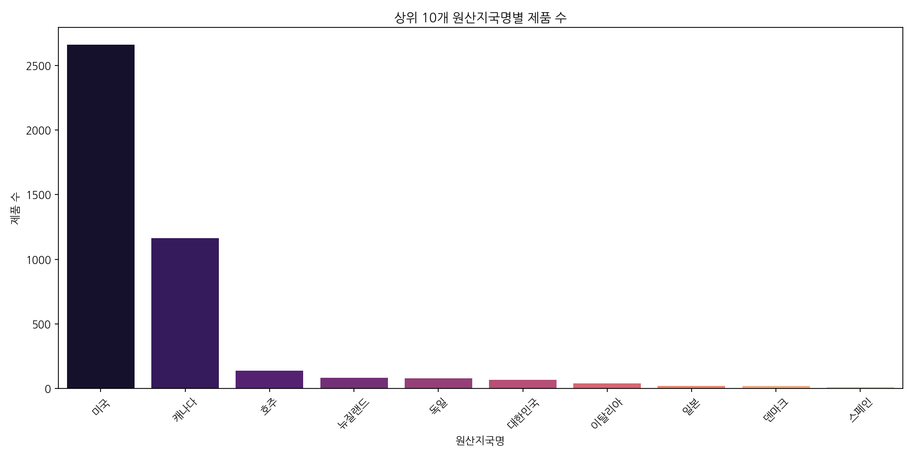

#### 📋 동반 데이터 테이블 (원산지 상위 10개 제품 수)
| 순위 | 원산지국명 | 제품 수 (개) |
| :---: | :--- | :---: |
| 1 | 미국 | 2,659 |
| 2 | 캐나다 | 1,162 |
| 3 | 호주 | 138 |
| 4 | 뉴질랜드 | 81 |
| 5 | 독일 | 78 |
| 6 | 대한민국 | 67 |
| 7 | 이탈리아 | 39 |
| 8 | 일본 | 21 |
| 9 | 덴마크 | 20 |
| 10 | 스페인 | 13 |

#### 💡 그래프 해석 및 통찰
수입 대상 국가 분포에서 미국(2,659개)과 캐나다(1,162개)가 압도적인 과점 구도(합계 87.2%)를 점유합니다. 북미권 영양제에 대한 국내 소비자의 높은 신뢰와 대량 수입 유통망의 활성화를 상징합니다. 3위 이하의 호주, 뉴질랜드는 주로 청정 자연 원료 기반 제품, 독일은 고밀도 액상 제형 등으로 다변화된 틈새 포지션을 취하므로, 대시보드에서 '원산지별 원료 정밀 검증 팁' 팝업을 제공하여 소비자의 똑똑한 선택을 지원할 수 있습니다.

---

### 📊 5) 식품대분류별 에너지(kcal) 분포 (이변량)
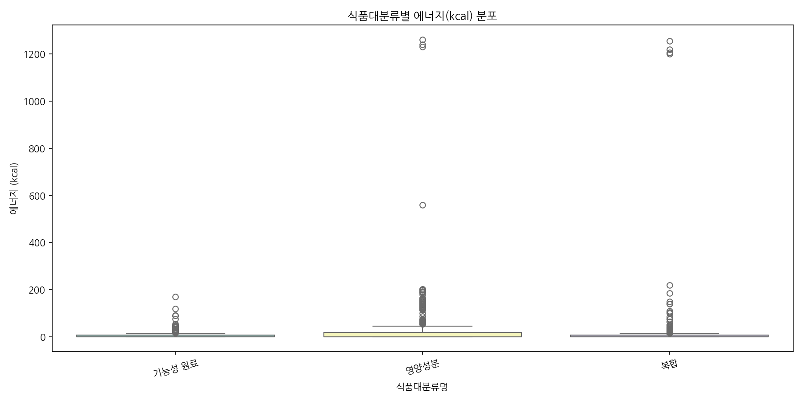

#### 📋 동반 데이터 테이블 (대분류별 에너지 기술 통계)
| 식품대분류명 | 제품 수 | 평균 (kcal) | 표준편차 | 최솟값 | 중앙값 | 최댓값 |
| :--- | :---: | :---: | :---: | :---: | :---: | :---: |
| **기능성 원료** | 556.0 | 5.21 | 13.48 | 0.0 | 0.0 | 170.0 |
| **복합** | 3,305.0 | 5.56 | 43.40 | 0.0 | 0.0 | 1,255.0 |
| **영양성분** | 519.0 | 36.52 | 108.21 | 0.0 | 0.0 | 1,260.0 |

#### 💡 그래프 해석 및 통찰
식품대분류에 따른 에너지 함량을 보면, '영양성분' 분류군의 평균 칼로리가 36.52 kcal로 기능성 원료(5.21 kcal)나 복합(5.56 kcal) 분류군에 비해 눈에 띄게 높고 분포의 범위가 넓습니다. 단백질 파우더나 필수 탄수화물이 다량 함유된 식사 대용 영양 분말 형태가 '영양성분'에 지정되어 있기 때문입니다. 운동 목적(체중 증가 vs 다이어트 데피니션)에 따라 칼로리 제한이 필요한 유저에게는 대분류별 칼로리 필터 기능을 차별화하여 적용해야 함을 보여줍니다.

---

### 📊 6) 단백질(g) vs 탄수화물(g) 상관관계 (이변량)
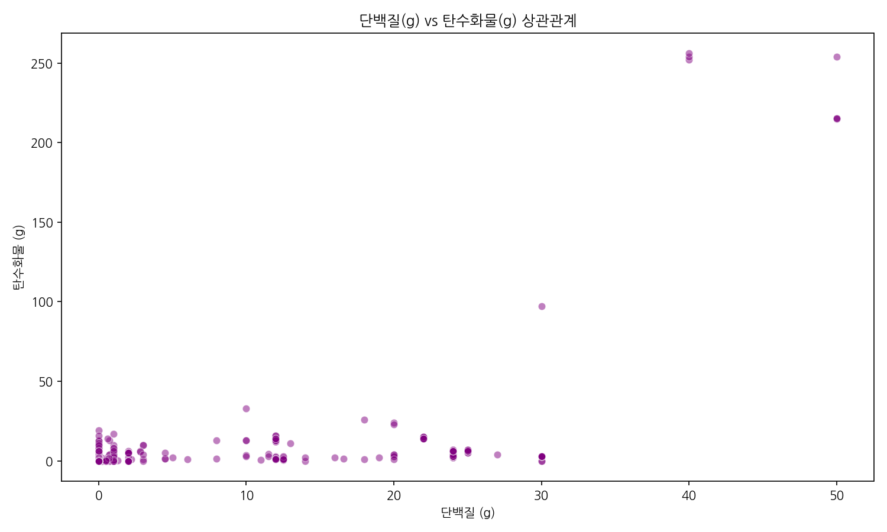

#### 📋 동반 데이터 테이블 (상관 계수 요약)
| 변수 쌍 | 피어슨 상관계수 |
| :--- | :---: |
| **단백질(g) & 탄수화물(g)** | 0.538 |

#### 💡 그래프 해석 및 통찰
대다수의 미량 영양소 위주 영양제는 (0,0) 좌표 부근에 조밀하게 뭉쳐 있습니다. 그러나 우측 상단으로 뻗어나가는 추세선은 고단백/고탄수화물 보충용 건기식의 동시 존재 경향을 나타냅니다. 운동 마니아층(러너, 보디빌더 등)의 벌크업이나 에너지 대사를 지원하는 고부피 단백질 제품군 정보를 큐레이션할 때, 대시보드 뷰어에서 3대 영양 균형 지표(단/탄/지 비율)를 계산하여 표기해 줄 경우 운동 목적 매핑의 활용도를 크게 제고할 것입니다.

---

### 📊 7) 비타민 D(μg) vs 비타민 C(mg) 상관관계 (이변량)
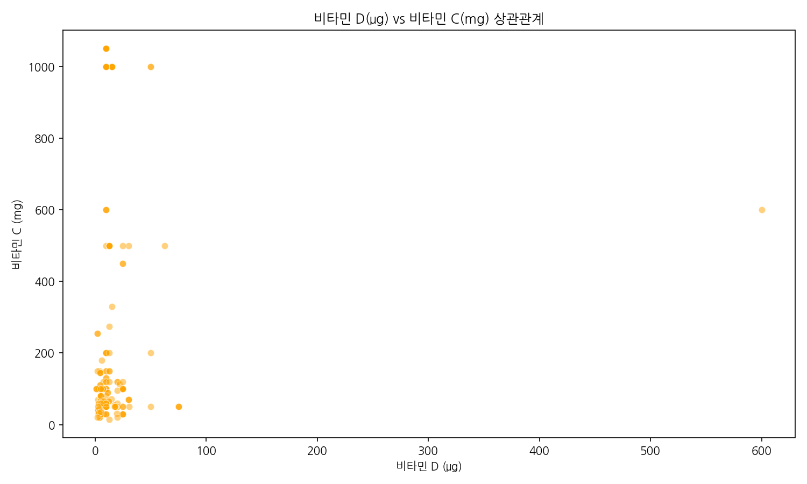

#### 📋 동반 데이터 테이블 (비타민 D 및 C 상관 계수)
| 변수 쌍 | 피어슨 상관계수 |
| :--- | :---: |
| **비타민 D(μg) & 비타민 C(mg)** | 0.007 |

#### 💡 그래프 해석 및 통찰
비타민 D와 비타민 C 함량 간의 상관계수는 0.007로 통계적 연관성이 전혀 존재하지 않습니다. 그러나 각각 단독 고함량으로 극단적인 이상치를 형성하는 다수의 메가도스 제품이 관찰됩니다. 종합 비타민과 단일 고함량 비타민 D/C를 무분별하게 혼합 복용하여 발생하는 신장 결석(비타민 C 과잉), 고칼슘혈증(비타민 D 과잉) 등의 부작용을 사전에 인지시킬 수 있도록, 대시보드 상에서 두 영양소 간 병용 한계선을 설정해줄 필요가 있음을 시각화로 방증합니다.

---

### 📊 8) 주요 영양성분 간의 상관관계 히트맵 (다변량)
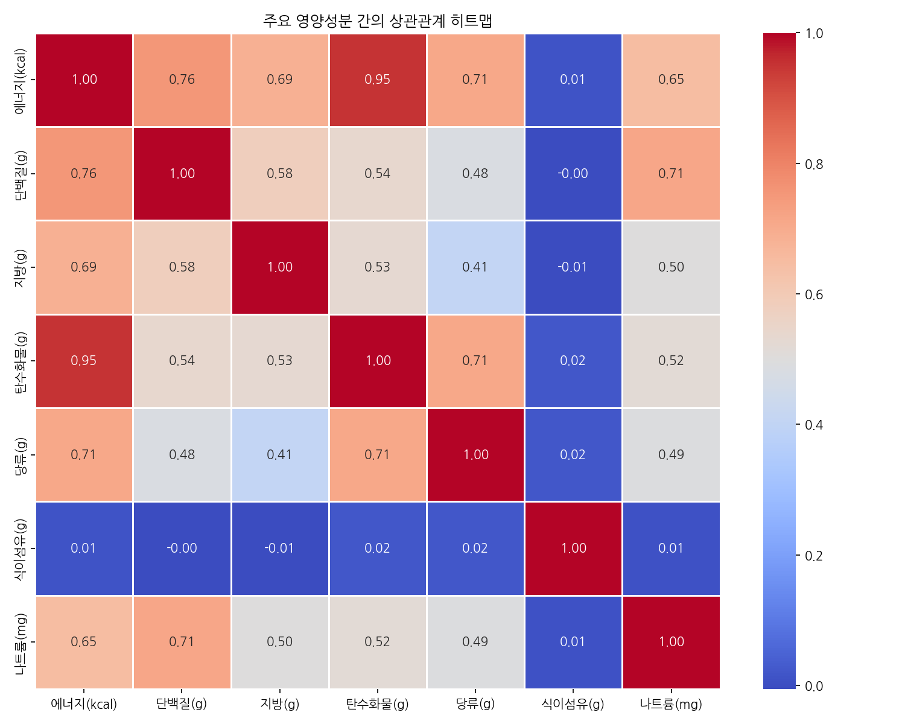

#### 📋 동반 데이터 테이블 (주요 영양소 상관 계수 행렬)
| 구분 | 에너지(kcal) | 단백질(g) | 지방(g) | 탄수화물(g) | 당류(g) | 식이섬유(g) | 나트륨(mg) |
| :--- | :---: | :---: | :---: | :---: | :---: | :---: | :---: |
| **에너지(kcal)** | 1.00 | 0.76 | 0.69 | 0.95 | 0.71 | 0.01 | 0.65 |
| **단백질(g)** | 0.76 | 1.00 | 0.58 | 0.54 | 0.48 | -0.00 | 0.71 |
| **지방(g)** | 0.69 | 0.58 | 1.00 | 0.53 | 0.41 | -0.01 | 0.50 |
| **탄수화물(g)** | 0.95 | 0.54 | 0.53 | 1.00 | 0.71 | 0.02 | 0.52 |
| **당류(g)** | 0.71 | 0.48 | 0.41 | 0.71 | 1.00 | 0.02 | 0.49 |
| **식이섬유(g)** | 0.01 | -0.00 | -0.01 | 0.02 | 0.02 | 1.00 | 0.01 |
| **나트륨(mg)** | 0.65 | 0.71 | 0.50 | 0.52 | 0.49 | 0.01 | 1.00 |

#### 💡 그래프 해석 및 통찰
에너지는 탄수화물 함량과 0.95라는 아주 강력한 상관관계를 보이며, 단백질(0.76), 당류(0.71), 지방(0.69) 순으로 칼로리 상승에 관여합니다. 나트륨(mg)은 단백질(g)과 0.71의 상관성을 띠어, 수입 헬스 단백질 보충제 가공 시 풍미와 전해질 균형을 위해 나트륨이 동반 첨가되는 설계적 특성이 드러납니다. 2030 세대의 청정 식단 관리 및 저나트륨 운동 라이프스타일 큐레이션 시 보충용 제품의 나트륨 함량을 크로스 체킹해야 함을 보여줍니다.

---

### 📊 9) 식품대분류 및 수입여부별 제품 수 비교 (다변량)
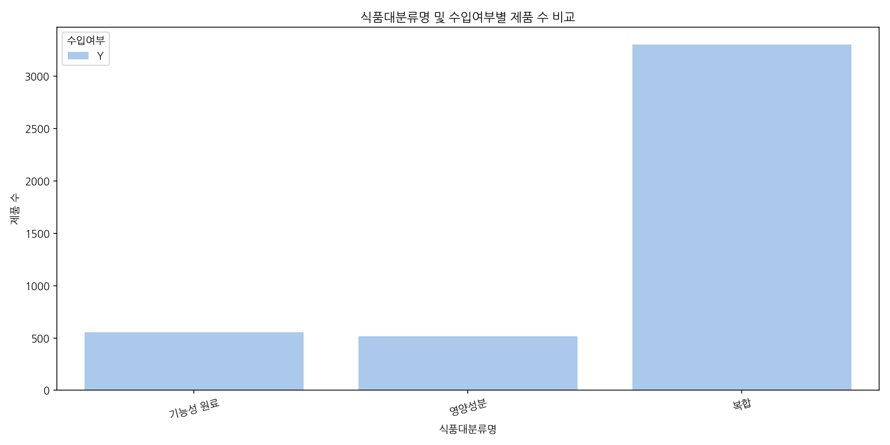

#### 📋 동반 데이터 테이블 (대분류 x 수입여부 교차표)
| 식품대분류명 | 수입 완료 제품 수 (Y) | 국내 가공/생산 (N) |
| :--- | :---: | :---: |
| **복합** | 3,305 | 0 |
| **기능성 원료** | 556 | 0 |
| **영양성분** | 519 | 0 |

#### 💡 그래프 해석 및 통찰
수입 완료된 '복합' 제품의 비중이 3,305개로 다른 두 카테고리의 합계 대비 3배 이상 압도적으로 높습니다. 수입 유통 브랜드의 기획 및 개발 흐름이 단일 영양소보다 통합적인 케어를 지향하는 복합 포뮬러에 완전하게 맞추어져 있음을 보입니다. 개인 맞춤형 플랜 제안 시 복합 제품군의 성분표를 단일 영양소 성분명으로 원자화(Atomization)하여 분해 분석해야만 다중 복용 부작용을 통제할 수 있는 시스템 로직이 확보됩니다.

---

### 📊 10) 상위 10개 1일 섭취 횟수 빈도 (이변량)
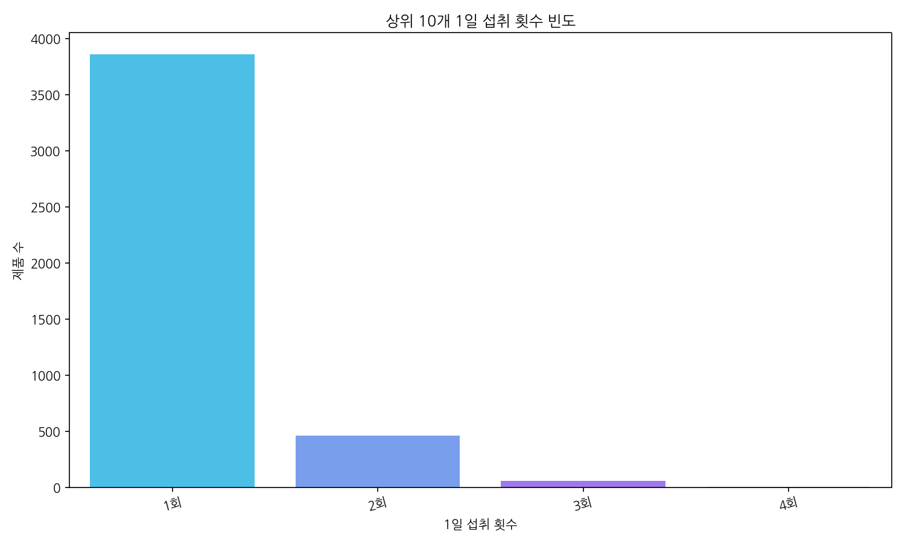

#### 📋 동반 데이터 테이블 (1일 섭취 횟수별 빈도)
| 1일 섭취 횟수 | 제품 수 (개) | 비율 (%) |
| :---: | :---: | :---: |
| **1회** | 3,858 | 88.08% |
| **2회** | 463 | 10.57% |
| **3회** | 57 | 1.30% |
| **4회** | 2 | 0.05% |
| **합계** | **4,380** | **100.00%** |

#### 💡 그래프 해석 및 통찰
1일 섭취 횟수 중 '1회' 복용 설계 제품이 88.08%로 시장의 지배적인 표준 규격임을 명확히 증명합니다. 하루에 여러 차례 챙겨 먹기 힘든 젊은 직장인 및 현대인의 라이프스타일에 맞춘 편의성 최적화 결과입니다. 스마트 케어 서비스 내 복용 알림 서비스 기획 시, 사용자 피로도를 낮추기 위해 '하루 한 알 복용' 제품 중심의 추천 알고리즘 가중치를 부여하는 것이 실구매 전환 및 사용자 복용 유지율 향상에 매우 유리합니다.

---

### 📊 11) 식품명 내 TF-IDF 핵심 키워드 상위 30개 (텍스트 분석)
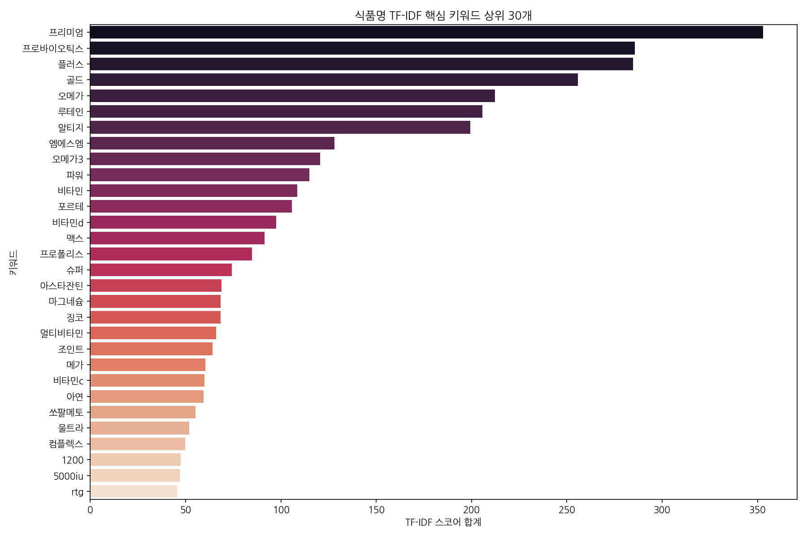

#### 📋 동반 데이터 테이블 (TF-IDF 상위 30개 키워드 및 스코어)
| 순위 | 키워드 | TF-IDF 스코어 합계 | 순위 | 키워드 | TF-IDF 스코어 합계 |
| :---: | :--- | :---: | :---: | :--- | :---: |
| 1 | 프리미엄 | 352.99 | 16 | 슈퍼 | 74.22 |
| 2 | 프로바이오틱스 | 285.56 | 17 | 아스타잔틴 | 68.87 |
| 3 | 플러스 | 284.72 | 18 | 마그네슘 | 68.35 |
| 4 | 골드 | 255.82 | 19 | 징코 | 68.31 |
| 5 | 오메가 | 212.15 | 20 | 멀티비타민 | 65.99 |
| 6 | 루테인 | 205.69 | 21 | 조인트 | 64.20 |
| 7 | 알티지 | 199.23 | 22 | 메가 | 60.35 |
| 8 | 엠에스엠 | 128.04 | 23 | 비타민c | 59.95 |
| 9 | 오메가3 | 120.58 | 24 | 아연 | 59.47 |
| 10 | 파워 | 114.79 | 25 | 쏘팔메토 | 55.14 |
| 11 | 비타민 | 108.62 | 26 | 울트라 | 51.94 |
| 12 | 포르테 | 105.72 | 27 | 컴플렉스 | 49.86 |
| 13 | 비타민d | 97.39 | 28 | 1200 | 47.45 |
| 14 | 맥스 | 91.30 | 29 | 5000iu | 46.89 |
| 15 | 프로폴리스 | 84.89 | 30 | rtg | 45.55 |

#### 💡 그래프 해석 및 통찰
텍스트 마이닝을 통한 식품명 키워드 추출 결과, 마케팅적 수식어인 '프리미엄', '플러스', '골드' 등이 최상위권을 독점하여 마케팅 표기의 유사성을 방증합니다. 주요 원료 키워드로 '프로바이오틱스(유산균)', '오메가/알티지/rtg(혈행)', '루테인/아스타잔틴(눈건강)', '엠에스엠/조인트(관절 및 테니스/러닝 특화)', '마그네슘/비타민d/비타민c' 등이 도출되었습니다. 이는 소비자가 직관적으로 가치를 판단하는 핵심 키워드로, 대시보드 내 검색 및 필터링 시 이러한 트렌디한 타깃 키워드를 인덱싱하여 빠른 매칭을 제공해야 함을 말해줍니다.

---

## 5. 2030 운동 목적별 대시보드(NutriFit 2030) 기획 반영 방안

### ① 운동 목적별 맞춤형 필수 영양소 정밀 매핑
분석된 제품 정보와 키워드 분포를 바탕으로, 대시보드의 B2C 추천 로직을 다음과 같이 연계합니다.
- **러닝/테니스 (관절 & 에너지 대사)**:
  - 핵심 매핑 키워드: `엠에스엠`(TF-IDF 8위), `조인트`(TF-IDF 21위), `비타민`(TF-IDF 11위)
  - 추천 알고리즘 가중치: MSM 및 관절 연골 보호 원료(콘드로이친 등) 함유 제품군에 노출 가중치 적용.
- **등산/골프 (항산화 & 피로 개선 & UV 케어)**:
  - 핵심 매핑 키워드: `비타민d`(TF-IDF 13위, 최댓값 600μg 고농도), `비타민c`(TF-IDF 23위), `아스타잔틴`(TF-IDF 17위)
  - 추천 알고리즘 가중치: 야외 자외선 노출에 따른 항산화 및 비타민 D 합성 최적 설계 제품 위주 배치.

### ② My 영양제 스마트 케어의 안전망 구축
- **병용 섭취 중복 & 상한 섭취량 초과 필터**:
  - 데이터 분석 결과 75.46%가 복합 제제이므로, 개별 단일제를 중복 섭취 시 지용성 비타민인 '비타민 D' 및 '비타민 A'의 누적 함량이 상한 섭취량을 초과하기 쉽습니다. 
  - 유저가 보유한 영양제들을 등록할 시 각 영양소의 단위를 변환(예: IU ↔ μg)하고 자동 합산하여 일일 상한 권장 기준을 초과하면 **"병용 섭취 경고 알림"**을 시각화합니다.
- **구미 및 액상형 건기식 뱃지 시스템**:
  - 2030이 맛과 간편성을 위해 선호하는 '구미' 제형의 경우, 식약처 인증 건강기능식품인지 아니면 일반 캔디류인지를 구분하기 위해 `데이터구분명`('건강기능식품') 및 식약처 기능성 원료 인증 데이터베이스와 매칭하여 **"인증 건기식 구미 마크"**를 제품 카드 위에 부여합니다.

---

## 6. 결론 및 데이터 요약 의견

본 EDA 과정을 통해 식품의약품안전처의 건강기능식품 영양성분 정보 데이터셋의 특성을 확인한 결과, 국내 수입 건강기능식품 시장은 **미국과 캐나다가 87.2%를 차지하며 복합 제품군(75.46%)과 1일 1회 복용 제형(88.08%)이 지배적인 구도**를 형성하고 있습니다. 

이는 대시보드 개발 시 단일 영양소 단위의 개별 매핑보다 복합 제품에서 특정 성분의 함량을 안전하게 쪼개어 연계 계산해주는 로직의 중요성을 상기시킵니다. 분석된 고함량 영양 성분 데이터(비타민 D, 비타민 C 등)와 텍스트 마이닝된 제품 특징 키워드를 결합하여, 유저가 마케팅적 미사구(프리미엄, 플러스, 골드 등)에 가려진 핵심 영양소와 유효 성분을 똑똑하게 검증하고 섭취 플랜을 설계할 수 있는 실질적인 데이터 기반 대시보드(NutriFit 2030)를 완벽히 구현할 수 있는 토대가 마련되었습니다.
