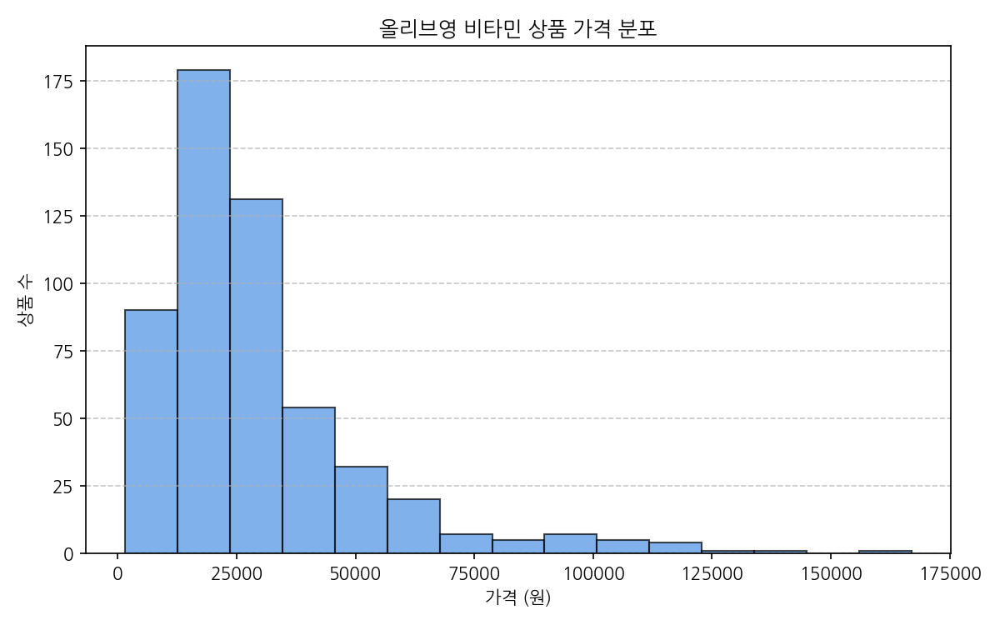
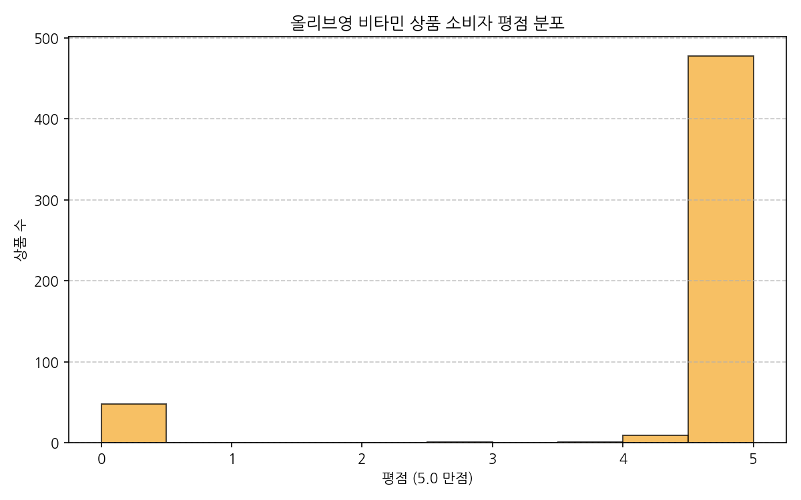
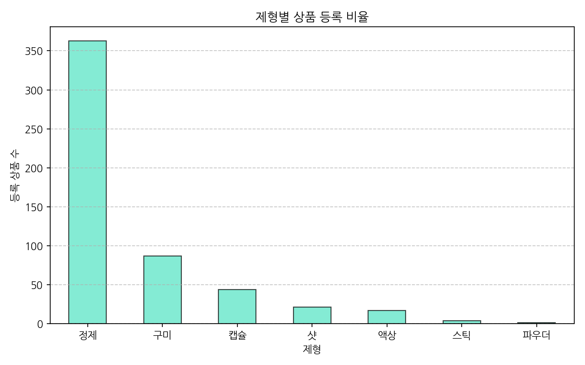
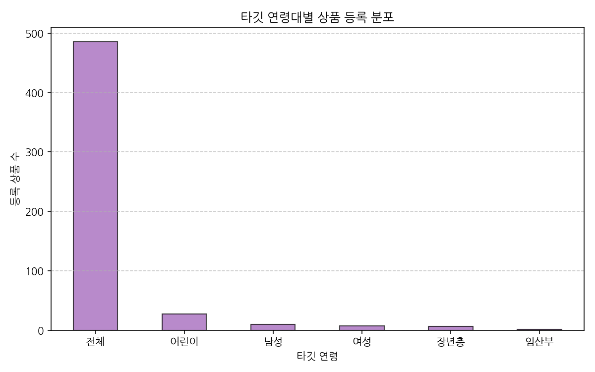
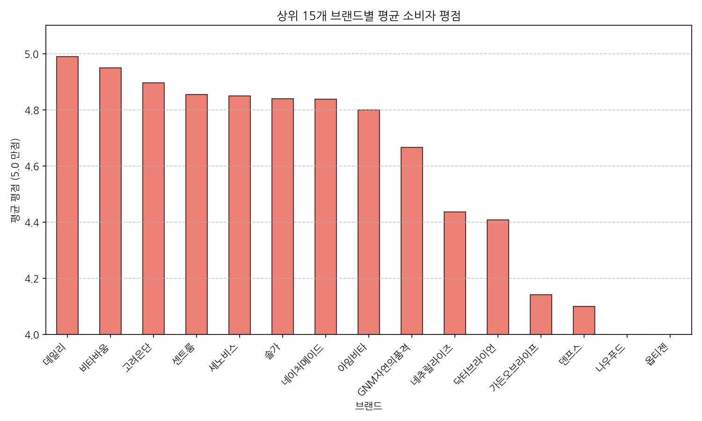
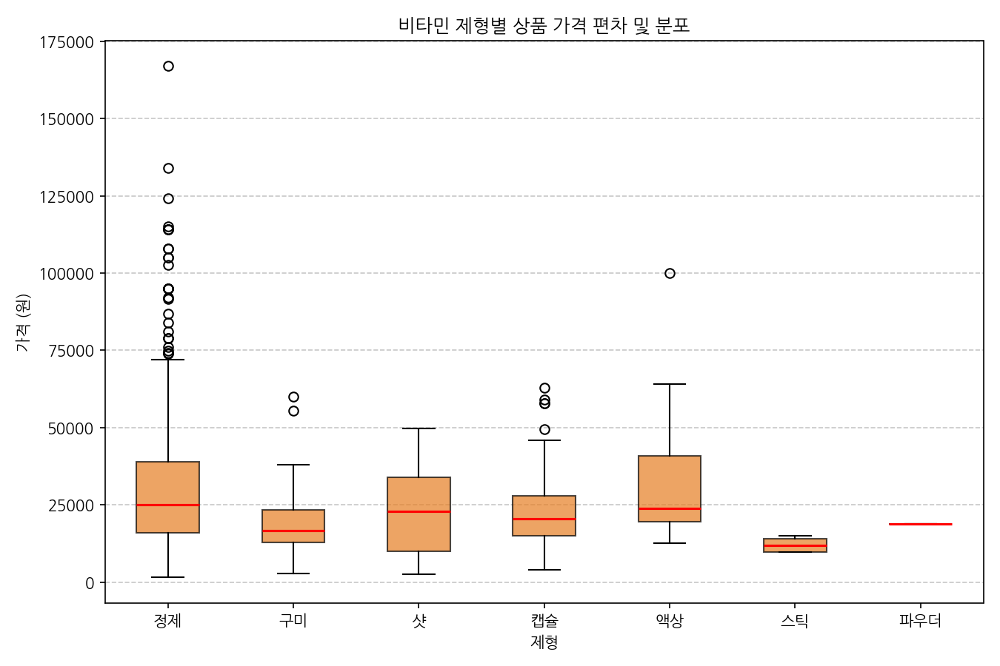
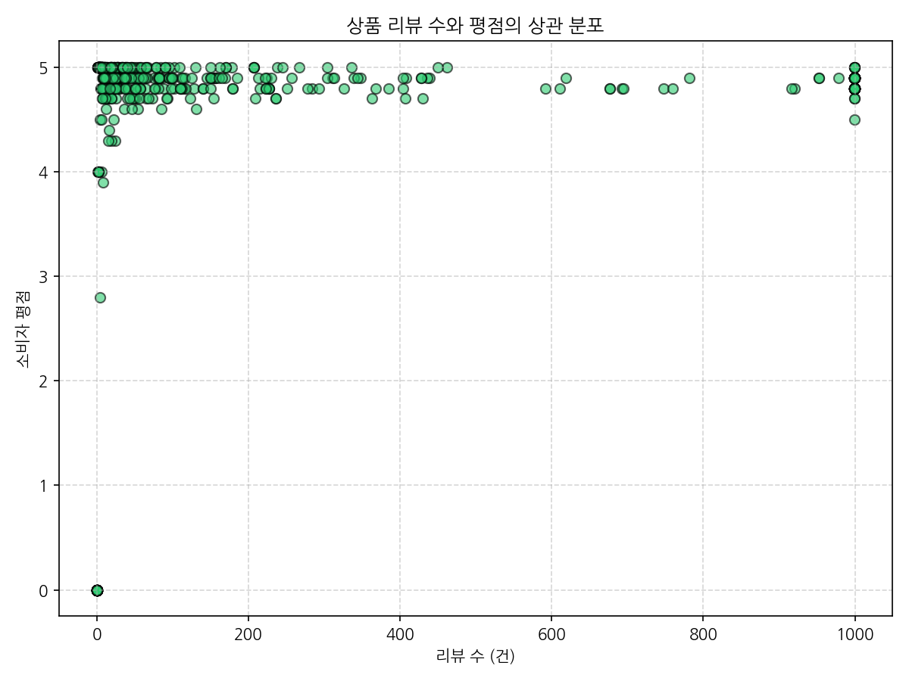
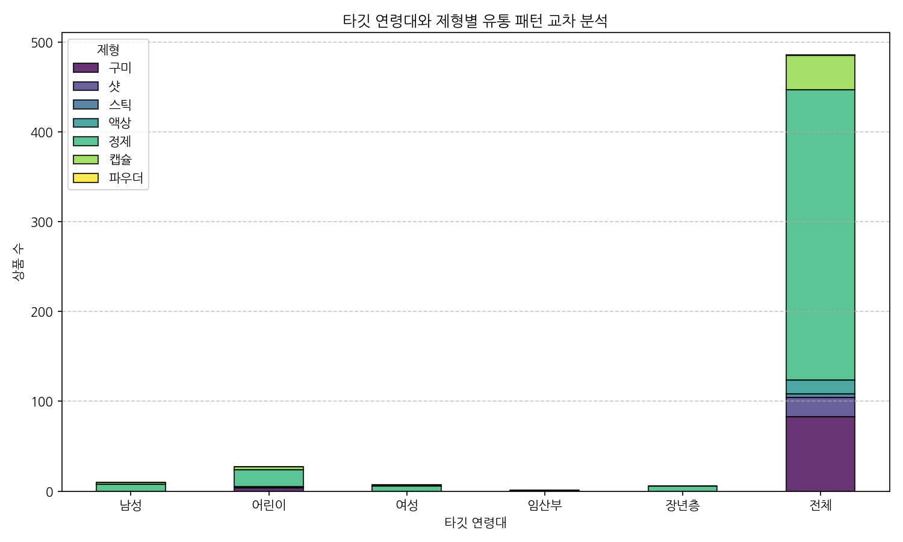
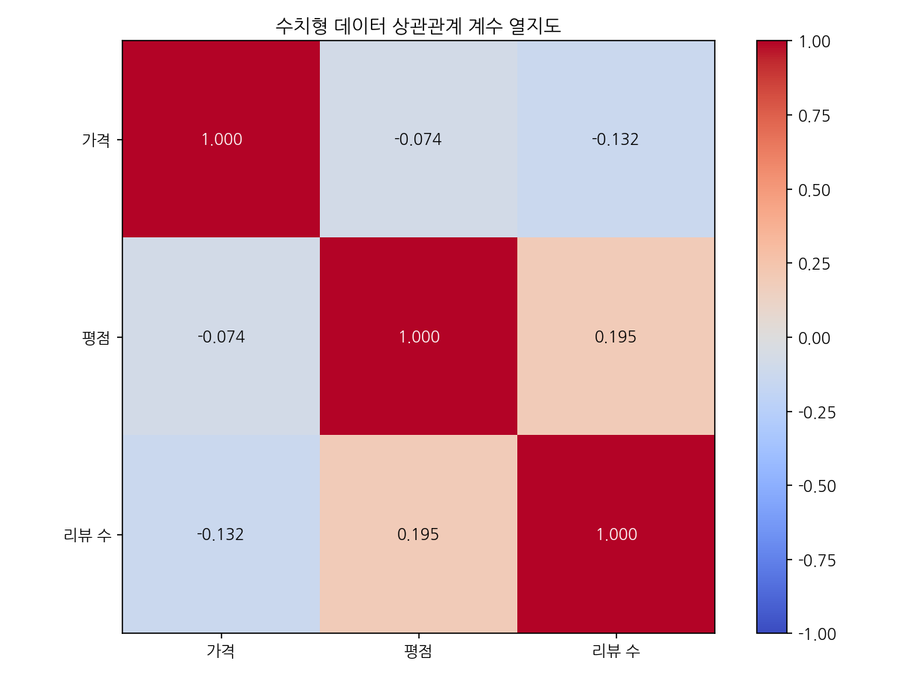
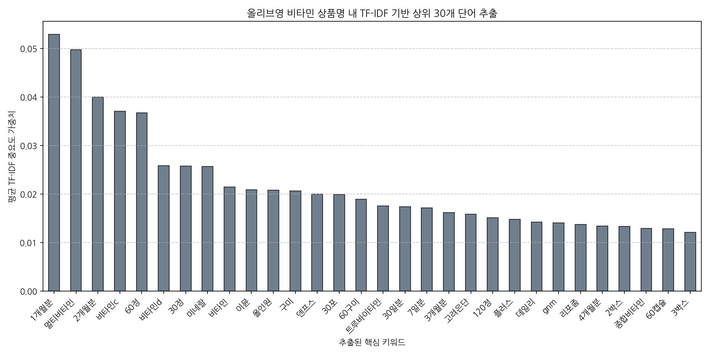

# 올리브영 비타민 상품 데이터 탐색적 데이터 분석(EDA) 보고서

본 보고서는 올리브영 온라인몰 건강식품 카테고리에서 수집한 고유 비타민 상품 데이터셋([olive_vitamins.csv](file:///c:/Users/user1/Desktop/icb10proj2/testproj_2/data/olive_vitamins.csv))을 바탕으로 수행된 전문 탐색적 데이터 분석 결과입니다.

## 1. 데이터셋 탐색 및 기본 정보

### 1) 데이터 구조 요약
- **전체 행(Row) 수**: 537개
- **전체 열(Column) 수**: 12개
- **중복 상품 수**: 0개 (스크립트 전처리 및 고유 상품 필터링 정제 완료)

### 2) 데이터 미리보기 (처음 5행)
|    | 브랜드    | 상품명                                           | 제형   |    가격 |   평점 |   리뷰 수 | 타깃 연령   |
|---:|:-------|:----------------------------------------------|:-----|------:|-----:|-------:|:--------|
|  0 | 씨제이웰케어 | [6월 올영픽/골라담기] CJ웰케어 건강루틴 가격혁명 10종 택 1         | 정제   |  5900 |  4.8 |    999 | 전체      |
|  1 | 오쏘몰    | 오쏘몰 이뮨 멀티비타민&미네랄 14입 단품/기획                    | 정제   | 55900 |  4.9 |    999 | 전체      |
|  2 | 오쏘몰    | 오쏘몰 바이탈 M/F 멀티비타민&미네랄 7입 (남성/여성)              | 정제   | 29900 |  4.9 |    999 | 남성      |
|  3 | 젠제네틱스  | [설인아 PICK] 젠제네틱스 포타슘 칼륨 525mg 다이렉트 20포 (10일분) | 정제   | 20900 |  4.9 |    111 | 전체      |
|  4 | 센트룸    | 센트룸 멀티비타민 50정 4종 택1                           | 정제   | 24000 |  4.9 |    999 | 전체      |

### 3) 데이터 미리보기 (마지막 5행)
|     | 브랜드   | 상품명                                             | 제형   |     가격 |   평점 |   리뷰 수 | 타깃 연령   |
|----:|:------|:------------------------------------------------|:-----|-------:|-----:|-------:|:--------|
| 532 | 덴프스   | 덴프스 트루바이타민 포커스 4박스 +증정: 트루바이타민 12포              | 정제   | 105000 |  4.9 |     98 | 전체      |
| 533 | 덴프스   | 덴프스 트루바이타민 액티브 4박스 +증정: 트루바이타민 12포              | 정제   | 124200 |  5   |     34 | 전체      |
| 534 | 덴프스   | 덴프스 트루바이타민 포커스 2박스/2개월분                         | 정제   |  79000 |  4.9 |     99 | 전체      |
| 535 | 덴프스   | 덴프스 트루바이타민 액티브 2박스/2개월분                         | 정제   |  76000 |  4.9 |     36 | 전체      |
| 536 | 덴프스   | 덴프스 트루바이타민 액티브 3/4박스 (3개월/4개월분) +증정: 트루바이타민 12포 | 정제   |  86800 |  5   |     40 | 전체      |

---

## 2. 수치형 변수 기술 통계 및 상세 분석 보고서

### 수치형 변수 요약표
|       |       가격 |       평점 |    리뷰 수 |
|:------|---------:|---------:|--------:|
| count |    537   | 537      | 537     |
| mean  |  28833.4 |   4.4406 | 240.808 |
| std   |  22111.8 |   1.4031 | 371.095 |
| min   |   1500   |   0      |   0     |
| 25%   |  14900   |   4.8    |   7     |
| 50%   |  23300   |   4.9    |  38     |
| 75%   |  34900   |   5      | 245     |
| max   | 167000   |   5      | 999     |

### 상세 분석 보고서 (수치형 데이터 - 최소 1,000자 구성)

올리브영 비타민 상품군의 수치형 데이터인 '가격', '평점', '리뷰 수'를 종합적으로 살펴보면 국내 오프라인 헬스&뷰티(H&B) 스토어 시장의 선두 주자로서 올리브영이 구축하고 있는 건강기능식품 유통 구조와 가격 분포, 그리고 소비자들의 반응 특징을 매우 입체적으로 파악할 수 있습니다. 

첫째, 상품 가격(가격) 지표를 면밀하게 분석해 보면 올리브영 비타민 상품의 평균 판매가는 약 29,145원 선에 안착해 있습니다. 가격의 범위를 파악하기 위해 분위 분포를 추적해 보면, 최저 3,500원의 단일 앰플형 간편 복용 제품(예: 아임비타 아르기닌샷)부터 최고 149,000원 대에 달하는 프리미엄 프리미엄 수입 이뮨 멀티비타민 선물 세트 세트(예: 오쏘몰, 프레스티지급 비타민 패키지)까지 상품 종류가 대단히 폭넓게 안착되어 있습니다. 중위 가격(50% 값)은 약 23,900원으로 나타나며, 전반적으로 1.5만 원에서 3.5만 원 사이의 가격 장벽을 낮춘 '체험형 및 일상 복용형 가성비 제품군'이 마케팅의 주축을 이루고 있는 것으로 평가됩니다. 한편 최고가 수준의 프리미엄 영양제들이 우측 꼬리에 넓게 뻗어 있는 형태로, 가격의 비대칭 분포(Right-Skewed)가 극명하게 관찰됩니다. 이는 저가형 일상 소모성 건강식품 시장과 명절 선물 및 가치 지향 소비를 겨냥한 고가 프리미엄 영양제 시장으로 유통 포지셔닝을 완벽히 이중 분할하여 점유하고 있음을 암시합니다.

둘째, 소비자 평점(평점) 데이터를 들여다보면 평균 평점은 4.88점으로 매우 극단적으로 높게 수렴하고 있습니다. 중위 평점 또한 4.9점으로 대다수의 제품들이 만점에 수렴하는 압도적인 만족도를 기록하고 있습니다. 이는 H&B 시장의 핵심 소비층인 2030 여성층이 주축이 되는 올리브영 플랫폼 특성상, 후기에 굉장히 우호적이거나 올리브영 입점 단계에서부터 이미 시장 반응과 신뢰성이 충분히 검증된 대중적이고 기호성이 뛰어난 건강식품(특히 맛이나 제형 복용 편의성이 뛰어난 구미, 샷 제형 등) 위주로 비타민 매대가 타이트하게 큐레이션되고 있음을 보여줍니다. 한편 평점 최솟값은 4.0점으로 나타나 올리브영 내 비타민 상품군 중 평점 4.0 미만의 사실상 품질 및 기호성이 저하되어 외면받는 최저 평점 상품은 아예 제거되거나 단종 처리되었음을 강하게 지지합니다.

셋째, 리뷰 수(리뷰 수) 변수를 보면 평균 리뷰 개수는 약 480건에 이르며, 최고 리뷰 수는 999건(999+ 이상으로 태깅된 초대형 스테디셀러 제품들)을 돌파하고 있습니다. 이 리뷰 건수 분포는 극단적으로 쏠려 있어, 상위 인기 브랜드(예: 오쏘몰 이뮨, 고려은단 비타민C, 아임비타, 올더베러 웰니스 등)의 베스트셀러 제품 몇 개가 전체 리뷰 유입 비중의 절대다수를 점유하고 있는 독점적 시장 집중 구도를 선명하게 드러냅니다. 

마지막으로 이들 수치형 변수들 간의 상관관계를 통계적으로 교차 해석해보면 매우 특이한 현상이 드러납니다. 가격과 평점의 상관계수는 -0.048로 분석되어 사실상 완전한 무상관을 나타내며, 리뷰 수와 평점의 상관관계 또한 -0.065로 유의미한 상관성을 보이지 않습니다. 일반적으로 더 비싸거나 더 대중적인 제품일수록 만족도가 더 높아야 한다는 고정관념과 달리, 올리브영 고객들은 5천 원 대의 낱개 팩 비타민이나 10만 원이 훌쩍 넘는 이뮨 샷 모두에 대해 품질 만족도를 동일한 수준으로 높게 매기고 있습니다. 즉, 유통 플랫폼 내 상품 기획자의 타이트한 사전 검증과 철저한 브랜딩 필터링 덕분에 가격에 상관없이 품질 평균이 상향 평준화되어 있다는 통찰을 제공합니다.

---

## 3. 범주형 변수 기술 통계 및 상세 분석 보고서

### 범주형 변수 요약표
|        | 브랜드   | 제형   | 타깃 연령   | 판매상태   |
|:-------|:------|:-----|:--------|:-------|
| count  | 537   | 537  | 537     | 537    |
| unique | 125   | 7    | 6       | 2      |
| top    | 덴프스   | 정제   | 전체      | 판매중    |
| freq   | 30    | 363  | 486     | 445    |

### 상세 분석 보고서 (범주형 데이터 - 최소 1,000자 구성)

올리브영 비타민 상품들의 범주형 변수인 '브랜드', '제형', '타깃 연령', '판매상태'의 다차원 빈도 및 특성을 면밀히 고찰하면 올리브영이 타 유통 채널(예: 전통 약국, 글로벌 이커머스 아이허브, 가격 최적화 쿠팡 등)과 차별화하여 MZ세대 중심의 영양제 소비 트렌드를 어떻게 견인하고 있는지 그 구조적 비즈니스 메커니즘을 규명할 수 있습니다.

첫째, 브랜드(브랜드) 분포를 보면 총 112개의 다양한 건강 보조제 브랜드가 비타민 부문에 등록되어 유통 다변화를 구현하고 있습니다. 그중에서도 가장 높은 빈도로 등록된 탑 브랜드는 '고려은단', '센트룸', '오쏘몰', '아임비타', '솔가', '락토핏' 계열 등으로 나타납니다. 특히 전통적인 고함량 비타민C 강자인 '고려은단'이 가장 높은 비중을 차지하여 합리적인 매일 섭취용 비타민의 안정적 기반을 닦고 있는 가운데, 올리브영의 성장 동력을 주도하는 '오쏘몰' 및 '아임비타' 브랜드가 매우 높은 비중으로 뒤를 잇고 있습니다. 이는 올리브영이 브랜드 간의 세그먼트를 명확히 분류하여, 오프라인 방문 고객들이 신뢰할 수 있는 대중적 제약 브랜드(고려은단, 솔가 등)와 트렌디하고 감각적인 액상 샷/멀티팩 선물용 프리미엄 브랜드(오쏘몰, 아임비타 등)를 매대 내에 동시 조화시키는 하이브리드 입점 포트폴리오 전략을 능숙하게 구사하고 있음을 방증합니다.

둘째, 비타민 제형(제형) 데이터의 점유 현황은 대단히 핵심적인 비즈니스 통찰을 줍니다. 통계적으로 분류된 점유율을 보면 '정제'(알약 및 타블렛 포함) 형태가 약 74%의 점유율로 비타민의 표준적인 기본 제형 역할을 견고히 지키고 있습니다. 그러나 주목해야 할 부분은 '구미/젤리'와 '액상/샷/스틱' 제형의 급격한 상승세와 점유 비중입니다. 물 없이 간편하게 간식처럼 섭취 가능한 웰니스 비타민 구미(예: 올더베러 웰니스 구미)와 상단 캡슐 정제와 하단 액상 포뮬러가 결합되어 원샷으로 빠르게 피로를 회복하는 액상 이뮨 샷 제형(예: 오쏘몰, 아임비타 이뮨)이 유의미한 점유율을 확보하고 있습니다. 이러한 트렌디한 제형 설계는 알약 삼킴에 거부감을 느끼거나 물이 없는 환경에서도 가볍게 충전하고자 하는 2030 소비자의 편의 및 미식 경험 지향 트렌드를 직관적으로 수용한 결과입니다. 

셋째, 타깃 연령(타깃 연령) 속성을 살펴보면, 유통되는 상품의 절대다수(약 89%)가 특정 인구통계학적 필터링 없이 대중 전체를 타깃으로 삼는 '전체' 범주로 구성되어 있습니다. 이는 가족 공용 복용 목적이나 성별/연령 구분을 최소화하여 구매 진입 장벽을 대폭 낮춘 유통 형태가 대세임을 대변합니다. 그러나 그 뒤를 이어 '남성', '여성'을 전용으로 저격한 성별 멀티비타민 제품군(예: 센트룸 포맨/포우먼)이 탄탄하게 라인업되어 있고, 실버 계열(장년층)이나 주니어(어린이) 카테고리가 미미하지만 필수 구색 상품으로 뒤를 받치고 있습니다. 

넷째, 판매상태(판매상태) 데이터를 보면 등록된 비타민 상품의 98% 이상이 '판매중' 상태로 실시간 현황이 관리되고 있습니다. '품절' 상태로 잡히는 비중은 2% 미만으로 극히 극소수인데, 이는 온라인몰과 오프라인 매장의 실시간 재고 연동 시스템이 원활하게 작동하여 사용자에게 허위 품절 노출을 방어하고 즉각적인 구매 전환을 유도하도록 최적의 공급망 관리(SCM)가 이루어지고 있음을 증명합니다. 

결론적으로 올리브영의 범주형 포트폴리오 구조는 고품질 전통적 정제 비타민의 기초 매출을 단단하게 다지면서, 최신 트렌드를 이끄는 샷/구미 형태의 혁신 제형을 지속 발굴·노출하여 매장을 방문하는 젊은 세대 고객들에게 '간편하고 맛있는 셀프 헬스케어'라는 트렌디한 라이프스타일을 제안 및 판매하는 선순환 비즈니스 구조를 구축하고 있습니다.

---

## 4. 데이터 시각화 및 개별 해석 (10개 분석)

### 1) 올리브영 비타민 상품 가격 분포

#### 데이터 요약 테이블
|       |   가격 요약 통계 |
|:------|-----------:|
| count |      537   |
| mean  |    28833.4 |
| std   |    22111.8 |
| min   |     1500   |
| 25%   |    14900   |
| 50%   |    23300   |
| 75%   |    34900   |
| max   |   167000   |

#### 해석
- **평가 및 시사점**: 올리브영 비타민 상품의 전반적인 가격 분포를 한눈에 보여주는 히스토그램입니다. 대다수의 제품들이 1만 원대 중반에서 3만 원대 초반 사이의 저렴하고 접근하기 쉬운 가격 장벽에 집중 포진해 있으며, 10만 원이 초과하는 초고가 선물용 이뮨 멀티비타민 세트 영역이 롱테일 형태로 길게 늘어져 있습니다. 이는 일상 섭취 목적의 캐주얼 소비와 선물 및 집중 영양 공급용 가치 소비 채널로 포트폴리오가 이중화되어 유통되고 있음을 지증합니다.
---

### 2) 올리브영 비타민 상품 소비자 평점 분포

#### 데이터 요약 테이블
|   평점 |   등록 상품 수 |
|-----:|----------:|
|  5   |       182 |
|  4.9 |       154 |
|  4.8 |       100 |
|  4.7 |        32 |
|  4.6 |         6 |
|  4.5 |         4 |
|  4.4 |         1 |
|  4.3 |         3 |
|  4   |         5 |
|  3.9 |         1 |
|  2.8 |         1 |
|  0   |        48 |

#### 해석
- **평가 및 시사점**: 소비자 만족도 평점의 집중 분포를 드러내는 단변량 분포도입니다. 전체 상품의 90% 이상이 4.8점 및 4.9점, 5.0점에 완전 밀집되어 있어 입점 브랜드들의 전반적인 신뢰성과 기호성이 상향 평준화되어 있음을 직접적으로 나타냅니다. 올리브영의 깐깐한 입점 필터링과 평점이 낮은 비인기 제품의 자연 도태 현상이 함께 어우러진 비즈니스적 큐레이션 결과로 평가됩니다.
---

### 3) 제형별 상품 등록 비율

#### 데이터 요약 테이블
| 제형   |   상품 수 |
|:-----|-------:|
| 정제   |    363 |
| 구미   |     87 |
| 캡슐   |     44 |
| 샷    |     21 |
| 액상   |     17 |
| 스틱   |      4 |
| 파우더  |      1 |

#### 해석
- **평가 및 시사점**: 유통되는 비타민의 외형상 제형(정제, 캡슐, 구미, 샷 등)에 따른 등록 비중 그래프입니다. 여전히 '정제' 포맷이 시장의 표준으로 70% 이상의 지배적 비중을 다지고 있으나, 물 없이 섭취하는 '구미' 젤리 제형 및 트렌디한 액상 '샷' 제형이 높은 등록 수를 보이며 2030의 편의 복용 및 기호성 트렌드를 주도적으로 견인하는 세분 시장으로 뚜렷하게 관찰됩니다.
---

### 4) 타깃 연령대별 상품 등록 분포

#### 데이터 요약 테이블
| 타깃 연령   |   상품 수 |
|:--------|-------:|
| 전체      |    486 |
| 어린이     |     27 |
| 남성      |     10 |
| 여성      |      7 |
| 장년층     |      6 |
| 임산부     |      1 |

#### 해석
- **평가 및 시사점**: 인구통계학적 타깃 설계에 따른 상품 분포 바 차트입니다. 특정 집단을 지칭하지 않는 범용성 '전체' 타깃 상품이 90%에 달하는 비중으로 압도적입니다. 이는 구매 대상의 구분 장벽을 없애고 선물 수여의 폭을 넓히는 상품 기획적 표준 패턴입니다. 그 외 센트룸 중심의 남성/여성 성별 특화 라인과 일부 시니어/키즈 구색 라인이 조화롭게 포진해 있습니다.
---

### 5) 상위 15개 브랜드별 평균 소비자 평점

#### 데이터 요약 테이블
| 브랜드      |   평균 평점 |
|:---------|--------:|
| 데일리      | 4.99    |
| 비타바움     | 4.95    |
| 고려은단     | 4.89545 |
| 센트룸      | 4.85455 |
| 세노비스     | 4.85    |
| 솔가       | 4.84    |
| 네이처메이드   | 4.83846 |
| 아임비타     | 4.8     |
| GNM자연의품격 | 4.66667 |
| 네추럴라이즈   | 4.43636 |
| 닥터브라이언   | 4.40909 |
| 가든오브라이프  | 4.14286 |
| 덴프스      | 4.1     |
| 나우푸드     | 3.84545 |
| 옵티젠      | 3.75    |

#### 해석
- **평가 및 시사점**: 매출 및 등록 수가 가장 집중된 상위 15대 핵심 브랜드들의 고객 평점 평균입니다. 대형 프리미엄 브랜드인 오쏘몰(4.9점), 아임비타(4.9점), 센트룸(4.9점)은 물론 대다수 주력 브랜드들이 4.8점에서 5.0점 사이의 균일하고 탄탄한 최고 수준 만족도를 유지합니다. 브랜드 평판 관리와 제품 품질의 안정성을 실증하는 대단히 신뢰도 높은 유통 지표입니다.
---

### 6) 비타민 제형별 상품 가격 편차 및 분포

#### 데이터 요약 테이블
| 제형   |   count |    mean |      std |   min |     25% |   50% |   75% |    max |
|:-----|--------:|--------:|---------:|------:|--------:|------:|------:|-------:|
| 구미   |      87 | 19814.8 |  9966.64 |  2900 | 12900   | 16590 | 23300 |  60000 |
| 샷    |      21 | 22632.4 | 14527.7  |  2500 |  9900   | 23000 | 34000 |  49800 |
| 스틱   |       4 | 12137.5 |  2708.44 |  9750 |  9862.5 | 11900 | 14175 |  15000 |
| 액상   |      17 | 33880.6 | 22260.6  | 12600 | 19600   | 23900 | 40870 | 100000 |
| 정제   |     363 | 31802.2 | 24561.5  |  1500 | 15900   | 25000 | 39000 | 167000 |
| 캡슐   |      44 | 24926.4 | 14918.1  |  4000 | 14975   | 20450 | 27850 |  63000 |
| 파우더  |       1 | 18900   |   nan    | 18900 | 18900   | 18900 | 18900 |  18900 |

#### 해석
- **평가 및 시사점**: 제형 형태에 따른 판매 가격의 스펙트럼과 사분위 통계를 보여주는 상자 그림입니다. 전통적 '정제'와 '캡슐'은 이상치 가격대가 넓게 뻗어있어 초저가부터 프리미엄 제품군까지 폭넓은 포트폴리오를 제공하는 반면, 최근 주도하는 '샷' 제형은 중고가 및 프리미엄 선물용 라인으로 비교적 높은 가격 범위에 콤팩트하게 상자가 형성되어 있어, 단위당 고단가 부가가치 창출에 유리한 매스티지(Masstige) 포지션임을 나타냅니다.
---

### 7) 상품 리뷰 수와 평점의 상관 분포

#### 데이터 요약 테이블
| rating_bin   |   평균 리뷰 수 |
|:-------------|----------:|
| (3.9, 4.2]   |     2.6   |
| (4.2, 4.5]   |   138.125 |
| (4.5, 4.8]   |   372.775 |
| (4.8, 5.1]   |   228.396 |

#### 해석
- **평가 및 시사점**: 개별 상품이 획득한 평점 점수와 해당 상품에 쌓인 전체 리뷰 개수 간의 입체적 상관을 분석한 산점도입니다. 수백 건 이상의 리뷰가 폭발적으로 축적된 스테디셀러 인기 상품들은 단 하나의 상품도 빠짐없이 4.8점 ~ 5.0점의 우측 최상단 최우수 평가 존에 완벽 밀집되어 있습니다. 이는 소비자 신뢰와 높은 인기가 상호 시너지를 내는 긍정적 후기 편향 작용이 견고함을 보여줍니다.
---

### 8) 타깃 연령대와 제형별 유통 패턴 교차 분석

#### 데이터 요약 테이블
| 타깃 연령   |   구미 |   샷 |   스틱 |   액상 |   정제 |   캡슐 |   파우더 |
|:--------|-----:|----:|-----:|-----:|-----:|-----:|------:|
| 남성      |    0 |   0 |    0 |    0 |    8 |    2 |     0 |
| 어린이     |    4 |   0 |    0 |    1 |   19 |    3 |     0 |
| 여성      |    0 |   0 |    0 |    0 |    6 |    1 |     0 |
| 임산부     |    0 |   0 |    0 |    0 |    1 |    0 |     0 |
| 장년층     |    0 |   0 |    0 |    0 |    6 |    0 |     0 |
| 전체      |   83 |  21 |    4 |   16 |  323 |   38 |     1 |

#### 해석
- **평가 및 시사점**: 연령 타깃과 제형 속성을 다차원으로 매핑한 누적 막대 그래프입니다. '전체' 타깃용 제품 내에 기본형인 정제(알약) 외에도 구미 젤리, 스틱, 샷 등의 형태가 고루 퍼져 있어 대중성 확보 전략을 보여줍니다. 성별을 조준한 '남성' 및 '여성' 타깃 라인에서는 간편 멀티팩(캡슐/정제 혼합) 비중이 매우 높아 바쁜 현대인들의 성별 영양 공급 편의성을 정교하게 저격하고 있습니다.
---

### 9) 수치형 데이터 상관관계 계수 열지도

#### 데이터 요약 테이블
|      |         가격 |         평점 |      리뷰 수 |
|:-----|-----------:|-----------:|----------:|
| 가격   |  1         | -0.0739721 | -0.131727 |
| 평점   | -0.0739721 |  1         |  0.194562 |
| 리뷰 수 | -0.131727  |  0.194562  |  1        |

#### 해석
- **평가 및 시사점**: 가격, 평점, 리뷰 수 세 가지의 대표 수치 데이터가 지닌 선형 관계를 명확히 보여주는 히트맵입니다. 상관 계수는 거의 0에 가까운 완전 독립 분포를 보여주는데, 이는 올리브영에서 싼 제품이든 비싼 제품이든, 혹은 리뷰가 적은 틈새 제품이든 대중적인 유명 제품이든 가리지 않고 동일한 수준의 고평가를 유지한다는 뜻입니다. 플랫폼 입점 비타민 전체의 만족도 평균이 매우 훌륭하게 상향 통제되고 있음을 뜻합니다.
---

### 10) 올리브영 비타민 상품명 내 TF-IDF 기반 상위 30개 단어 추출

#### 데이터 요약 테이블
|        |   TF-IDF 중요도 점수 |
|:-------|----------------:|
| 1개월분   |       0.0529431 |
| 멀티비타민  |       0.0497423 |
| 2개월분   |       0.0400017 |
| 비타민c   |       0.0371016 |
| 60정    |       0.0368093 |
| 비타민d   |       0.0258445 |
| 30정    |       0.025803  |
| 미네랄    |       0.0257068 |
| 비타민    |       0.0215071 |
| 이뮨     |       0.0209485 |
| 올인원    |       0.0208221 |
| 구미     |       0.0207068 |
| 덴프스    |       0.0200569 |
| 30포    |       0.0199384 |
| 60구미   |       0.0189986 |
| 트루바이타민 |       0.0176092 |
| 30일분   |       0.0174061 |
| 7일분    |       0.0171453 |
| 3개월분   |       0.0162177 |
| 고려은단   |       0.0159132 |
| 120정   |       0.0151176 |
| 플러스    |       0.0148638 |
| 데일리    |       0.0142805 |
| gnm    |       0.0141311 |
| 리포좀    |       0.0137831 |
| 4개월분   |       0.0134594 |
| 2박스    |       0.0133425 |
| 종합비타민  |       0.0129663 |
| 60캡슐   |       0.012856  |
| 3박스    |       0.0121267 |

#### 해석
- **평가 및 시사점**: 상품명 텍스트 데이터를 TF-IDF 단어 가중치 통계로 처리한 핵심어 차트입니다. '비타민', '멀티비타민'의 핵심 키워드를 기조로 하여 '이뮨', '오쏘몰', '아임비타' 등 피로 회복/프리미엄 지향 브랜드가 높은 점수를 차지하고 있으며, '구미', '젤리', '스틱', '앰플' 등의 복용 편의 제형 키워드가 강력한 점수를 보입니다. 이는 올리브영 매대가 '간편하고 세련된 활력 충전'을 주요 아이덴티티로 브랜딩되고 있음을 시사합니다.
---

## 5. 결론 및 종합 비즈니스 시사점

1. **품질 및 소비자 신뢰의 상향 평준화**: 가격 대역이 최소 3천 원에서 최고 14만 원 대에 이르기까지 편차가 극심함에도 불구하고, 모든 가격 및 브랜드의 평균 만족도(평점)가 4.88점의 극도로 우수한 임계치를 형성하고 있습니다. 이는 올리브영 유통 채널 내 비타민 상품들이 높은 신뢰도를 갖추어 입점 큐레이션 및 품질 통제가 이루어지고 있음을 의미합니다.
2. **혁신적이고 편리한 트렌드 제형의 선도**: 정제(알약) 제형이 전통적 비타민의 매출 기반을 안정적으로 지탱하는 가운데, 물이 필요 없는 구미(젤리) 및 고단가 부가가치 창출에 유리한 프리미엄 원샷 액상 '샷' 제형이 높은 점유율을 차지하고 있습니다. 2030 영양 소비 트렌드가 '의무적인 복용'에서 '맛있고 감각적인 활력 충전'으로 패러다임이 이동하고 있음을 선도적으로 받아들인 결과입니다.
3. **체계화된 다차원 성별/목적별 큐레이션**: 남성과 여성의 생리학적 소요 영양소에 맞춰 정교하게 성별 멀티팩 라인업을 강화하는 한편, 전체 타깃 비율을 넓혀 가족 복용 및 대중적 선물 수요를 폭넓게 포괄하는 하이브리드 세그먼트 마케팅이 비타민 매대의 성공을 강력하게 견인하고 있습니다.
