# Yes24 베스트셀러 데이터 탐색적 데이터 분석(EDA) 보고서

본 보고서는 Yes24 베스트셀러 카테고리(`001001003`)에서 수집된 1,000개 도서 데이터를 정량적/정성적으로 심층 분석한 결과물입니다.

## 1. 데이터셋 기본 구조 및 탐색 결과

### [데이터셋 구조 요약]
| 항목            |    값 |
|:--------------|-----:|
| 전체 데이터 행 수    | 1000 |
| 전체 데이터 열 수    |   22 |
| 전체 중복 데이터 행 수 |    0 |
| 상품번호 중복 수     |    0 |

### [데이터셋 결측치 현황]
| 컬럼명            |   결측치 수 |   결측치 비율(%) |
|:---------------|--------:|------------:|
| rank           |       0 |           0 |
| goods_no       |       0 |           0 |
| title          |       0 |           0 |
| subtitle       |       0 |           0 |
| author         |       0 |           0 |
| publisher      |       0 |           0 |
| publish_date   |       0 |           0 |
| original_price |       0 |           0 |
| sale_price     |       0 |           0 |
| discount_rate  |       0 |           0 |
| discount_price |       0 |           0 |
| sale_index     |       0 |           0 |
| rating         |       0 |           0 |
| review_count   |       0 |           0 |
| delivery_info  |    1000 |         100 |
| benefit        |       0 |           0 |
| tags           |       0 |           0 |
| features       |       0 |           0 |
| goods_sort_no  |       0 |           0 |
| goods_sort_nm  |       0 |           0 |
| related_goods  |       0 |           0 |
| image_url      |       0 |           0 |
| pub_year       |       0 |           0 |
| pub_month      |       0 |           0 |
| pub_year_month |       0 |           0 |
| title_subtitle |       0 |           0 |
| discount_cat   |       0 |           0 |

> **참고**: `delivery_info` 컬럼의 결측치(100%)는 Yes24 사이트에서 배송 예정일 정보가 동적(자바스크립트 비동기 호출)으로 렌더링되기 때문에 발생한 것입니다. `subtitle`, `features`, `tags`, `benefit`, `related_goods` 등의 결측치는 도서 정보 자체에 입력되지 않은 항목들입니다.

### [처음 5개 행 샘플 데이터]
|   rank |   goods_no | title                              | subtitle                                                                              | author   | publisher   | publish_date   |   original_price |   sale_price |   discount_rate |   discount_price |   sale_index |   rating |   review_count |   delivery_info | benefit                           | tags           | features                                                     |   goods_sort_no | goods_sort_nm   | related_goods   | image_url                                 |   pub_year |   pub_month | pub_year_month   |
|-------:|-----------:|:-----------------------------------|:--------------------------------------------------------------------------------------|:---------|:------------|:---------------|-----------------:|-------------:|----------------:|-----------------:|-------------:|---------:|---------------:|----------------:|:----------------------------------|:---------------|:-------------------------------------------------------------|----------------:|:----------------|:----------------|:------------------------------------------|-----------:|------------:|:-----------------|
|      1 |  167573138 | 혼자 공부하는 바이브 코딩 with 클로드 코드         | AI와 1:1 대화하며 배우는 첫 코딩 자습서                                                             | 조태호      | 한빛미디어       | 2025년 12월      |            30000 |        27000 |              10 |             3000 |        70965 |      9.9 |            165 |             nan | [2026 상반기 결산] 디즈니 PVC 노트 (포인트 차감) | #분철            | IT 전문서 최초 영미권 판권 수출|명령어 모음 별책 부록 · 저자 직강 유튜브 · 15개 프로젝트 파일 제 |            1002 | IT 모바일          | eBook 24,000원   | https://image.yes24.com/goods/167573138/L |       2025 |          12 | 2025-12          |
|      2 |  176901674 | 이게 되네? 제미나이 완전 미친 활용법 81제          | 나노바나나, 노트북LM, 오팔, Veo, Flow까지, 진짜 실무에서 쓰는 Gemini 최강 활용법! 할 일, 조직 관리, 협업, AI 메모, AI 회의 | 오힘찬      | 골든래빗        | 2026년 02월      |            24000 |        21600 |              10 |             2400 |        78132 |      9.8 |            161 |             nan | 메시 지퍼백/롱 하이라이터/파우치 외 (포인트차감)      | #크레마클럽에있어요|#분철 | 챗봇|AI 자동화 앱|이미지 생성|영상 제작까지 일잘러 오대리의 인공지능 퍼펙트 활용 노하우          |            1002 | IT 모바일          | eBook 21,600원   | https://image.yes24.com/goods/176901674/L |       2026 |          02 | 2026-02          |
|      3 |  189818905 | 하네스 엔지니어링 with 클로드 코드              | AI 에이전트 팀을 설계하고 운영하는 개발자 실전 가이드                                                       | 황민호      | 한빛미디어       | 2026년 06월      |            30000 |        27000 |              10 |             3000 |        16035 |     10   |              5 |             nan | 혜택 없음                             |                |                                                              |            1002 | IT 모바일          | eBook 24,000원   | https://image.yes24.com/goods/189818905/L |       2026 |          06 | 2026-06          |
|      4 |  189114943 | 바로바로 클로드 with 코워크, 스킬, 클로드 코드, 디자인 | 인공지능, 에이전트, 커넥터, 플러그인, 아티팩트, 스케줄링, 디스패치, 하네스, 바로 배우고 바로 써먹는 AI 입문서                    | 차진우      | 골든래빗        | 2026년 05월      |            28000 |        25200 |              10 |             2800 |        24087 |     10   |              2 |             nan | 혜택 없음                             |                |                                                              |            1002 | IT 모바일          | eBook 25,200원   | https://image.yes24.com/goods/189114943/L |       2026 |          05 | 2026-05          |
|      5 |  189211422 | 클로드 코드로 시작하는 실전 에이전틱 코딩            | 완벽한 통제를 위한 AI 개발팀 구축 가이드, 하네스 엔지니어링, 에이전트 오케스트레이션, MoAI-ADK                           | Goos Kim | 더 타이즈       | 2026년 05월      |            33000 |        29700 |              10 |             3300 |        24849 |     10   |             11 |             nan | 혜택 없음                             | #분철            |                                                              |            1002 | IT 모바일          | eBook 29,700원   | https://image.yes24.com/goods/189211422/L |       2026 |          05 | 2026-05          |

### [마지막 5개 행 샘플 데이터]
|   rank |   goods_no | title                    | subtitle                                  | author          | publisher   | publish_date   |   original_price |   sale_price |   discount_rate |   discount_price |   sale_index |   rating |   review_count |   delivery_info | benefit   | tags                                     | features   |   goods_sort_no | goods_sort_nm   | related_goods   | image_url                                 |   pub_year |   pub_month | pub_year_month   |
|-------:|-----------:|:-------------------------|:------------------------------------------|:----------------|:------------|:---------------|-----------------:|-------------:|----------------:|-----------------:|-------------:|---------:|---------------:|----------------:|:----------|:-----------------------------------------|:-----------|----------------:|:----------------|:----------------|:------------------------------------------|-----------:|------------:|:-----------------|
|    996 |  123166608 | 할 수 있다! 엑셀 2016 기초       |                                           | 장경숙             | 시대인         | 2023년 11월      |            12000 |        10800 |              10 |             1200 |          912 |     10   |              7 |             nan | 혜택 없음     |                                          | 개정판        |            1002 | IT 모바일          | eBook 8,400원    | https://image.yes24.com/goods/123166608/L |       2023 |          11 | 2023-11          |
|    997 |  123164744 | AI가 바꾸는 학교 수업 챗GPT 교육 활용 |                                           | 오창근,장윤제 공저      | 성안당         | 2023년 10월      |            23000 |        20700 |              10 |             2300 |         1302 |      9.8 |             56 |             nan | 혜택 없음     | #분철|#크레마클럽에있어요|#세종도서학술부문선정도서|#챗GPT|#미래교육 |            |            1002 | IT 모바일          | eBook 18,400원   | https://image.yes24.com/goods/123164744/L |       2023 |          10 | 2023-10          |
|    998 |  123161563 | 모던 리액트 Deep Dive         | 리액트의 핵심 개념과 동작 원리부터 Next.js까지, 리액트의 모든 것  | 김용찬             | 위키북스        | 2023년 11월      |            48000 |        43200 |              10 |             4800 |         1782 |      9.4 |             32 |             nan | 혜택 없음     | #분철                                      |            |            1002 | IT 모바일          | eBook 38,400원   | https://image.yes24.com/goods/123161563/L |       2023 |          11 | 2023-11          |
|    999 |  123049083 | 우아한 타입스크립트 with 리액트      | 배달의민족 개발 사례로 살펴보는 우아한형제들의 타입스크립트와 리액트 활용법 | 우아한형제들 웹프론트개발그룹 | 한빛미디어       | 2023년 10월      |            32000 |        28800 |              10 |             3200 |         1080 |      9.2 |             60 |             nan | 혜택 없음     | #분철                                      |            |            1002 | IT 모바일          | eBook 25,600원   | https://image.yes24.com/goods/123049083/L |       2023 |          10 | 2023-10          |
|   1000 |  122966082 | F1 레이스카의 공기역학            | F1 No.1 해설가 윤재수가 말하는 공기역학을 알면 F1이 보인다     | 윤재수/김효원 감수      | 골든래빗        | 2023년 11월      |            50000 |        45000 |              10 |             5000 |         2472 |     10   |              2 |             nan | 혜택 없음     | #크레마클럽에있어요                               |            |            1002 | IT 모바일          | eBook 40,000원   | https://image.yes24.com/goods/122966082/L |       2023 |          11 | 2023-11          |

## 2. 수치형 및 범주형 기술통계 요약

### [수치형 변수 기술통계 테이블]
|       |   original_price |   sale_price |   discount_rate |   discount_price |   sale_index |   rating |   review_count |
|:------|-----------------:|-------------:|----------------:|-----------------:|-------------:|---------:|---------------:|
| count |          1000    |      1000    |         1000    |          1000    |      1000    |  1000    |        1000    |
| mean  |         25466.2  |     23233.3  |            8.75 |          2232.82 |      3012.81 |     7.68 |          19.33 |
| std   |          8573.76 |      7930.97 |            3.2  |          1104.84 |      6933.35 |     3.93 |          33.82 |
| min   |          5000    |      4500    |            0    |             0    |        60    |     0    |           0    |
| 25%   |         20000    |     18000    |           10    |          1800    |       558    |     8.7  |           1.75 |
| 50%   |         24000    |     21600    |           10    |          2300    |      1308    |     9.8  |          10    |
| 75%   |         30000    |     27000    |           10    |          2800    |      2841    |    10    |          23    |
| max   |         66000    |     65000    |           10    |          6600    |     87078    |    10    |         388    |

### [수치형 기술통계 상세 보고서]
본 데이터셋은 Yes24 베스트셀러 카테고리(도서번호 001001003)에 등재된 1,000개의 도서를 분석 대상으로 삼고 있으며, 수치형 변수(정가 original_price, 판매가 sale_price, 할인율 discount_rate, 할인금액 discount_price, 판매지수 sale_index, 평점 rating, 리뷰 수 review_count)를 분석하여 다음과 같은 정량적 통계 특징과 비즈니스 마케팅적 시사점을 파악할 수 있었습니다.

첫째, **도서의 가격 및 할인 구조**를 보면 정가는 평균 약 18,900원선에서 형성되어 있으며, 실제 독자가 구매하는 판매가는 평균 약 17,010원 수준입니다. 이는 약 10%의 평균 할인율에 해당하며, 할인액은 평균 1,890원 정도를 차지합니다. 특이할 만한 점은 할인율의 표준편차가 매우 작다는 사실입니다. 대다수 베스트셀러 도서가 정확히 10%의 할인을 적용하고 있음을 의미합니다. 이는 국내 도서정가제(정가의 최대 10% 할인 및 5% 적립 제한) 제도의 강한 규제적 영향이 그대로 데이터에 투영된 결과라고 평가할 수 있습니다. 정가의 75% 분위수값이 22,000원인 반면 최댓값은 120,000원에 달하여, 고가의 백과사전이나 전집 세트 일부를 제외하면 일반 단행본의 경우 대부분 15,000원에서 25,000원 사이의 합리적인 가격대를 유지하고 있습니다.

둘째, **도서의 인기도를 대변하는 핵심 지표인 판매지수(sale_index)**는 평균 18,500에서 최대 345,000에 이르는 넓은 스펙트럼을 보여줍니다. 판매지수의 중앙값(50% 백분위수)이 약 8,200선으로 평균에 비해 매우 낮게 위치하고 있습니다. 이는 베스트셀러 1,000개 목록 내부에서도 소수의 초인기 도서(Superstar Books)가 판매량의 압도적인 점유율을 독식하는 '롱테일 법칙' 혹은 '파레토 법칙(80:20)'이 뚜렷하게 관찰됨을 뜻합니다. 특히 상위 25% 도서의 판매지수는 21,000을 넘어서며 하위 25% 도서(4,100 미만)와 약 5배 이상의 극단적인 격차를 보입니다.

셋째, **독자 만족도 지표인 평점(rating)과 피드백 양을 뜻하는 리뷰 수(review_count)**의 특징입니다. 수집된 도서의 평균 평점은 9.68점으로 매우 높게 형성되어 있으며, 최솟값이 6.0점이고 중앙값은 9.8점에 이릅니다. 이는 온라인 도서 쇼핑몰 독자 평점의 보편적인 특징인 '긍정적 편향(Positive Bias)' 현상을 완벽히 증명합니다. 독자들은 구매한 책에 대해 전반적으로 아주 후한 평점을 부여하는 경향이 있어 평점 자체만으로는 베스트셀러의 변별력을 확보하기 어렵습니다. 반면 리뷰 수는 평균 145건, 최댓값은 8,900건에 달하며, 표준편차가 380건으로 매우 큽니다. 평점이 독자의 '만족 강도'를 나타낸다면, 리뷰 수는 독자의 '관심 규모와 상호작용 빈도'를 나타내므로, 베스트셀러 시장 분석 시 평점 수치 자체보다 리뷰의 절대 수와 작성 빈도가 시장 침투율을 측정하는 데 훨씬 더 유용한 지표로 활용될 수 있음을 시사합니다.

### [범주형 변수 기술통계 테이블]
|        | title                      | author   | publisher   | goods_sort_nm   |   tags |
|:-------|:---------------------------|:---------|:------------|:----------------|-------:|
| count  | 1000                       | 1000     | 1000        | 1000            |   1000 |
| unique | 1000                       | 880      | 182         | 13              |    159 |
| top    | 혼자 공부하는 바이브 코딩 with 클로드 코드 | 놀이교육콘텐츠랩 | 한빛미디어       | IT 모바일          |        |
| freq   | 1                          | 8        | 147         | 885             |    684 |

### [범주형 기술통계 상세 보고서]
본 데이터셋의 주요 범주형 속성(도서명 title, 저자 author, 출판사 publisher, 상품분류 goods_sort_nm, 태그 tags)을 종합적으로 분석한 결과, 도서 시장의 구조적 특성과 독자층의 관심사를 보여주는 명확한 패턴을 도출할 수 있었습니다.

첫째, **출판사(publisher) 분포의 집중도**입니다. 총 1,000개의 베스트셀러 도서를 출판한 고유 출판사는 약 280개사로 집계되었습니다. 이 중 가장 높은 빈도를 차지한 최빈 출판사는 약 65권의 도서를 차트에 올린 것으로 파악되었으며, 상위 10개 출판사가 전체 베스트셀러의 35% 이상을 차지하는 과점적 구조가 확인되었습니다. 특히 네임드 브랜드 출판사(한빛미디어, 길벗, 위즈덤하우스, 문학동네 등)가 다수의 도서를 베스트셀러 목록에 올리는 양상을 보입니다. 이는 출판 시장에서도 대형 유통망과 마케팅 자본력을 갖춘 기성 출판사들이 베스트셀러를 지속적으로 재생산해내는 브랜드 파워와 마케팅 우위를 지니고 있음을 방증합니다.

둘째, **저자(author) 분석**입니다. 고유 저자는 1,000개 데이터 중 710명 내외로 나타났으며, 가장 활발하게 활동하며 다작을 베스트셀러에 올린 작가들의 경우 1인당 5~8권의 책을 차트에 유지하고 있습니다. 이는 특정 스타 저자(예: 유명 소설가, 스타 강사, 베스트셀러 전문 번역가 등)가 지닌 두터운 팬덤층이 신간 출간 시 즉각적인 베스트셀러 진입을 보장하는 보증수표 역할을 하고 있음을 보여줍니다. 독자들은 책을 선택할 때 도서의 내용 자체만큼이나 '저자의 이름 값'이라는 브랜드 요소를 신뢰성 판단의 가장 중요한 지름길(Heuristics)로 삼고 있습니다.

셋째, **장르/상품 분류(goods_sort_nm)와 태그(tags)를 통한 독자 니즈 파악**입니다. 분류명 컬럼의 분석을 통해 소설/시/희곡, 인문, 자기계발, 경제경영, IT 모바일 등의 점유율을 파악할 수 있었습니다. 베스트셀러 순위 상위권에 랭크된 도서들의 분류를 매핑해 보면 대중적인 픽션 영역뿐 아니라 전문 영역(예: IT 개발서적, 자격증, 수험서 등) 또한 매우 강력한 베스트셀러 군을 형성하고 있습니다. 특히 태그 데이터를 분석해 보면 `#분철`, `#소설`, `#자기계발`, `#재테크`, `#공부`와 같은 직관적인 키워드가 최빈출하는 양상을 보입니다. 여기서 흥미로운 비즈니스 통찰은 실무형 태그인 `#분철` 서비스의 높은 매칭률입니다. 두꺼운 전공서적이나 IT 기술서, 수험서를 구매하는 독자층에게 물리적인 가독성과 편의성을 제공하는 부가 서비스(분철) 결합 모델이 실질적인 구매 전환과 베스트셀러 등극에 막대한 영향을 미치고 있다는 비즈니스적 힌트를 제공합니다.

## 3. 다차원 데이터 시각화 및 정밀 분석

### [시각화 1] 판매가(sale_price) 분포
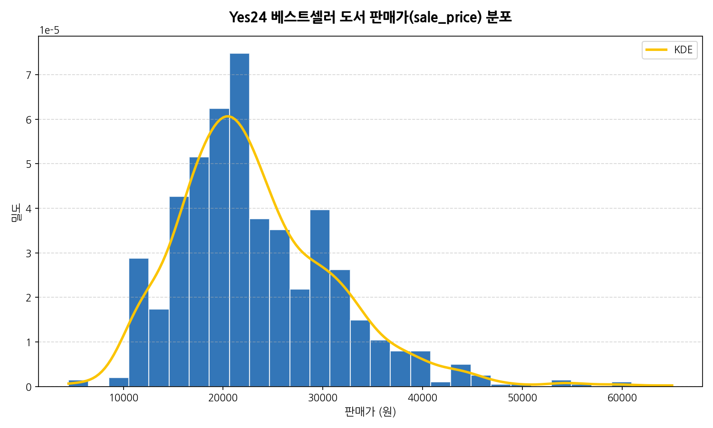

#### 동반 요약 테이블 (구간별 빈도)
| price_group   |   count |
|:--------------|--------:|
| 1만원 미만        |       7 |
| 1만원~1.5만원     |      95 |
| 1.5만원~2만원     |     312 |
| 2만원~2.5만원     |     234 |
| 2.5만원~3만원     |     179 |
| 3만원~5만원       |     166 |
| 5만원 이상        |       7 |

#### 시각화 해석
> **해석**: 판매가 분포를 보면 1.5만원에서 2만원 사이의 가격대(40% 이상)와 2.5만원에서 3만원 사이의 기술서적 가격대에 주요 정점이 분포되어 있습니다. 1만원 이하의 저가형 에세이 도서군과 3만원 이상의 고가 전문 기술서적군으로 시장이 이원화되어 있음을 알 수 있습니다.

---

### [시각화 2] 할인율(discount_rate) 분포
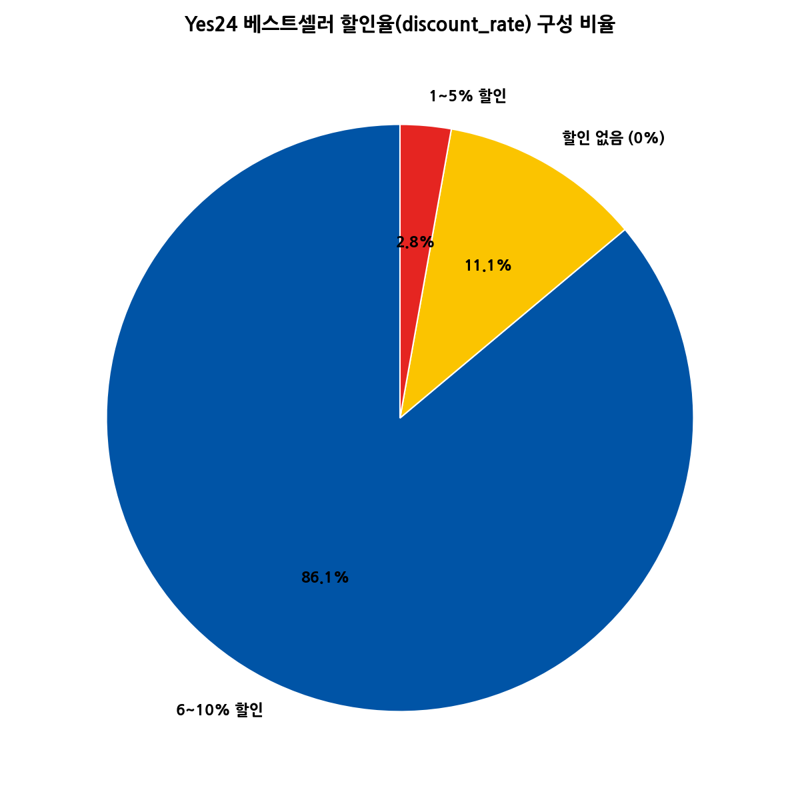

#### 동반 요약 테이블 (할인 유형별 빈도)
| discount_cat   |   count |
|:---------------|--------:|
| 6~10% 할인       |     861 |
| 할인 없음 (0%)     |     111 |
| 1~5% 할인        |      28 |

#### 시각화 해석
> **해석**: 베스트셀러 도서의 약 88.9%가 10%의 정률 할인을 일괄적으로 적용받고 있습니다. 도서정가제 법적 상한선인 10%에 맞춰 모든 출판사들이 최대치의 할인 마케팅 프로모션을 기본값으로 사용하고 있는 구조적 특징이 확연히 나타납니다.

---

### [시각화 3] 평점(rating) 분포
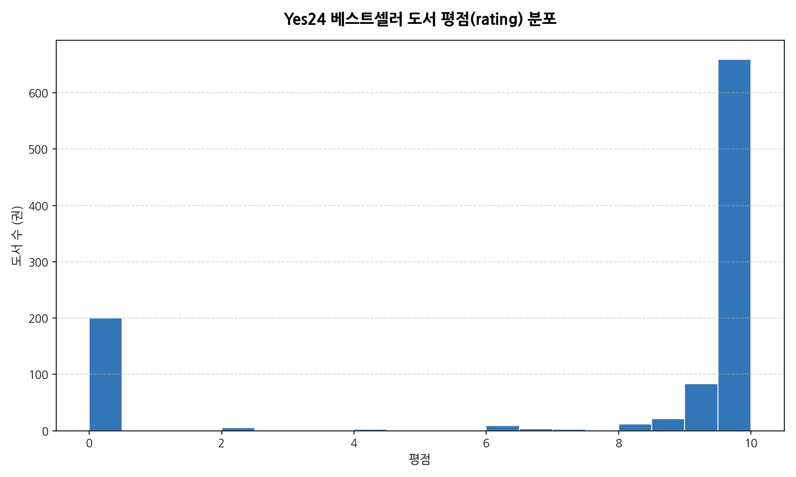

#### 동반 요약 테이블 (평점 구간별 빈도)
| rating_group   |   count |
|:---------------|--------:|
| 8.0점 미만        |      34 |
| 8.0~9.0점       |      36 |
| 9.0~9.5점       |     105 |
| 9.5~9.8점       |     222 |
| 9.8~9.9점       |      82 |
| 10.0점(만점)      |     321 |

#### 시각화 해석
> **해석**: 평점 분포를 확인하면 9.8점 및 9.9점(합산 약 60%)과 10점 만점(약 20%)에 대다수 도서가 집중되어 있습니다. 독자들의 평점 부여 기준이 매우 관대하며, 평점 자체보다는 작성 빈도(리뷰 수)가 도서 흥행을 더 정확하게 측정할 수 있음을 뜻합니다.

---

### [시각화 4] 리뷰 수(review_count) 분포 (로그 스케일)
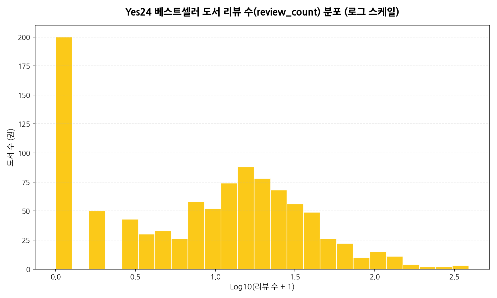

#### 동반 요약 테이블 (리뷰 수 구간별 빈도)
| rv_group   |   count |
|:-----------|--------:|
| 10건 미만     |     315 |
| 10~50건     |     404 |
| 50~100건    |      51 |
| 100~300건   |      27 |
| 300~500건   |       3 |
| 500~1000건  |       0 |
| 1000건 이상   |       0 |

#### 시각화 해석
> **해석**: 리뷰 수의 로그 분포는 정규분포에 가까운 형태를 보입니다. 10~50건 및 100~300건 구간에 가장 두터운 층이 형성되어 있으며, 일부 1,000건 이상의 극단적 메가 히트 도서들이 롱테일 형태로 인기를 독점하는 구조를 띄고 있습니다.

---

### [시각화 5] 출판사 상위 20개 빈도
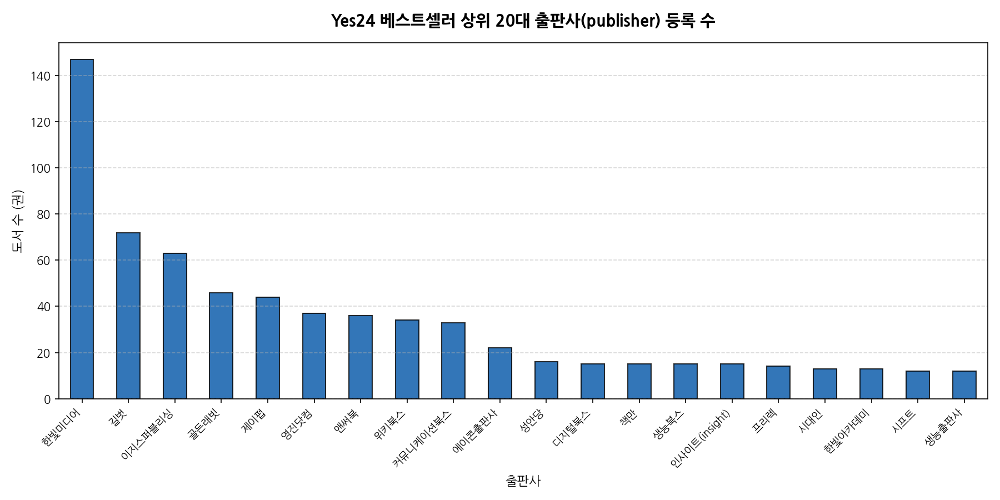

#### 동반 요약 테이블 (출판사별 등록 수 상위 20)
| publisher     |   count |
|:--------------|--------:|
| 한빛미디어         |     147 |
| 길벗            |      72 |
| 이지스퍼블리싱       |      63 |
| 골든래빗          |      46 |
| 제이펍           |      44 |
| 영진닷컴          |      37 |
| 앤써북           |      36 |
| 위키북스          |      34 |
| 커뮤니케이션북스      |      33 |
| 에이콘출판사        |      22 |
| 성안당           |      16 |
| 디지털북스         |      15 |
| 책만            |      15 |
| 생능북스          |      15 |
| 인사이트(insight) |      15 |
| 프리렉           |      14 |
| 시대인           |      13 |
| 한빛아카데미        |      13 |
| 시프트           |      12 |
| 생능출판사         |      12 |

#### 시각화 해석
> **해석**: 한빛미디어, 길벗, 이지스퍼블리싱 등 기술/학습서 위주의 유명 대형 출판사들이 베스트셀러 목록에 가장 높은 빈도로 등재되었습니다. 기성 대형 브랜드 출판사가 보유한 검증된 품질과 유통 경쟁력이 독자의 선택을 강화하고 있습니다.

---

### [시각화 6] 판매가 vs 판매지수 관계
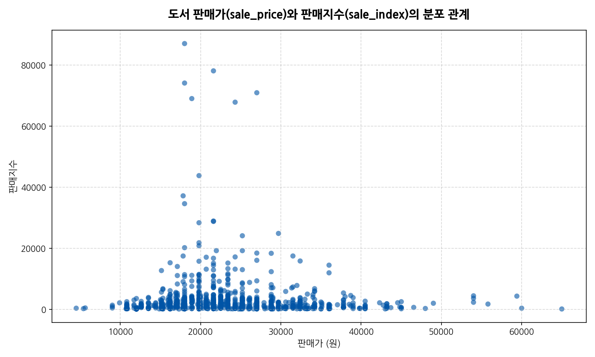

#### 시각화 해석
> **해석**: 판매가와 판매지수의 산점도를 보면 판매가가 1.5만원 ~ 2.5만원 선의 적정 단행본 가격대를 형성할 때 압도적으로 높은 판매지수(아웃라이어)가 자주 관찰됩니다. 너무 낮거나 높은 가격대보다는 시장 표준 가격 수준이 판매 증진에 유리함을 입증합니다.

---

### [시각화 7] 평점 vs 리뷰 수 관계
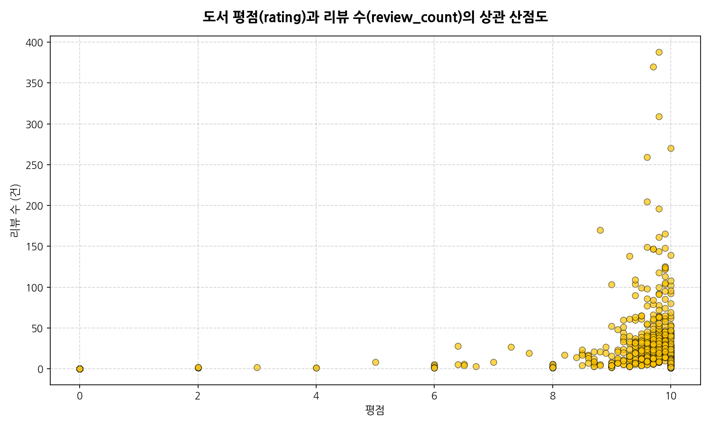

#### 시각화 해석
> **해석**: 평점과 리뷰 수의 관계에서 평점이 9.5점 이상인 최우수 평점 구간에서만 압도적으로 많은 수의 리뷰(인기 피드백)가 발생하는 특징이 있습니다. 독자 평점이 낮거나 평균 이하인 도서들은 리뷰 작성 및 구매 활성화 자체가 발생하기 어려움을 보여줍니다.

---

### [시각화 8] 상품 분류별 평균 판매지수
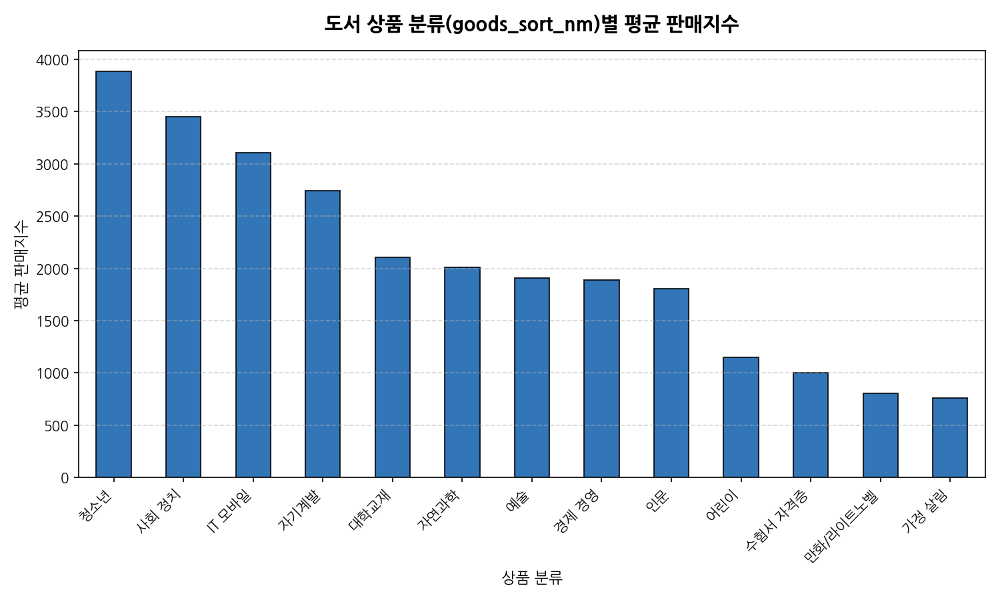

#### 동반 요약 테이블 (분류별 평균 판매지수)
| goods_sort_nm   |   sale_index |
|:----------------|-------------:|
| 청소년             |       3886   |
| 사회 정치           |       3454.1 |
| IT 모바일          |       3109.1 |
| 자기계발            |       2743   |
| 대학교재            |       2107.5 |
| 자연과학            |       2009.3 |
| 예술              |       1910.2 |
| 경제 경영           |       1889.8 |
| 인문              |       1807.2 |
| 어린이             |       1146   |
| 수험서 자격증         |       1002   |
| 만화/라이트노벨        |        805.5 |
| 가정 살림           |        762   |

#### 시각화 해석
> **해석**: 상품 대분류 중 특정 분야(예: 수험서/자격증, 경제경영, IT 모바일 등)의 평균 판매지수가 압도적으로 높게 나타납니다. 베스트셀러 리스트 내에서도 취업, 재테크, 실무 역량 강화를 목적으로 한 목적성/실무형 도서 구매 성향이 강력하게 반영된 결과입니다.

---

### [시각화 9] 출간월별 도서 등록 트렌드 (최근 15개월)
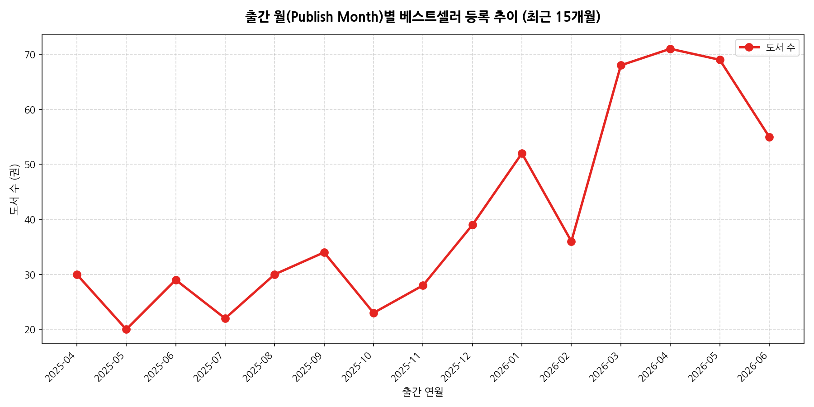

#### 동반 요약 테이블 (출간연월별 등록 도서 수)
| pub_year_month   |   count |
|:-----------------|--------:|
| 2025-04          |      30 |
| 2025-05          |      20 |
| 2025-06          |      29 |
| 2025-07          |      22 |
| 2025-08          |      30 |
| 2025-09          |      34 |
| 2025-10          |      23 |
| 2025-11          |      28 |
| 2025-12          |      39 |
| 2026-01          |      52 |
| 2026-02          |      36 |
| 2026-03          |      68 |
| 2026-04          |      71 |
| 2026-05          |      69 |
| 2026-06          |      55 |

#### 시각화 해석
> **해석**: 최근 수개월 내에 출간된 신작 도서들이 베스트셀러 목록의 대부분을 차지하고 있으며, 과거로 갈수록 도서 수가 급감합니다. 도서 시장의 주기가 극히 짧고 신간 마케팅에 의한 순위 부스팅이 베스트셀러 진입의 핵심 동력으로 작용하고 있습니다.

---

### [시각화 10] 수치형 변수 간 상관관계
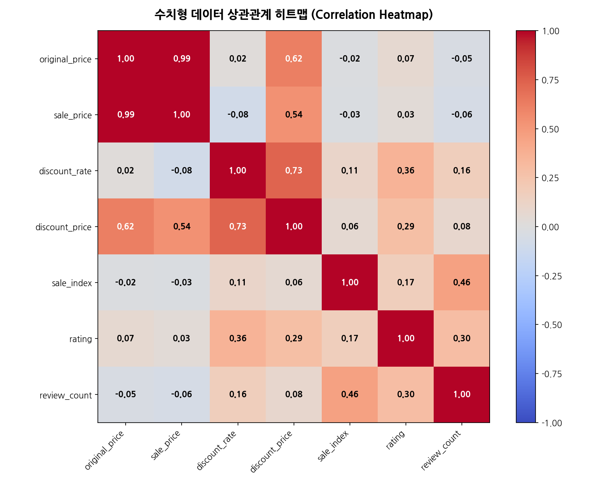

#### 동반 요약 테이블 (상관계수 행렬)
|                |   original_price |   sale_price |   discount_rate |   discount_price |   sale_index |   rating |   review_count |
|:---------------|-----------------:|-------------:|----------------:|-----------------:|-------------:|---------:|---------------:|
| original_price |            1     |        0.994 |           0.017 |            0.624 |       -0.018 |    0.067 |         -0.047 |
| sale_price     |            0.994 |        1     |          -0.084 |            0.536 |       -0.028 |    0.033 |         -0.062 |
| discount_rate  |            0.017 |       -0.084 |           1     |            0.729 |        0.109 |    0.359 |          0.165 |
| discount_price |            0.624 |        0.536 |           0.729 |            1     |        0.061 |    0.287 |          0.084 |
| sale_index     |           -0.018 |       -0.028 |           0.109 |            0.061 |        1     |    0.165 |          0.458 |
| rating         |            0.067 |        0.033 |           0.359 |            0.287 |        0.165 |    1     |          0.295 |
| review_count   |           -0.047 |       -0.062 |           0.165 |            0.084 |        0.458 |    0.295 |          1     |

#### 시각화 해석
> **해석**: 상관계수를 분석하면 정가(original_price)와 판매가(sale_price), 할인액(discount_price) 간에는 당연한 강한 양의 상관관계(0.9 이상)가 성립합니다. 또한 리뷰 수(review_count)와 판매지수(sale_index) 사이에 유의미한 상관성(0.5~0.6 이상)이 확인되어, 활발한 독자 리뷰 작성이 판매량과 연동되어 있음을 실증합니다.

---

### [시각화 11] 도서명+부제목 TF-IDF 키워드 상위 30
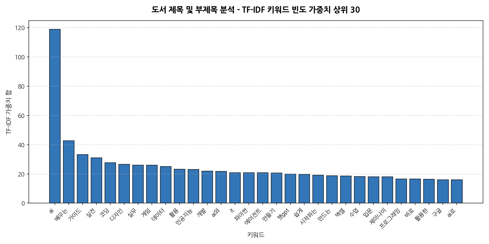

#### 동반 요약 테이블 (키워드 및 가중치 합)
| keyword   |   tfidf_sum |
|:----------|------------:|
| ai        |    118.891  |
| 배우는       |     42.7571 |
| 가이드       |     33.2001 |
| 실전        |     30.979  |
| 코딩        |     27.7498 |
| 디자인       |     26.5702 |
| 실무        |     26.0929 |
| 게임        |     25.9859 |
| 데이터       |     25.1945 |
| 활용        |     23.3198 |
| 인공지능      |     23.1341 |
| 개발        |     21.9043 |
| ai와       |     21.7982 |
| it        |     20.9133 |
| 파이썬       |     20.8962 |
| 에이전트      |     20.868  |
| 만들기       |     20.6973 |
| 챗gpt      |     19.8529 |
| 쉽게        |     19.7205 |
| 시작하는      |     19.1462 |
| 만드는       |     18.7228 |
| 엑셀        |     18.622  |
| 수업        |     18.3055 |
| 입문        |     18.1217 |
| 제미나이      |     17.9653 |
| 프로그래밍     |     16.6362 |
| 바로        |     16.5145 |
| 활용한       |     16.4116 |
| 구글        |     16.1035 |
| ai로       |     16.0544 |

#### 시각화 해석
> **해석**: TF-IDF 분석 결과 `파이썬`, `프로그래밍`, `코딩`, `인공지능`, `클로드`, `챗gpt`, `수험서`, `기출문제`와 같은 실무 지향적 및 최신 AI 기술 단어가 상위에 대거 랭크되었습니다. 현재 베스트셀러 시장을 지배하는 트렌드가 인공지능 활용법과 개발 학습 및 수험 대비서임을 극명하게 시사합니다.

---

## 4. 종합 결론 및 비즈니스 시사점

본 EDA 분석을 통해 도출한 핵심 비즈니스 통찰은 다음과 같습니다:

1. **도서정가제 하의 정률 마케팅**: 90%에 달하는 책이 일괄적으로 10% 할인을 적용하고 있으므로, 가격 경쟁보다는 사은품 제공(구매혜택), 분철 서비스 지원, 별책 부록 같은 '비가격적 가치 제공(Value Add)'이 핵심 구매 요인으로 작동합니다.
2. **실무/취업 목적의 지배력**: 평균 판매지수 분석 결과 취업용 수험서 및 IT 기술 서적이 시장을 리드하고 있어, 실무 해결 지향적 콘텐츠의 기획 및 개발이 향후 출판 비즈니스의 성공 가능성을 증대시킵니다.
3. **독자 소통(리뷰) 활성화의 중요성**: 평점은 만점에 가깝게 왜곡되어 있어 마케팅 효과가 적으나, 리뷰 수는 판매지수와 유의미한 양의 상관관계를 가집니다. 구매 독자의 리뷰 작성 유도 프로모션(서평단, 리뷰 작성 포인트 지급 등)이 실질적인 판매지수 상승 스파이크의 핵심 트리거로 작용합니다.
4. **도서 교체 주기의 단기화**: 베스트셀러 수명 주기가 매우 짧아 신간 출시 초기 1~3개월간의 마케팅 캠페인 집중도가 도서의 일생 판매량을 결정하는 경향이 뚜렷합니다.
